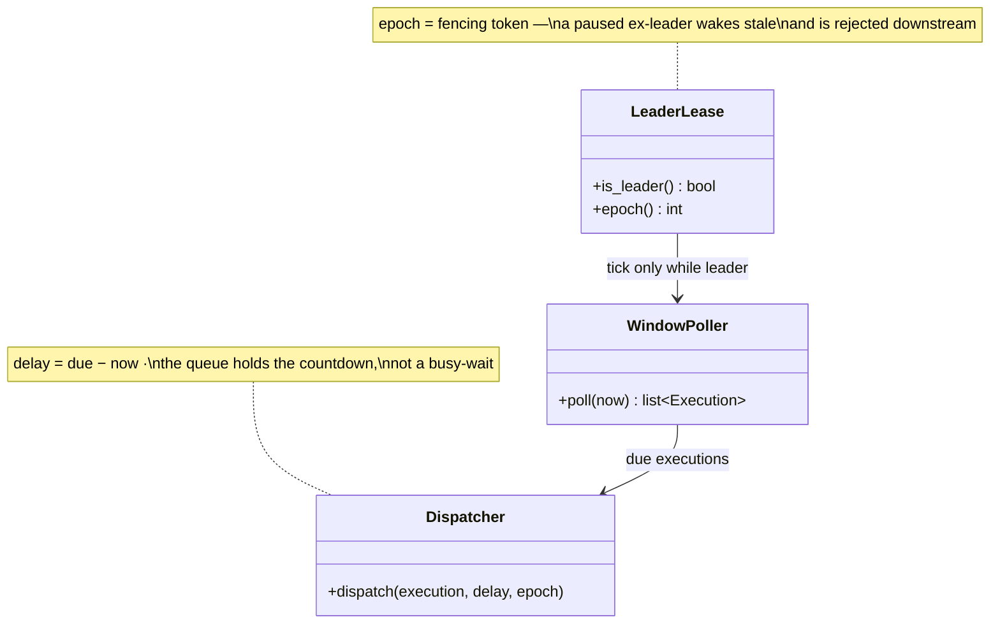

## Scheduler tick

The **Scheduler tick** is the elected, fenced heartbeat of the system: one logical process that must exist (or due jobs are silently missed) and must be *singular* (or every due job is enqueued twice). Every five minutes it range-reads the current hour bucket for PENDING executions due within the window and hands each to the delay queue with delay = due − now. It deliberately does no job work — read and enqueue is cheap enough that a single leader carries 10k executions/second, which is why the sequenced answer is leader-elect first, partition the keyspace only when tick latency data says so.

**Responsibilities**

- Hold the coordination lease; tick **only while leader**, and carry the lease's epoch on every side effect.
- Poll a **bounded window** — one or two bucket partitions, never a scan over job definitions.
- Enqueue each due execution with its per-message delay and the current fencing epoch.
- Trust clocks carefully: monotonic clock for sleep intervals (wall clocks jump backward), monitored wall time for the due comparison.

Three classes carry the loop — the C4 code level, mirrored 1:1 by the forthcoming POC:

Each class maps to a file in the forthcoming POC at `06-case-studies/examples/job-scheduler/scheduler/` — click the code-level boxes for their docs.

**Where it breaks.** The zombie: a GC pause between checking the lease and acting on it means the old leader resumes and finishes a tick a new leader already ran. Unpreventable — only made harmless, by the stale epoch bouncing at the store and the worker's idempotent claim absorbing whatever leaked into the queue.
