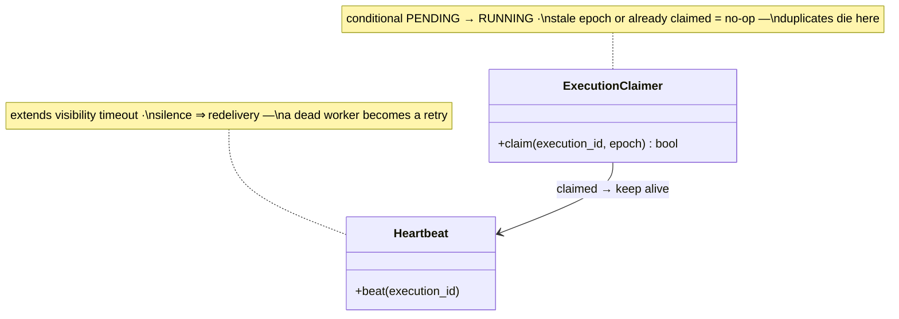

## Worker fleet

The **Worker fleet** is where "exactly-once" gets assembled from parts that individually promise less. Everything upstream duplicates by design — a zombie scheduler double-enqueues, the queue redelivers on a lost ack, retries re-send — and every duplicate carries the *same* `execution_id`. So the worker's first act is a **conditional claim**: flip the Execution row PENDING → RUNNING only if it isn't already claimed; a duplicate finds the row claimed or COMPLETED and drops the message. At-least-once delivery plus an idempotent claim at the effect = **effectively-once execution** — an outcome you assemble, never a delivery guarantee you buy.

**Responsibilities**

- Claim idempotently, keyed by `execution_id` and fencing epoch — stale or already-claimed is a silent no-op.
- **Heartbeat while running**: extend the queue's visibility timeout every ~15 s; stop (crash, pause, network death) and the message reappears in ≤30 s for a healthy worker — supporting multi-minute jobs without a multi-minute detection window.
- Catch visible failures: mark RETRYING with attempt count, re-enqueue with exponential backoff, give up into FAILED after ~3 attempts.

Two classes carry that work — the C4 code level, mirrored 1:1 by the forthcoming POC:

Each class maps to a file in the forthcoming POC at `06-case-studies/examples/job-scheduler/worker/` — click the code-level boxes for their docs.

**Where it breaks.** A paused worker can resume as a zombie and finish a job another worker re-ran: the fence protects the *record* (its stale write bounces), but only idempotent task design protects the *world* — you can't retract a twice-sent email.
