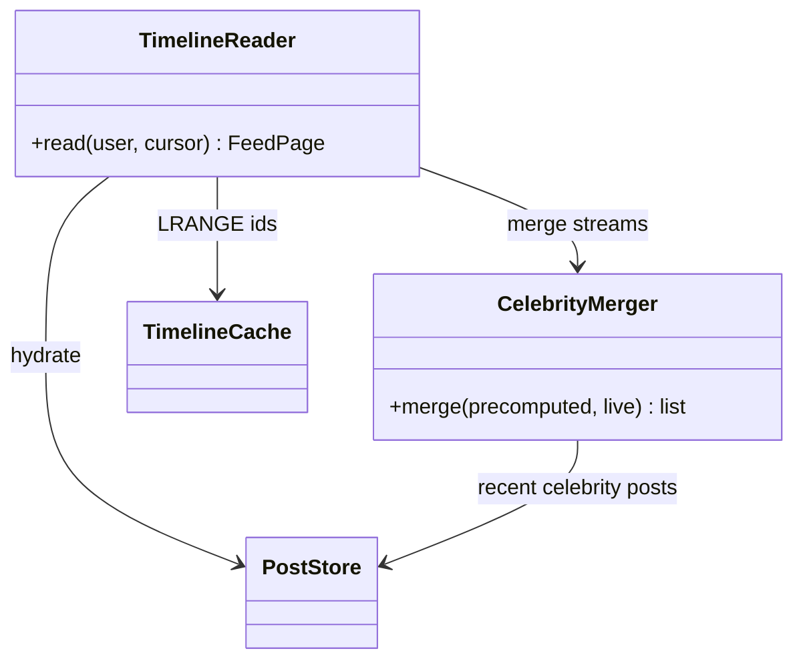

## Feed API

The **Feed API** is the system's only synchronous surface: post creation and timeline reads, both inside the &lt;500 ms budget.

**Responsibilities**

- `POST /posts` — write the post to the **Post store**, then enqueue `{postId, authorId}` on the **Fan-out queue** and return `201`. The response never waits for fan-out; the queue is where the request path ends and the async pipeline begins.
- `GET /feed` — reads are **IDs-then-hydrate**: pull the precomputed ID list from the **Timeline cache**, merge in live posts from any celebrity accounts the reader follows, then hydrate IDs into content from the Post store. Pages by cursor (oldest-seen timestamp), not offset.

Two classes carry the read path:

**TimelineReader** owns the lookup, hydration, and cursor; **CelebrityMerger** is the read-time half of the hybrid — celebrity posts never rode the write path, so the reader merges two time-sorted streams on every request.

**Where it grows.** The API is stateless and scales horizontally; its ceiling is the stores behind it. Hydration survives scale only because posts are write-once, read-enormously — the friendliest skew caching ever gets.
