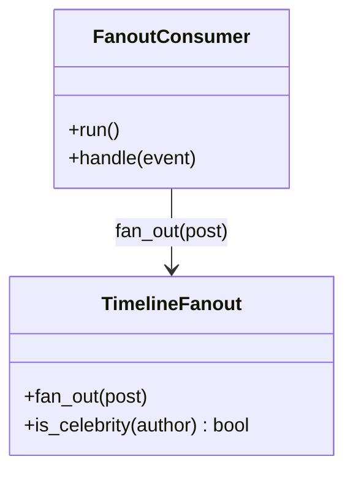

## Fan-out workers

The **Fan-out workers** are the async half of the design: they turn one post event into ~200 timeline writes — ~1M+ writes/second fleet-wide — off the request path, against a freshness SLO (~5 seconds) instead of a request deadline.

**Responsibilities**

- Consume post events from the **fan-out queue** with at-least-once semantics.
- Look up the author's followers in the **follow graph store**.
- Insert the post id into each follower's materialized timeline in the **timeline cache** — idempotently.
- **Skip celebrity authors** entirely: their posts are merged at read time by the feed API, because a 100M-follower fan-out (~20M writes/second to hit the SLO) has no sane write-path answer.

Two classes carry the pipeline:

`FanoutConsumer` owns the queue discipline (consume, hand off, acknowledge); `TimelineFanout` owns the delivery decision (who gets it, who's skipped) and the idempotent insert. Together they compose the effectively-exactly-once pipeline: at-least-once redelivery plus an insert that converges duplicates to one entry. Each mirrors a file in the forthcoming POC at `06-case-studies/examples/news-feed/worker/`.

**Where it breaks.** Work per message varies brutally — one event means 200 writes, another means a million — so a single celebrity-sized job skews worker load and starves everything behind it while queue depth looks fine. Split large jobs, and watch the age of the oldest undelivered post, not the depth.
