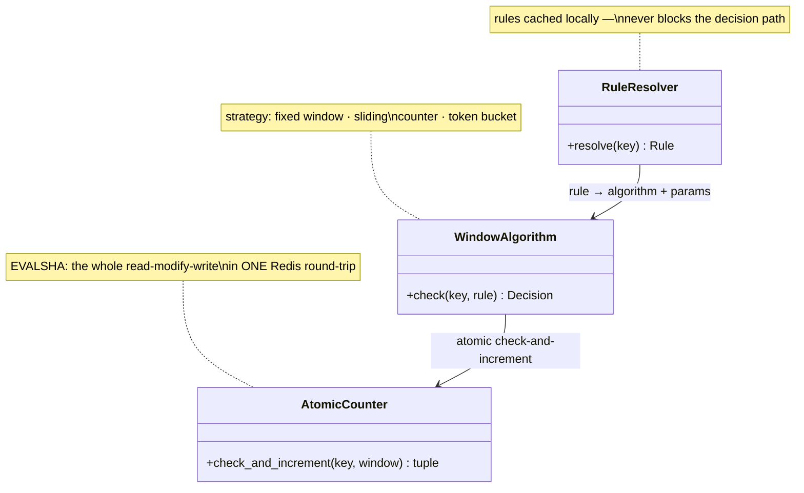

## Limiter

The **Limiter** is the middleware where the design's three corrected instincts meet: state lives *out of process* in shared Redis, rules are resolved from a local cache, and the check-and-increment is **one atomic round-trip** — because a read followed by a write, however carefully transacted, leaves a gap where two concurrent checks both see the last token and both spend it (the **lost update**). The whole decision — resolve rule, run algorithm, read-refill-decide-write — fits inside the request's single-digit-millisecond budget only because the state round-trip is exactly one.

**Responsibilities**

- Resolve which rule applies to the key — most-restrictive wins across per-user, per-IP, and per-endpoint layers — without ever blocking on the rule store.
- Run the configured window algorithm (this design's pick: token bucket, for its tunable burst) against shared counter state via `EVALSHA`.
- Answer allow/deny with the header payload: limit, remaining, reset, and `Retry-After` on denial.

Three classes carry that pipeline — the C4 code level, mirrored 1:1 by the forthcoming POC:

Each class maps to a file in the POC at `06-case-studies/examples/rate-limiter/app/` (deferred to the hands-on phase) — click the code-level boxes for their docs.

**Where it breaks.** When Redis is unreachable the limiter can't answer honestly, and this design's stance is **fail closed** — limiter failures correlate with the traffic spikes that make failing open most dangerous. The degraded mode must be alerted on, not discovered.
