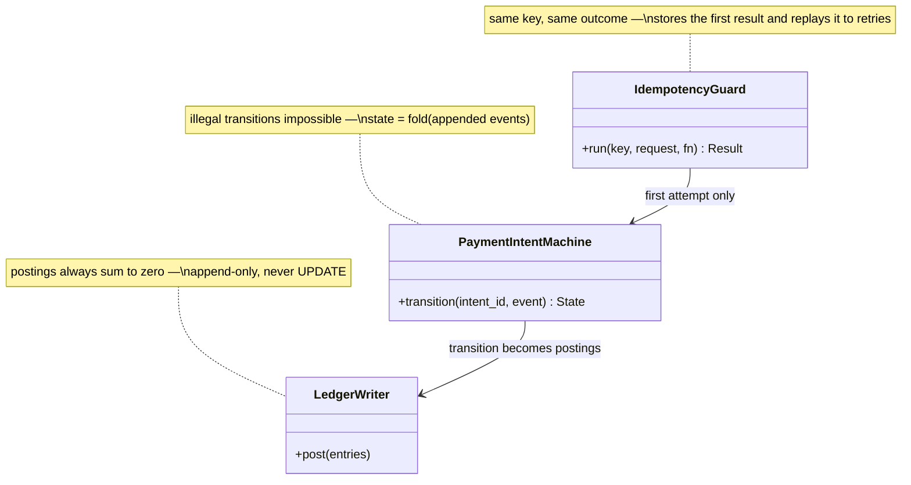

## Payment API

The **Payment API** is the only write path for money, and its internal order of operations *is* the design: idempotency check first, then the state machine, then ledger postings — in that order, every time. The ordering encodes the lesson's two hard truths. Retries are mandatory (a timeout tells the merchant nothing) and lethal (a double charge is data corruption with a customer attached), so duplicate suppression must run before anything else. And money is never UPDATEd, so what the state machine decides lands as appended events and balanced ledger postings, never as edits.

**Responsibilities**

- Check the merchant's `Idempotency-Key` against the key store *inside the same transaction* that records the attempt — a retry hits the uniqueness constraint and gets the stored first outcome replayed, not a second charge.
- Drive the PaymentIntent lifecycle by appending state events; record the attempt **before** calling the PSP, so our intention is on disk whatever happens next.
- On a PSP timeout, guess nothing: mark the attempt `pending_verification` — pending is a first-class state, because the PSP's truth arrives late.
- Append double-entry postings for every money movement; balances are derived elsewhere.

Three classes carry that work — the C4 code level, mirrored 1:1 by the forthcoming POC:

Each class maps to a file in the POC at `06-case-studies/examples/stripe-payments/app/` (deferred to the hands-on phase) — click the code-level boxes for their docs.

**Where it breaks.** Skip or reorder any step and a specific failure follows: idempotency after the charge means the retry pays twice; calling the PSP before recording the attempt means a crash erases the evidence that money may have moved.
