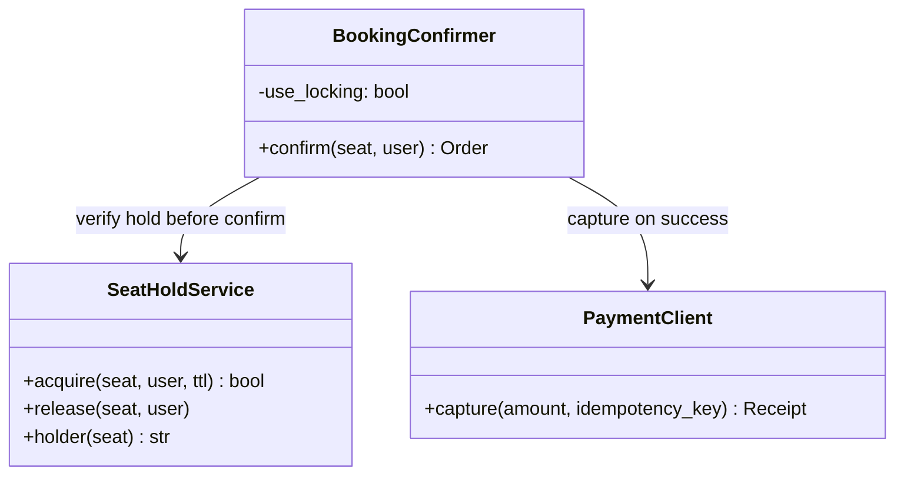

## Booking service

The **Booking service** is the critical section of the entire platform: acquire a seat hold, take payment, confirm the order. Everything else in the design — waiting room, cache, search — exists to keep traffic *away* from this container so its short transactions stay short.

**Responsibilities**

- On seat selection, acquire a per-seat **TTL hold** in Redis — the checkout's admission ticket; walk-aways and crashes free themselves by expiry.
- Take payment through the PSP, one idempotency key per checkout attempt.
- Confirm the order in a **row-locked Postgres transaction** that re-verifies the hold, marks the seats sold, and writes the order — the final arbiter against double-sells.

Three classes carry that sequence:

The layering to say out loud: **Redis is the experience; Postgres is the invariant.** Holds make checkout humane; the conditional, locked confirm is what makes "never sell a seat twice" true even if every hold lies (`BookingConfirmer`'s `use_locking` flag exists precisely to demonstrate the difference). Each class mirrors a file in the forthcoming POC at `06-case-studies/examples/ticketmaster/app/` — click the code-level boxes for their docs.

**Where it breaks.** Not by scaling: more instances just add transactions converging on the same ~50k ticket rows, which is why admission control upstream — not autoscaling here — answers the on-sale spike.
