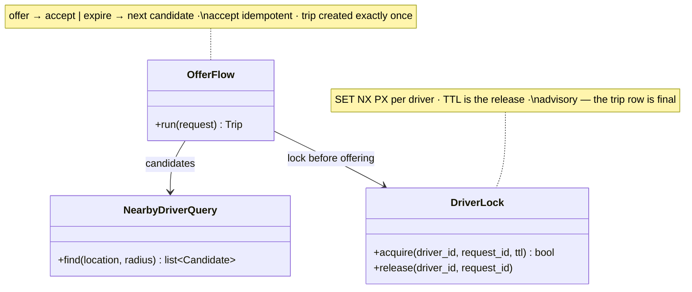

## Matching service

The **Matching service** is the contention core — where a scarce, moving inventory (drivers) meets concurrent claimants (ride requests). If you did Ticketmaster, you've seen the shape: an inventory unit claimable by exactly one party for a bounded window. The seat became a driver, ten minutes became ten seconds, the inventory now drives around — the ladder is the same.

**Responsibilities**

- Radius-query the geo index for nearby available drivers and rank them (ETA, rating).
- Take the per-driver **TTL lock** before every offer — the guarantee that no driver ever sees two simultaneous offers, and that a crashed matcher's lock releases itself by expiry.
- Walk the offer chain *one driver at a time*: offer, wait out the 10-second window, on decline or silence move to the next candidate.
- On accept, hand off to the Trip service — whose conditional, constraint-backed write is the **final arbiter**; the Redis lock is the experience, the trip row is the invariant.

Three classes carry that loop:

Each class maps to a file in the forthcoming POC at `06-case-studies/examples/uber/app/` — click the code-level boxes for their docs.

**Where it breaks.** The lease that lies: a GC-paused matcher can resume as a zombie, still acting on a lock that expired mid-pause. The design survives because assignment never trusts the lock — the zombie's late write matches zero rows downstream. And hot zones: one stadium's worth of requests converging on one cell is why matching sits behind a buffer, degrading to latency instead of dropped requests.
