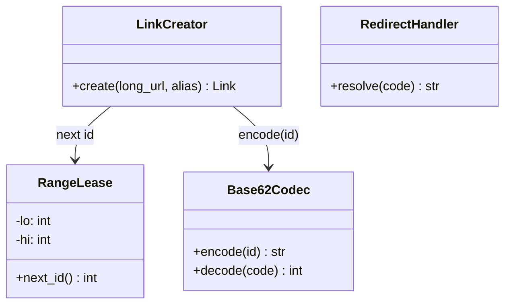

## API service

The **API service** is the only compute in the system: it owns both endpoints and stays deliberately **stateless** — any node can serve any request, so scaling is simply adding nodes behind the load balancer. The one piece of per-node state it holds, a leased counter range, is designed to be safely *lost* (a crash abandons the range; gaps, never duplicates).

**Responsibilities**

- `POST /links`: validate the long URL, mint a unique short code, insert the mapping into the link store.
- `GET /{code}`: resolve the code — cache first, store on a miss — and answer `302 Found`.
- Emit a click event per redirect, fire-and-forget, so analytics never adds latency to the hot path.

Internally it is four classes with one-way dependencies — the write path (`LinkCreator → RangeLease → Base62Codec`) and the read path (`RedirectHandler`) share nothing, which is what makes "no coordination on the read path" literally true:

Each class mirrors a file in the runnable POC at `06-case-studies/examples/url-shortener/app/` — click the code-level boxes for their docs.

**Where it grows.** Statelessness means the service itself never becomes the bottleneck — pressure always lands downstream, on the cache (hot keys), the store (miss traffic), or the allocator (failover). If read and write traffic ever need independent scaling or isolation, the four classes split cleanly into separate read and write services along the dependency seam above.
