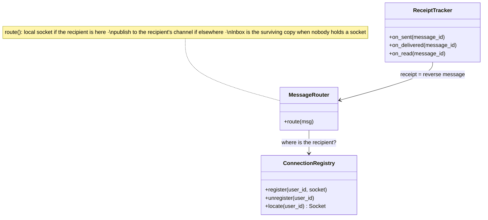

## Chat servers

The **Chat servers** terminate every persistent WebSocket and do the design's defining work: get each message to the recipient's socket, *wherever that socket lives*. Each server keeps an in-memory map `userId → connection` for the sockets it holds; historically WhatsApp ran 1–2 million connections per host on a purpose-built Erlang system, so even at that ceiling this is a fleet of hundreds, never one machine.

**Responsibilities**

- Accept `sendMessage`, commit the Message + per-recipient-client Inbox rows in one transaction, and only then ack the sender — "sent" *means* that commit.
- Deliver: push to a local socket if the recipient is here, publish to the recipient's channel otherwise, and let the Inbox row carry messages nobody can receive right now.
- On a client's application-level ack, delete its Inbox row and flow the receipt back to the sender.

Three classes carry that flow — the C4 code level, mirrored 1:1 by the forthcoming POC:

Each class maps to a file in the POC at `06-case-studies/examples/whatsapp/app/` (deferred to the project's hands-on phase) — click the code-level boxes for their docs.

**Where it breaks.** Not on steady-state throughput — on **correlated reconnection**: one server dying orphans millions of sockets that redial at once, each paying TLS handshake + subscribe + Inbox drain. Deploys trigger this deliberately, so draining a chat server is an operational discipline, not an accident.
