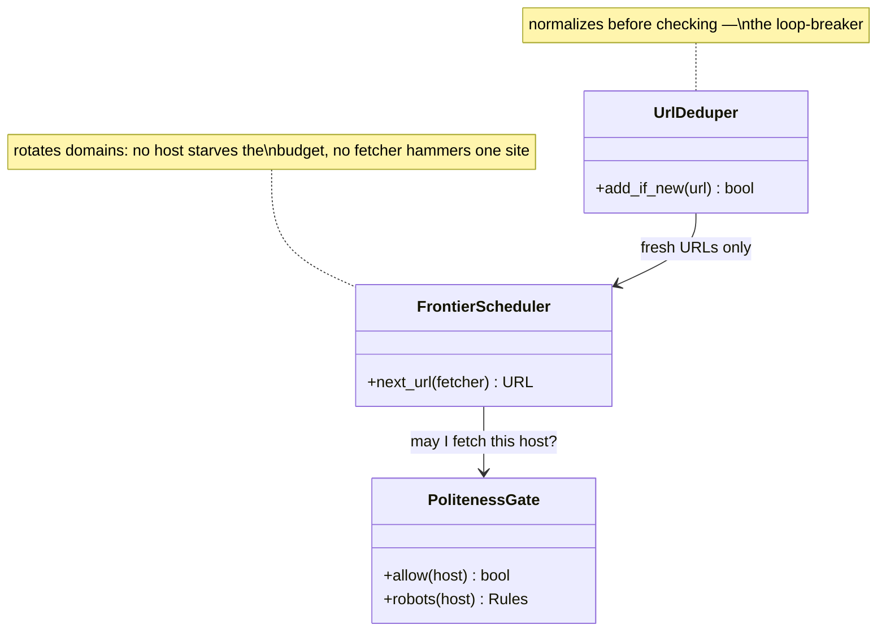

## URL frontier

The **URL frontier** is the part of the design where the naive answer — "it's a queue" — is most wrong. A queue answers "what arrived first?"; the frontier answers a question no plain queue can: *of all the URLs I could crawl right now, which am I **allowed** to crawl, and which is **worth** crawling first?* That makes it the scheduler of the entire system — the crawl's brain.

**Responsibilities**

- Interleave domains rather than serve discovery order: think of it as logically **sharded by domain** — every URL of a host in one lane, lanes consumed round-robin, a rate-limited lane delaying only itself. (In the SDS build the same effect emerges compositionally: shared queue + per-domain Redis window + delayed re-enqueue.)
- Enforce politeness *before* a URL leaves: robots.txt rules and the per-host rate limit — because per-domain throughput is capped (~1 req/s means a 1M-page domain needs ~11.6 days alone), throughput must come from breadth.
- Admit only fresh work: discovered links pass a normalize-then-seen-check before entering.

Three classes carry that logic — the C4 code level, mirrored 1:1 by the forthcoming POC:

Each class maps to a file in the POC at `06-case-studies/examples/web-crawler/app/` (deferred to the hands-on phase) — click the code-level boxes for their docs.

**Where it grows.** For a one-shot corpus crawl, FIFO-with-politeness is defensible; add freshness requirements and the frontier gains a **priority** dimension — a URL Scheduler ordering by importance and recrawl due-date.
