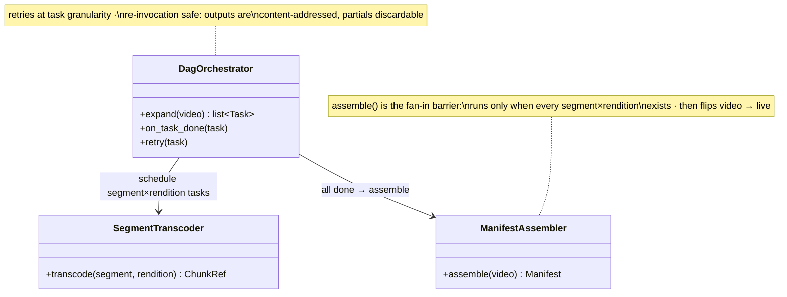

## Transcoding pipeline

The **Transcoding pipeline** is the manufacturing floor between upload and playback: it takes one original file and produces the hundreds of derived files watching actually requires. The work forms a **DAG** — split the original into few-seconds segments, transcode each segment across the (resolution × codec) ladder in parallel (the fan-out), assemble manifests when every piece lands (the fan-in) — because each step has explicit inputs and outputs and segment-level work has no cross-segment dependencies, so the expensive middle parallelizes across as many workers as you can buy.

**Responsibilities**

- Expand each upload-complete event into segment×rendition tasks and drive them to completion.
- Read only the raw store; write only content-addressed artifacts to the rendition store; hand intermediate data between stages through blob storage, never worker memory.
- Retry failures at **task granularity**: a dead task's partial output is discarded and the task rescheduled elsewhere — no cross-task state to repair, no whole-job rerun for one lost segment. Content-addressed outputs make the re-run a safe overwrite, which is what lets the fleet ride cheap preemptible instances.
- Flip the video live in the metadata DB — only after the fan-in confirms every artifact.

Three classes carry that flow — the C4 code level, mirrored 1:1 by the forthcoming POC:

Each class maps to a file in the POC at `06-case-studies/examples/youtube/pipeline/` (deferred to the project's hands-on phase) — click the code-level boxes for their docs.

**Where it breaks.** On poison inputs: a malformed upload crashes its worker on every retry, so attempts are capped and the job dead-letters — cheap, because everything here is discardable derived data. And on backlog: the pipeline's real SLO is time-to-ready, eaten silently as the queue ages.
