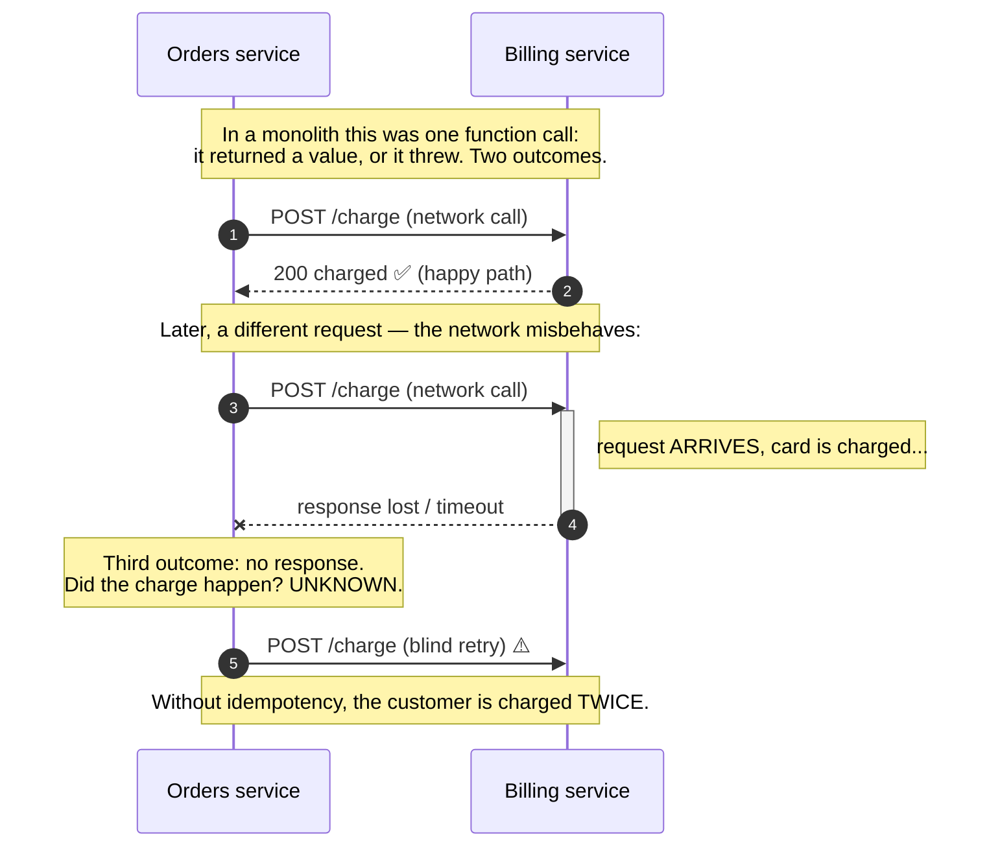

# Service Architecture: Monoliths to Microservices

> **Prerequisites:** [API Design](/synapse/system-design-from-first-principles/foundations/api-design), [Nonfunctional Requirements](/synapse/system-design-from-first-principles/foundations/nonfunctional-requirements) | **You'll be able to:** argue for a modular-monolith-first default and name the specific pressures that justify splitting; place a service boundary on a business capability rather than a technical layer; and enumerate what a network call costs you that a function call did not.

## The problem (why this exists)

You are two years into a product. The codebase is one deployable — orders, billing, inventory, notifications, user profiles, all in one process, all talking to one database. It started clean. It is no longer clean. A change to the billing logic requires a full redeploy of everything, including the untouched notification code. Two teams keep colliding in the same files. A slow analytics query on the shared database occasionally drags down checkout. Someone read a blog post about Netflix and now there is a meeting on the calendar titled "Migrate to microservices."

Here is the trap. "Monolith" has quietly become a slur, and "microservices" a badge of seriousness — as if the number of deployables were a measure of engineering maturity. It is not. The decision of how many services to run, and where to draw the lines between them, is one of the most consequential architectural choices you will make, because it shapes everything downstream: how you deploy, how you test, how you debug an outage at 3 a.m., how your data stays consistent, and how many teams can move without tripping over each other. Get it wrong in the "too many services, too early" direction and you inherit all the costs of a distributed system with none of the benefits — the worst configuration there is.

This lesson is about making that decision honestly. The punchline, stated up front so the rest earns it: **for most systems, and for most interviews, the right answer is a well-structured monolith — and the pressures that justify breaking it apart are specific, nameable, and mostly organizational rather than technical.**

## Intuition first

Strip the words down. A **monolith** is one application: one thing you build, one thing you deploy, one process (replicated for scale, but the same code everywhere). Inside it, when the checkout code needs to charge a card, it *calls a function* — billing code runs in the same process, sharing the same memory, and either returns a value or throws an exception. That is the entire interaction. It is fast (nanoseconds), it is reliable (the call cannot get "lost"), and you can wrap the whole checkout in a single database transaction that either fully commits or fully rolls back.

**Microservices** take that same application and split it across the network into many independently deployable services, each with one well-defined purpose, each exposing a network-callable API, and — critically — each owned by one team responsible for its maintenance `[DDIA2 p. 21]`. Now when checkout needs to charge a card, it makes an *HTTP (or gRPC) request* to a separate Billing service running on a different machine. That request travels over a network that can drop it, delay it, or return a timeout that leaves you genuinely unsure whether the charge happened `[DDIA2 p. 20]`.

That single substitution — **a function call becomes a network call** — is the whole story. Everything microservices give you and everything they cost you flows from it. So the honest framing is not "monolith vs. microservices" as a binary. There is a decisive middle option that most teams skip straight past:

The **modular monolith** is still one deployable — one process, one build, one deploy — but internally it is organized into clean modules with enforced boundaries: Orders cannot reach into Billing's tables; it calls Billing's *in-process interface*. You get the discipline of well-drawn service boundaries while keeping function calls, single-transaction consistency, and one thing to deploy and debug. It is the monolith without the mud, and it is the right starting point for almost everything. When a real pressure later forces a genuine split, you extract a module into a service across a boundary you have *already* drawn and hardened — a controlled promotion, not an archaeological dig.

So the mental model is a progression, not a fork:

> a big-ball-of-mud monolith → a **modular monolith** (the default) → selectively extract services **only where a specific pressure demands it**.

## How it works

Let's look at the three architectures side by side, because the diagram makes the trade you are actually making visible.

```d2
direction: right

classes: {
  svc:  {style: {fill: "#dcfce7"; stroke: "#16a34a"}}
  data: {style: {fill: "#ffedd5"; stroke: "#ea580c"}}
}

mono: "1. Monolith" {
  style: {fill: "#f8fafc"; stroke: "#94a3b8"}
  app: "One process (modules tangled together)" {class: svc}
  db: "Shared database" {class: data}
  app -> db
}

modmono: "2. Modular monolith  (the default)" {
  style: {fill: "#f8fafc"; stroke: "#94a3b8"}
  app: "One process, enforced module boundaries" {
    orders:  "Orders" {class: svc}
    billing: "Billing" {class: svc}
    users:   "Users" {class: svc}
    orders -> billing: "in-process call"
  }
  db: "Shared DB (a schema per module)" {class: data}
  app.orders  -> db
  app.billing -> db
  app.users   -> db
}

micro: "3. Microservices" {
  style: {fill: "#f8fafc"; stroke: "#94a3b8"}
  o: "Orders service"  {class: svc}
  b: "Billing service" {class: svc}
  u: "Users service"   {class: svc}
  odb: "Orders DB" {class: data}
  bdb: "Billing DB" {class: data}
  udb: "Users DB"  {class: data}
  o -> odb
  b -> bdb
  u -> udb
  o -> b: "network call (can fail)"
}
```

Reading left to right: the boundaries get *stronger* and the coupling gets *looser*, but the coordination cost of every cross-boundary interaction gets *higher*. In the monolith the modules are tangled — a boundary exists only in someone's head, so it erodes. In the modular monolith the boundaries are enforced by the compiler or the module system, yet crossing one is still a cheap function call and the data still lives in one transactional database. In microservices the boundary is now a network hop and — the part people underestimate — the database has split too.

### When to actually split: the pressures that earn it

Microservices are not free architecture; you buy them, and they are expensive. So the question is never "should we do microservices?" but "does a *specific* pressure justify paying for *this particular* split?" There are essentially four that do:

**1. Independent deployment.** A team should be able to release its service on its own cadence, frequently, without coordinating a joint deploy with every other team `[DDIA2 pp. 180–181]`. If your billing team ships ten times a day and your reporting team ships monthly, forcing them to share one deploy pipeline creates constant friction. Separate deployables let each release independently and let a bad release be rolled back in isolation.

**2. Independent scaling and hardware.** Different parts of a system have wildly different resource profiles. A video-transcoding path is CPU-bound; a session store is memory-bound; an image thumbnailer might want GPUs. In a monolith you replicate the *whole* process to scale any one part. Splitting lets you allocate hardware per service and scale the hot path alone `[DDIA2 pp. 21–22]`. (Tie this to [Capacity & Autoscaling](/synapse/system-design-from-first-principles/production-engineering/capacity-and-autoscaling) — independent scaling is where the split pays rent.)

**3. Fault and implementation isolation.** A service hides its implementation behind an API, so its owners can change internals — even the language or the datastore — without affecting clients `[DDIA2 pp. 21–22]`. A memory leak or crash in one service need not take down the others.

**4. Team autonomy at organizational scale — the real driver.** DDIA is blunt about this: microservices are *"primarily a technical solution to a people problem"* — letting teams progress independently without constant cross-team coordination `[DDIA2 p. 22]`. This is **Conway's Law** in action: an organization will tend to produce a system whose structure mirrors its own communication structure `[web: Melvin Conway, "How Do Committees Invent?", 1968]`. Service boundaries are, in large part, *team* boundaries. That is why microservices are valuable in a large company with many teams and, per DDIA directly, "likely unnecessary" overhead in a small company where the simplest possible implementation is preferable `[DDIA2 p. 22]`.

Notice what is *not* on that list: "it's the modern way," "it'll be more scalable someday," "microservices are best practice." None of those are pressures. They are fashions, and Martin Fowler's advice on them is the industry's hard-won default — begin with a monolith and extract services only once the codebase and the organization are big enough that the monolith genuinely hurts, a stance he calls **"Monolith First"** `[web: martinfowler.com, "MonolithFirst", 2015]`.

### How to draw the boundaries: capability, not layer

Suppose a pressure genuinely justifies splitting. *Where* do the lines go? This is where most microservice migrations quietly fail.

The wrong instinct is to split by **technical layer**: a "web tier" service, an "application logic" service, a "data access" service. This feels tidy and is a disaster, because almost every real feature cuts *across* all three layers. Adding a "gift receipt" option touches the UI, the logic, and the data — so with layered services it requires a coordinated change and deploy across three teams for one small feature. You have created maximum coupling on the axis that changes most often.

The right instinct is to split by **business capability** (equivalently, by **bounded context** from Domain-Driven Design): Orders, Payments, Inventory, Shipping, Search `[web: microservices.io, "Decompose by business capability" & "by subdomain"; Eric Evans, Domain-Driven Design, 2003]`. Each service owns one coherent chunk of the business, top to bottom — its own UI concerns, its own logic, its own data. A change to "how gift receipts work" now lands inside *one* service owned by *one* team. The boundary follows the grain of how the business actually changes, so most changes stay local. A useful test: if a proposed service can't own a meaningful business noun and a verb ("Payments — charge, refund, reconcile"), it is probably a layer, not a capability.

### The data-per-service rule (and why a shared database re-couples everything)

Drawing the service boundary is only half the split. The other half — the half teams skip because it is hard — is the data. The rule is stark: **each service owns its data privately, and no other service touches that database directly** `[web: microservices.io, "Database per service"]`. Other services must go through the owning service's API.

DDIA explains *why* this is non-negotiable, and it is worth internalizing because it is subtle. If two services share a database, that shared schema *effectively becomes part of the API* between them — and now it is an API that is extremely hard to change, because either service's queries depend on the exact table structure. Worse, one service's expensive query can degrade the other's performance, since they contend for the same database `[DDIA2 pp. 21–22]`. You have split the code but left the coupling exactly where it hurts most. A "microservices" system on a shared database has the deployment complexity of microservices and the coupling of a monolith — strictly the worst of both.

So a real split means the data splits too: Orders gets its own database, Payments gets its own. Which immediately raises the consequence the whole rest of this book has been preparing you for.

## Trade-offs

| Property | Monolith (tangled) | **Modular monolith** | Microservices |
| --- | --- | --- | --- |
| Deployables | 1 | 1 | Many |
| Cross-module interaction | Function call | Function call (via interface) | Network call — can fail/time out |
| Internal boundaries | Erode over time | **Enforced by the module system** | Enforced by the network |
| Data consistency | One ACID transaction | One ACID transaction | Distributed → sagas / eventual |
| Independent deploy | No | No | **Yes** |
| Independent scaling / hardware | No (scale the whole thing) | No | **Yes (per service)** |
| Team autonomy at scale | Poor | Moderate | **Strong (Conway's Law)** |
| Debugging | In-process stack trace | In-process stack trace | Distributed tracing needed |
| Operational cost | Low | Low | **High (deploy, monitor, on-call per service)** |
| Right for | Legacy / prototypes to clean up | **Most systems; the default** | Large orgs with real split-pressure |

The column that matters is the middle one. The modular monolith keeps every "low/simple" property of the monolith while fixing the one thing that actually rots — eroding internal boundaries — by enforcing them mechanically. You only give up the three "Yes" rows (independent deploy, independent scaling, team autonomy), and you give them up *until a specific pressure makes you want them*, at which point you extract along a boundary you already drew.

## Numbers that matter

The single number that reframes the whole decision is the cost of the interaction you are changing. An in-process function call is on the order of **1 nanosecond**. A network call within the same datacenter is on the order of **0.5–1 millisecond** — roughly a *million times* slower — and that is the fast, happy case; a cross-region call is tens to hundreds of milliseconds `[web: Jeff Dean, "Latency Numbers Every Programmer Should Know"; see also` [Latency, Throughput & Percentiles](/synapse/system-design-from-first-principles/foundations/latency-throughput-percentiles)`]`. DDIA states the principle plainly: a cross-service call is "vastly slower than an in-process function call," and for large data volumes it can be faster to move the computation to the data than the data to the computation `[DDIA2 p. 20]`.

This is why chatty splits are lethal. If rendering one page made 3 in-process calls and you naively extract those into services, one page now makes 3 network round-trips — and if each of those services in turn calls two more, you have a fan-out that turns a 5 ms page into a 200 ms page, with far more ways to fail. A back-of-envelope check before any split: *how many network hops will the hottest request path now take, and what does that do to its [tail latency](/synapse/system-design-from-first-principles/foundations/latency-throughput-percentiles)?* If the answer is "many," the boundary is in the wrong place. (See [Estimation & Numbers](/synapse/system-design-from-first-principles/foundations/estimation-and-numbers) for the full latency ladder.)

## In production

Real organizations live on the whole spectrum, and the instructive cases are the ones that *chose their spot deliberately*.

**Amazon** is the canonical microservices story, usually told backwards. Amazon did not adopt services because services are elegant; it adopted them because of the "two-pizza team" model — small autonomous teams that each own a service end to end. The architecture is downstream of the org chart: Conway's Law used as a *tool*, shaping software boundaries to match the team boundaries they wanted `[web: Conway 1968; widely documented in Amazon's SOA history]`.

**Shopify** is the more useful role model for most teams, because it stayed a **modular monolith** — one large Rails application — deep into enormous scale, investing heavily in *enforced internal modularity* (their "Componentization" work) rather than splitting into hundreds of services. It is a proof that "big and successful" does not compel "many services" `[web: Shopify Engineering, "Deconstructing the Monolith", 2019]`.

**The migration that goes wrong** has a name: the **distributed monolith** — services split at the wrong boundaries (usually by layer, or without splitting the data) that therefore must be deployed together, in lockstep, to make any change `[web: microservices.io / Chris Richardson]`. Teams routinely spend a year on a migration only to end up slower than the monolith they left, having inherited network latency, partial failure, and distributed debugging without gaining any independence. When you read a "we moved back from microservices to a monolith" post-mortem, this is almost always what happened: they never had microservices; they had a monolith sprayed across a network.

Operating real services pulls in the rest of this module as hard requirements. You need [service discovery and a mesh](/synapse/system-design-from-first-principles/production-engineering/service-discovery-and-mesh) so services find each other as instances come and go; DDIA notes each service also needs its own deploy infrastructure, resource tuning, log collection, health monitoring, and on-call alerting `[DDIA2 pp. 21–22]`. Debugging stops being a stack trace and becomes a distributed-tracing problem — troubleshooting across services is hard and demands [observability](/synapse/system-design-from-first-principles/production-engineering/observability) tooling like OpenTelemetry and Jaeger to reconstruct which service called which `[DDIA2 pp. 20–21]`. And because independent deployment means old and new versions run simultaneously during a rollout, every service API must be evolved with backward and forward compatibility, or a deploy breaks its callers `[DDIA2 p. 22]` — the subject of [Deployment Strategies](/synapse/system-design-from-first-principles/production-engineering/deployment-strategies).

## Pitfalls & interview traps

<div style="border-left:4px solid #da5233;background:rgba(218,82,51,0.08);padding:0.6rem 1rem;border-radius:0 0.5rem 0.5rem 0;margin:1.25rem 0">

⚠️ **The distributed monolith is worse than either pure option.** If your "microservices" share a database, or must all be deployed together to ship one feature, you have built the trap: the operational cost and network latency of microservices *plus* the tight coupling of a monolith, with zero of the independence you paid for. The two tells are (1) a **shared database** and (2) a **lockstep deploy**. Splitting the services without splitting the data is not a smaller version of microservices — it is the anti-pattern in full.

</div>

**Trap: "we'll do microservices for scalability."** A monolith scales horizontally perfectly well by running more copies behind a load balancer. Microservices give you *independent* scaling of parts — a real but narrower benefit. Splitting for "scale" without a specific hot component that needs its own scaling profile is a fashion decision, and the honest answer to "how do we scale this?" almost never starts with "split into microservices."

**Trap: distributed data consistency, waved away.** The moment you split the data, a business operation that touches two services (charge the card *and* create the order) can no longer be one ACID transaction. You cannot wrap two service calls in a single database transaction, and DDIA notes distributed transactions (2PC) are rarely used across microservices precisely because they undermine service independence and many databases don't support them `[DDIA2 p. 21]`. This is not a detail to hand-wave — it forces you into [distributed transactions and sagas](/synapse/system-design-from-first-principles/distributed-data/distributed-transactions), [compensating multi-step processes](/synapse/system-design-from-first-principles/patterns/multi-step-processes-and-sagas), and [idempotency](/synapse/system-design-from-first-principles/patterns/idempotency-and-exactly-once) so retried cross-service calls don't double-charge. An interviewer who hears "then I'll split into microservices" will immediately ask "and how do you keep the order and the payment consistent now?" — and the quality of that answer separates levels.

**Trap: naming Netflix/Uber as the goal.** Citing hyperscalers as justification signals fashion-following. The senior move is the opposite: "I'd start with a modular monolith, keep boundaries enforced internally, and extract a service only when a specific pressure — a team that needs to deploy independently, or a component with a distinct scaling profile — makes the extraction pay for itself." That answer shows you understand the *cost*.

**Trap: partial failure treated like local failure.** In a monolith, a function call either returns or throws — cleanly. A network call has a *third* outcome: it times out with no response, and you do not know whether it was received `[DDIA2 p. 20]`. Designs that assume cross-service calls behave like function calls are broken from the start; every cross-service call needs timeouts, retries, and idempotency, covered in [Resilience & Incidents](/synapse/system-design-from-first-principles/production-engineering/resilience-and-incidents).

That third outcome deserves a picture, because it is the crux of the whole shift:



The happy path (steps 1–2) looks exactly like the function call it replaced, which is what lulls people. The failure path is the new reality you bought with the split: a request that arrives but whose acknowledgement is lost leaves the caller unable to tell success from failure, so a naive retry double-charges. Making the Billing endpoint [idempotent](/synapse/system-design-from-first-principles/patterns/idempotency-and-exactly-once) — safe to call twice with the same key — is not optional polish; it is the price of admission for the split.

## Check yourself

```quiz
{"prompt": "A 4-engineer startup is building an MVP for a food-delivery app. An advisor insists they architect it as microservices from day one 'so it scales later.' What is the strongest objection?", "options": ["Microservices can't handle food-delivery traffic patterns", "Microservices are primarily a solution to an organizational (people) problem and are unnecessary overhead for a few engineers with no team-coordination pain to solve; a modular monolith is simpler and just as scalable for an MVP", "Microservices are always slower than monoliths in every case", "They should use serverless functions instead of either option"], "answer": "Microservices are primarily a solution to an organizational (people) problem and are unnecessary overhead for a few engineers with no team-coordination pain to solve; a modular monolith is simpler and just as scalable for an MVP"}
```

```quiz
{"prompt": "You're splitting an e-commerce monolith into services. Which decomposition is most likely to succeed?", "options": ["A 'presentation service', a 'business-logic service', and a 'database-access service' (split by technical layer)", "An 'Orders service', a 'Payments service', and an 'Inventory service', each owning its own data (split by business capability)", "One service per database table, so each table has a dedicated service", "A 'read service' and a 'write service' that share the same database"], "answer": "An 'Orders service', a 'Payments service', and an 'Inventory service', each owning its own data (split by business capability)"}
```

```quiz
{"prompt": "A team split their monolith into six services, but all six read and write the same shared database, and any feature change requires deploying all six together. What have they built?", "options": ["A well-designed microservices architecture", "A modular monolith", "A distributed monolith — the operational cost of microservices plus the coupling of a monolith, i.e. the worst of both", "A service mesh"], "answer": "A distributed monolith — the operational cost of microservices plus the coupling of a monolith, i.e. the worst of both"}
```

<details>
<summary><strong>Q: You extract Payments into its own service. Checkout now calls Payments over the network to charge a card, then writes the order to its own database. Name the two new failure modes this creates that did not exist in the monolith, and the mechanism that addresses each.</strong></summary>

**(1) Partial failure / unknown outcome.** The network call to Payments can time out with no response, so Checkout cannot tell whether the card was charged `[DDIA2 p. 20]`. A blind retry might double-charge. The mechanism: **idempotency** — Checkout sends a unique idempotency key with the charge, and Payments deduplicates on it, so a retry is safe. See [Idempotency & Exactly-Once](/synapse/system-design-from-first-principles/patterns/idempotency-and-exactly-once).

**(2) Loss of cross-service atomicity.** "Charge the card AND create the order" can no longer be one ACID transaction, because the two facts live in two databases. If the charge succeeds but the order write fails, you've taken money with no order. The mechanism: a **saga** with a compensating action (refund the charge if the order can't be created), because you can't wrap two service calls in one transaction and 2PC is generally avoided across services `[DDIA2 p. 21]`. See [Multi-step Processes & Sagas](/synapse/system-design-from-first-principles/patterns/multi-step-processes-and-sagas).

</details>

<details>
<summary><strong>Q: Your monolith is genuinely painful — 40 engineers across 6 teams constantly block each other on deploys. Does that justify microservices, and how would you sequence the move?</strong></summary>

The *deploy-coordination pain across many teams* is exactly a legitimate pressure — it is the Conway's-Law / team-autonomy driver, the strongest real reason to split `[DDIA2 p. 22; web: Conway 1968]`. But "microservices are justified" does not mean "rewrite everything into services." The senior sequence: **first** make the monolith a strict *modular* monolith with enforced internal boundaries (so each team owns clear modules and stops colliding in shared code); **then** extract services one at a time, starting with the module whose team most needs independent deployment, along the boundary you've already hardened. Each extraction includes splitting that module's data into its own database and adding idempotency/sagas for the calls that now cross the network. This is a controlled promotion of an existing boundary, not a big-bang rewrite — and it lets you stop at any point where the remaining pain no longer justifies the next split.

</details>

## Sources

DDIA2 ch. 1 pp. 19–22 (distributed vs single-node; microservices & serverless; "people problem") · DDIA2 ch. 5 pp. 180–186 (services: independent deployability, per-service databases, partial failure) · [web: Melvin Conway, "How Do Committees Invent?", 1968 — Conway's Law] · [web: martinfowler.com, "MonolithFirst" (2015) & "MicroservicePremium"] · [web: microservices.io (Chris Richardson) — Database-per-service, Decompose-by-business-capability, Distributed-monolith] · [web: Eric Evans, *Domain-Driven Design*, 2003 — bounded contexts] · [web: Shopify Engineering, "Deconstructing the Monolith", 2019] · [web: Jeff Dean, "Latency Numbers Every Programmer Should Know"]
