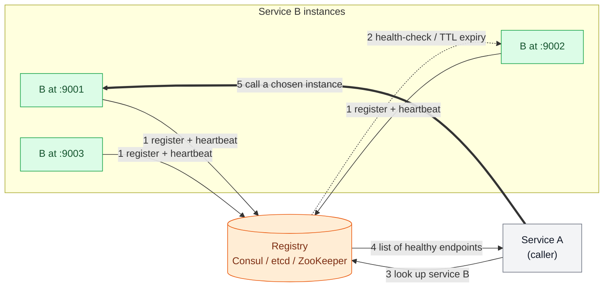

# Service Discovery & Mesh

> **Prerequisites:** [Load Balancing & Gateways](/synapse/system-design-from-first-principles/building-blocks/load-balancing-and-gateways), [Consensus & Coordination](/synapse/system-design-from-first-principles/distributed-data/consensus-and-coordination) | **You'll be able to:** explain how a service finds a healthy instance of another service without hardcoding addresses; choose between client-side and server-side discovery and defend the pick; and say when a service mesh earns its keep and when it is expensive ceremony.

## The problem (why this exists)

Two services, A and B. A needs to call B. The most obvious thing in the world is to write B's address into A's config: `http://10.0.3.14:9001`. It works on your laptop, it works in the demo, and it survives roughly until the first time anything real happens.

Then the real things happen. Autoscaling doubles B's fleet at 9 a.m. and halves it at midnight, so most of B's instances didn't exist when A was deployed. A rolling deploy of B replaces every instance with a new one on a new IP over the course of ten minutes. An instance crashes and Kubernetes reschedules it onto a different node with a different address. A cloud VM is reclaimed and its replacement comes up somewhere else. In a modern deployment the set of addresses where B is reachable is not a fact you can write down — it is a *live quantity* that changes by the minute, and every one of those changes silently invalidates the address baked into A.

DDIA names this exactly: a client must know its service's address — the **service discovery** problem — and the simplest approach of configuring a fixed IP and port breaks the moment the server moves, goes offline, or is overloaded, requiring manual reconfiguration [p. 184]. Manual reconfiguration at 3 a.m., across dozens of callers, while an incident is in progress, is not a plan. What A actually needs is to stop asking "what is B's address?" — a question with no stable answer — and start asking "*where is a healthy instance of B, right now?*" That question has an answer, but only if something is keeping track. This lesson is about that something: the registry that always knows, the health-check loop that keeps it honest, the two architectures for consulting it, and the heavyweight option — a service mesh — that pushes all of it, plus encryption and retries and metrics, out of your code and into a proxy riding shotgun next to every service.

## Intuition first

Forget servers for a second. You've moved to a new city and you need a plumber. You could memorize one plumber's phone number — but plumbers retire, change numbers, go on holiday, or simply don't pick up. Memorizing one number is the hardcoded IP. What you actually do is consult a *directory*: a listing that someone keeps current, where plumbers add themselves, dead entries eventually fall off, and you get back whoever is available now. You look up the category, not the individual.

Service discovery is that directory for programs. Instead of one endpoint dialing another by a fixed address, every instance of B, when it starts, **registers** itself in a directory — "I am an instance of service B, reachable at this IP and port" — and periodically proves it's still alive. When A wants to call B, it asks the directory "give me healthy instances of B" and gets back a current list. B's fleet can churn all it likes; the directory absorbs the churn, and A only ever depends on the *name* "service B," never on an address.

Two design questions fall straight out of that picture, and they define the whole lesson. First: **who does the looking-up?** Either A queries the directory itself and picks an instance (client-side), or A dials a single stable front door and something behind it consults the directory on A's behalf (server-side). Second, once you've solved discovery, you notice A also wants to *retry* failed calls, *time them out*, *encrypt* them, and *measure* them — and so does every other service. A **service mesh** is what you get when you stop making each service reimplement that list and instead run a little proxy next to every service that does all of it uniformly. Discovery first; the mesh is the maximal version of the same idea.

## How it works

### The registry and the health-check loop

At the center of service discovery sits a **registry**: a store whose whole job is to hold "which instances of which services are up, and where." DDIA describes it precisely — a centralized registry where instances register host and port plus metadata (shard ownership, datacenter) and send heartbeats; clients query for available endpoints, then connect directly [p. 185]. The canonical implementations are the coordination services from the [Consensus & Coordination](/synapse/system-design-from-first-principles/distributed-data/consensus-and-coordination) lesson — Apache ZooKeeper, etcd, and HashiCorp Consul — which are already built to hold small, slow-changing, disk-durable data replicated by consensus [p. 438].

Four things happen in a continuous loop:



**Register.** When an instance of B boots, it announces itself to the registry with its address and metadata. In a coordination service this is naturally an **ephemeral** entry — a ZooKeeper ephemeral node tied to the client's session, which is auto-released the moment the client's heartbeat lapses [p. 438]. Registration can be *self-registration* (the app calls the registry API on startup) or done by a *sidecar agent* — Consul, for instance, runs an agent on each node that registers the local services and owns their health checks [web: HashiCorp Consul docs].

**Health-check.** A dead instance still listed in the registry is worse than useless: it draws traffic into a black hole. So the registry must continuously distinguish live from dead. Two mechanisms, often combined. *Heartbeat / TTL*: the instance must renew its registration within a time-to-live window; miss the window and the entry expires — this is exactly the ZooKeeper session-heartbeat model where a lease survives brief interruptions but is released once no heartbeat arrives before the timeout [p. 438]. *Active probing*: the registry (or its agent) periodically hits a `/health` endpoint on the instance and marks it unhealthy on failure — Consul supports HTTP, TCP, and script checks this way [web: HashiCorp Consul docs]. Heartbeats catch a *vanished* process; active probes catch a process that is *running but broken* (deadlocked, out of DB connections, disk full) — a distinction we'll return to in [Observability](/synapse/system-design-from-first-principles/production-engineering/observability).

**Look up.** When A needs B, it asks the registry for the current healthy set. Crucially, this read does **not** need to be linearizable. DDIA is explicit: service discovery usually doesn't need strong consistency, so it's better to cache — bypass the cache and retry on failure, refresh on a TTL, DNS-style — and ZooKeeper *observers* exist precisely to serve possibly-stale, non-linearizable, highly-available reads without joining the consensus vote, boosting read throughput [p. 440]. A momentarily-stale endpoint list is fine because the caller retries; paying for a quorum read on every lookup is not [p. 442].

**Call.** A picks an instance and issues the request directly. Because the network is involved, the call is not a local function call — it may be lost, time out with an unknown outcome, or hit a slow node, so retries are mandatory and any retried operation must be [idempotent](/synapse/system-design-from-first-principles/patterns/idempotency-and-exactly-once) to avoid double-execution [p. 183].

### Client-side vs server-side discovery

The loop above is *client-side discovery*: A talks to the registry and load-balances across the returned instances itself. The alternative moves both jobs behind a stable front door.

In **server-side discovery**, A doesn't know the registry exists. It sends every request for B to a single stable address — a load balancer, or a virtual IP — and *that* component queries the registry and forwards to a healthy instance. This is the [load balancer](/synapse/system-design-from-first-principles/building-blocks/load-balancing-and-gateways) model extended with a registry feed: the LB's backend pool is populated dynamically instead of by hand. Kubernetes is the ubiquitous example — a `Service` gives you one stable virtual IP and DNS name, and the platform (kube-proxy / the CNI dataplane, with endpoints kept current as pods come and go) routes each connection to a live pod; the calling code just uses the service name [web: Kubernetes docs].

**DNS-based discovery** is the oldest server-side flavor and deserves its own warning. DNS supports load balancing by returning multiple IPs for a name, with the client's network layer picking one [p. 185]. It's universal and requires zero client library. But DNS was built for a slow-changing internet, and its Achilles' heel is caching: DNS propagates changes slowly and caches entries at every layer (resolver, OS, language runtime, connection pool), so frequently-changing servers can leave clients pointing at stale IPs long after an instance is gone [p. 185]. TTLs mitigate this only in theory — many clients ignore short TTLs, JVMs historically cached DNS forever, and connection pools resolve once at startup and never again. Discovery systems like Consul expose a DNS interface *and* set aggressive TTLs to fight this [web: HashiCorp Consul docs], but DNS remains a leaky fit for fleets that churn by the second.

The trade-off between the two architectures is the heart of the lesson:

<div style="border-left:4px solid #15448e;background:rgba(21,68,142,0.08);padding:0.6rem 1rem;border-radius:0 0.5rem 0.5rem 0;margin:1.25rem 0">

**Rule of thumb, not from source:** if you already run Kubernetes, you are already doing server-side discovery — the platform hands it to you. Reach for a client-side library only when you need routing decisions the platform LB can't make (locality-aware balancing, request-level retries across instances, custom weighting).

</div>

### The service mesh: pull the cross-cutting concerns into a sidecar

Client-side discovery has a hidden tax. To do it well, A's process must contain a discovery client, a load-balancing algorithm, retry logic, timeout logic, circuit breaking, TLS handling, and metrics emission. Now multiply that by every service *and* every language in your company. The Java team's retry logic and the Go team's retry logic drift apart; a mesh-wide policy change means twelve libraries and twelve redeploys. These are **cross-cutting concerns** — identical for every service, owned by none.

A **service mesh** extracts all of it. DDIA frames the mesh as combining software load balancers and service discovery, deployed as an in-process library or — more commonly — a **sidecar** container running alongside both client and server, so traffic routes through local connections; this lets connection encryption be handled at the proxy level, shielding apps from TLS complexity, and gives sophisticated observability into which services call which, their failures, and their load [pp. 185–186].

```d2
direction: down
classes: {
  client: {style: {fill: "#f3f4f6"; stroke: "#6b7280"}}
  edge: {style: {fill: "#dbeafe"; stroke: "#2563eb"}}
  svc: {style: {fill: "#dcfce7"; stroke: "#16a34a"}}
  data: {style: {fill: "#ffedd5"; stroke: "#ea580c"}}
}

control: "Control plane (istiod / Linkerd controller)" {
  class: edge
}

podA: "Pod A" {
  appA: "Service A" {class: svc}
  proxyA: "Sidecar proxy (Envoy)" {class: edge}
  appA -> proxyA: "localhost"
}

podB: "Pod B" {
  appB: "Service B" {class: svc}
  proxyB: "Sidecar proxy (Envoy)" {class: edge}
  proxyB -> appB: "localhost"
}

proxyA -> proxyB: "mTLS: retries, timeouts, metrics"
control -> proxyA: "policy + certs + endpoints"
control -> proxyB: "policy + certs + endpoints"
```

The architecture splits in two. The **data plane** is the fleet of sidecar proxies — most commonly **Envoy**, a high-performance L7 proxy — one per pod, that intercept all inbound and outbound traffic. Service A's outbound call goes to *its own* sidecar over localhost; that sidecar does discovery, load-balances, retries, opens an mTLS tunnel to B's sidecar, records the metrics, and delivers to B over localhost. Neither application has a line of code about any of it [web: Envoy docs]. The **control plane** — Istio's `istiod`, or Linkerd's controller — is the brain: it watches the platform's registry, computes routing and security policy, mints the certificates for mTLS, and pushes configuration down to every sidecar [web: Istio docs]. (Linkerd notably ships its own lightweight Rust "micro-proxy" instead of Envoy, trading Envoy's configurability for a smaller resource footprint [web: Linkerd docs].)

What the mesh buys you, uniformly and language-agnostically: **mutual TLS** between every pair of services (identity and encryption for zero-trust networking) [web: Istio docs]; **resilience** — retries, timeouts, circuit breaking, and outlier detection that ejects a misbehaving instance [web: Envoy docs]; **traffic shaping** — weighted splits for canary and blue-green [deploys](/synapse/system-design-from-first-principles/production-engineering/deployment-strategies), fault injection for testing; and **observability** — golden-signal metrics, distributed-trace propagation, and a live topology of who-calls-whom, for free at the proxy [web: Envoy docs]. That last item is why a mesh and your [observability](/synapse/system-design-from-first-principles/production-engineering/observability) stack are natural partners.

The cost is equally concrete, and the next sections are about not kidding yourself about it.

## Trade-offs

| Dimension | Client-side discovery | Server-side discovery |
| --- | --- | --- |
| Who queries the registry | The caller's own process (a library) | A load balancer / platform in front of the pool |
| Load-balancing logic | In every client, every language | Centralized in one component |
| Extra network hop | No — caller connects directly to the instance | Yes — through the LB / virtual IP |
| Client complexity | High (discovery + LB + retries baked in) | Low (just dial one stable name) |
| Smart routing (locality, weighting, per-request retry) | Easy — client sees all instances + metadata | Limited to what the LB supports |
| Polyglot fleets | Painful — reimplement the library per language | Free — logic lives outside the app |
| Canonical example | Netflix Eureka + Ribbon (classic), gRPC client-side LB | Kubernetes Services, AWS ELB target groups, DNS |

The mesh is a third position that resolves the tension: it gives client-side's smart per-request routing *without* baking anything into the app, by moving the "client" into a sidecar. You pay for that with the mesh's own cost:

| | No mesh (libraries or platform LB) | Service mesh (sidecar per pod) |
| --- | --- | --- |
| Per-call latency | One hop | Two extra proxy hops (out of A, into B) |
| Resource overhead | None beyond the app | A proxy container's CPU/memory *per pod* |
| Cross-cutting features | Reimplemented per service/language | Uniform, config-driven, language-agnostic |
| Operational complexity | Low | High — a control plane to run, upgrade, debug |
| mTLS everywhere | Hand-rolled or absent | Built in |
| Earns its keep when | Few services, one or two languages | Many services, polyglot, zero-trust + rich traffic control needed |

## Numbers that matter

A few figures anchor the decision. The registry itself is a coordination service and runs on a **fixed small cluster of 3 or 5 nodes** regardless of how many services it tracks — 3 tolerates one failure, 5 tolerates two [pp. 439–440]. Do not scale it with your fleet; its data (endpoints, leadership) changes over seconds-to-minutes, not milliseconds [p. 439]. Registry *reads*, being cache-friendly and non-linearizable, can be fanned out cheaply to observers or local caches [p. 440]; registry *writes* and any linearizable read pay a quorum round-trip, which is expensive across regions [p. 442] — a reason to keep the registry regional and the write rate low.

For the mesh, the number that decides adoption is the **sidecar tax**: two additional proxy hops on every inter-service call (leaving A, entering B), plus a proxy container's memory and CPU multiplied across *every* pod in the fleet. On a hot path measured in single-digit milliseconds, a per-hop proxy latency of even a few hundred microseconds is a real percentage; across thousands of pods, the aggregate proxy memory is a real bill. These figures move with proxy, version, and config, so measure them in *your* cluster rather than trusting a blog — `Rule of thumb, not from source:` treat the mesh's latency and memory overhead as a line item you must benchmark before committing, not a rounding error. For back-of-envelope discipline on hops and percentiles, see [Latency, Throughput & Percentiles](/synapse/system-design-from-first-principles/foundations/latency-throughput-percentiles).

## In production

**Kubernetes + CoreDNS** is the default many teams never look past: a `Service` object is server-side discovery, its virtual IP fronts a pool the platform keeps current from pod lifecycle events, and `CoreDNS` resolves the service name in-cluster [web: Kubernetes docs]. For a large fraction of systems this *is* the whole answer — no separate registry, no mesh.

**HashiCorp Consul** is the standalone registry of choice outside or across Kubernetes clusters: agents on each node handle registration and health checks (HTTP/TCP/script), it offers both a DNS interface and an HTTP API for lookups, and it spans multiple datacenters — and it has grown a mesh mode (Consul Connect) on top [web: HashiCorp Consul docs]. **etcd** is the registry beneath Kubernetes itself (Kubernetes stores all cluster state, including endpoints, in etcd) [p. 438], and **ZooKeeper** long served this role for the Hadoop/Kafka world with its ephemeral-node + watch mechanics [p. 438].

**The historical client-side lineage** is worth knowing for interviews: Netflix's **Eureka** (registry) paired with **Ribbon** (client-side LB) defined the pattern for a generation of JVM microservices — every service embedded the discovery client and balanced locally. The industry has largely migrated that logic *out* of applications and into platforms (Kubernetes) and meshes (Istio, Linkerd) precisely to escape the polyglot-library tax [web: Istio docs].

**On the mesh**, the two names to know are **Istio** (Envoy data plane, `istiod` control plane — the feature-rich, more complex option) and **Linkerd** (its own Rust micro-proxy — the lighter, simpler option) [web: Istio docs][web: Linkerd docs]. Both deliver the same core value proposition — mTLS, retries/timeouts, traffic shifting, and uniform telemetry — with the recurring operational lesson from practitioners being that the control plane is itself a distributed system you now have to operate, upgrade, and debug during incidents. The mesh solves the application's cross-cutting problem by handing the platform team a new one.

## Pitfalls & interview traps

<div style="border-left:4px solid #da5233;background:rgba(218,82,51,0.08);padding:0.6rem 1rem;border-radius:0 0.5rem 0.5rem 0;margin:1.25rem 0">

⚠️ **A registry is only as good as its health checking.** The classic outage: an instance dies *hard* (kernel panic, network partition) so it never deregisters, and if health checks are too lax or the TTL too long, its entry lingers and the registry keeps handing that dead address to callers — routing live traffic into a black hole. Stale registry entries routing to dead instances is *the* failure mode of naive discovery. Mitigate with short-enough TTLs, active probing that catches hung-but-registered processes, and client-side retry to a *different* instance on failure — never trust that "listed" means "alive."

</div>

**"Just use DNS."** A tempting interview answer that collapses under one follow-up: *what happens when an instance dies?* DNS caching at the resolver, OS, runtime, and connection-pool layers means clients keep dialing the dead IP well past the TTL [p. 185]. DNS is a fine coarse-grained discovery mechanism for slow-changing endpoints; it is a poor fit for a fleet that churns every few seconds.

**Making the registry strongly consistent.** Reaching for linearizable reads on every lookup is over-engineering — discovery tolerates staleness because callers retry, so cache aggressively and use highly-available (possibly-stale) reads [p. 440]. Conversely, don't run consensus over your whole fleet: the registry is a *small* dedicated cluster (3–5 nodes), not a node on every machine [pp. 439–440].

**Reaching for a mesh too early.** The trap the prompt exists to warn against: standing up Istio for a **three-service system** is almost always a net loss. You inherit a control plane to operate, a proxy per pod to resource and debug, and two extra hops on every call — to solve cross-cutting problems you barely have at three services. A mesh earns its keep when the service count and language diversity make per-library reimplementation genuinely painful, and when you specifically need fleet-wide mTLS or rich traffic control [p. 186]. DDIA's own guidance is that the choice depends on need — dynamic Kubernetes environments often warrant a mesh; specialized infrastructure may want purpose-built LBs; and *simpler deployments are best served by plain software load balancers* [p. 186]. "When does a mesh earn its keep?" is a favorite question precisely because the correct answer is usually "later than you think."

**Sidecar startup ordering.** A subtle production bug: if the app container starts before its sidecar is ready, its early outbound calls fail because there's no proxy to route them yet — a race that has burned many mesh adopters and is fixed with startup ordering / holds at the platform level [web: Istio docs].

## Check yourself

```quiz
{"prompt": "In client-side service discovery, which component decides which specific instance of service B a request goes to?", "options": ["A dedicated load balancer sitting in front of B's pool", "The caller (service A) itself, using the instance list it fetched from the registry", "The registry, which forwards the request to a chosen instance", "DNS, by returning a single IP"], "answer": "The caller (service A) itself, using the instance list it fetched from the registry"}
```

```quiz
{"prompt": "Your fleet autoscales constantly and instances are replaced every few minutes. Why is plain DNS-based discovery risky here?", "options": ["DNS cannot return more than one IP for a name", "DNS requires a consensus quorum on every lookup", "Caching at resolver/OS/runtime/pool layers means clients keep using stale IPs after an instance is gone", "DNS only works inside Kubernetes"], "answer": "Caching at resolver/OS/runtime/pool layers means clients keep using stale IPs after an instance is gone"}
```

```quiz
{"prompt": "A startup runs three backend services, all in Go, on Kubernetes. They want to add Istio 'for best practices.' What is the strongest reason to hold off?", "options": ["Istio does not support Go services", "The cross-cutting-concern problem a mesh solves is minimal at three same-language services, while the mesh adds a control plane, a proxy per pod, and two hops per call", "A mesh removes the need for a registry, which they still need", "Kubernetes cannot run a service mesh"], "answer": "The cross-cutting-concern problem a mesh solves is minimal at three same-language services, while the mesh adds a control plane, a proxy per pod, and two hops per call"}
```

```quiz
{"prompt": "Why is it acceptable for a service-discovery lookup to return a slightly stale list of endpoints, rather than a linearizable one?", "options": ["Because instances never actually change address", "Because the caller retries against another instance on failure, so occasional staleness is cheap to absorb — while a quorum read on every lookup is expensive", "Because staleness is impossible in a registry", "Because linearizable reads are not supported by any registry"], "answer": "Because the caller retries against another instance on failure, so occasional staleness is cheap to absorb — while a quorum read on every lookup is expensive"}
```

<details>
<summary>Client-side vs server-side discovery for a polyglot fleet (Java, Go, Python, Node) — which fits better and why?</summary>

**Server-side** (or a mesh) fits better. Client-side discovery pushes the discovery client, load-balancing algorithm, and retry/timeout logic *into every service*, which means maintaining that library in four languages and keeping the four implementations behaviorally consistent. Server-side discovery keeps that logic in one component (a platform LB or virtual IP) so every language just dials a stable name. A service mesh is the natural endgame: it gives client-side's smart per-request routing while keeping the logic out of the apps by relocating it into a language-agnostic sidecar — which is exactly why meshes are most attractive to large, polyglot organizations.

</details>

<details>
<summary>An instance suffers a kernel panic and drops off the network without deregistering. Trace what the registry and callers do — and what prevents traffic from black-holing.</summary>

The dead instance never sends a deregister call, so the registry cannot rely on graceful shutdown. Two safety nets catch it. (1) **Heartbeat/TTL:** the instance stops renewing its lease, and once no heartbeat arrives within the TTL, the registry expires its entry (a ZooKeeper ephemeral node auto-releases when the session times out [p. 438]). (2) **Active health checks:** the registry's probe to the instance's `/health` endpoint fails and marks it unhealthy before or independently of TTL expiry. In the gap between the panic and the entry's removal, callers may still receive the dead address — which is why **client-side retry to a different instance** is the final backstop: the call fails fast, the caller retries another endpoint, and the request succeeds. The lesson: short TTLs and active probing shrink the black-hole window, and retries cover what's left.

</details>

## Sources

DDIA2 ch. 5 pp. 184–186 (load balancers, service discovery, service meshes; RPC network unpredictability p. 183) · DDIA2 ch. 10 pp. 438–440, 442 (coordination services as the registry backbone: ephemeral nodes, heartbeats, observers/stale reads, 3–5 node clusters, quorum cost) · [web: HashiCorp Consul docs — agents, health checks (HTTP/TCP/script), DNS interface, multi-datacenter] · [web: Kubernetes docs — Services, virtual IPs, endpoints, CoreDNS] · [web: Envoy docs — L7 sidecar proxy, retries/timeouts/circuit breaking/outlier detection, telemetry] · [web: Istio docs — istiod control plane, mTLS, traffic shifting, sidecar injection/ordering] · [web: Linkerd docs — Rust micro-proxy data plane]
