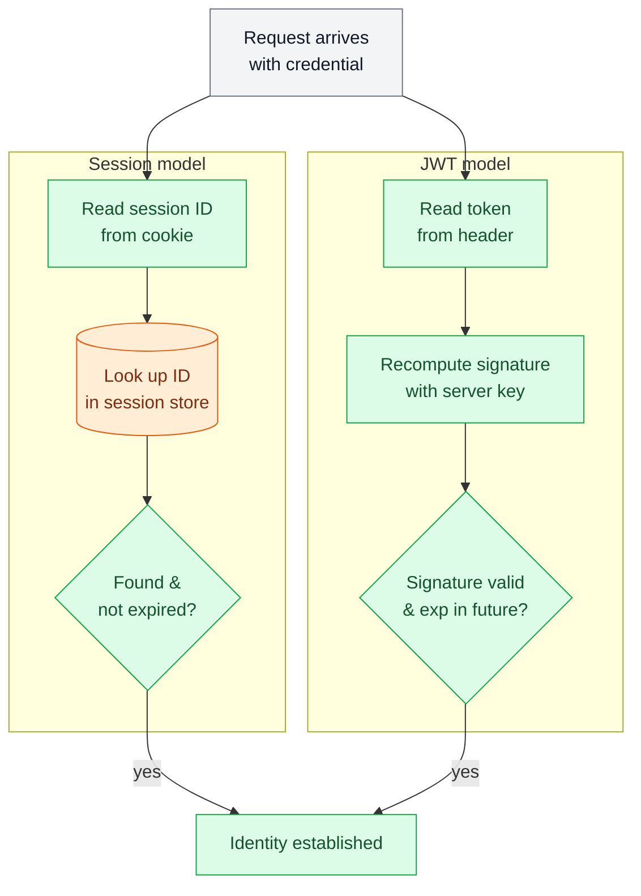
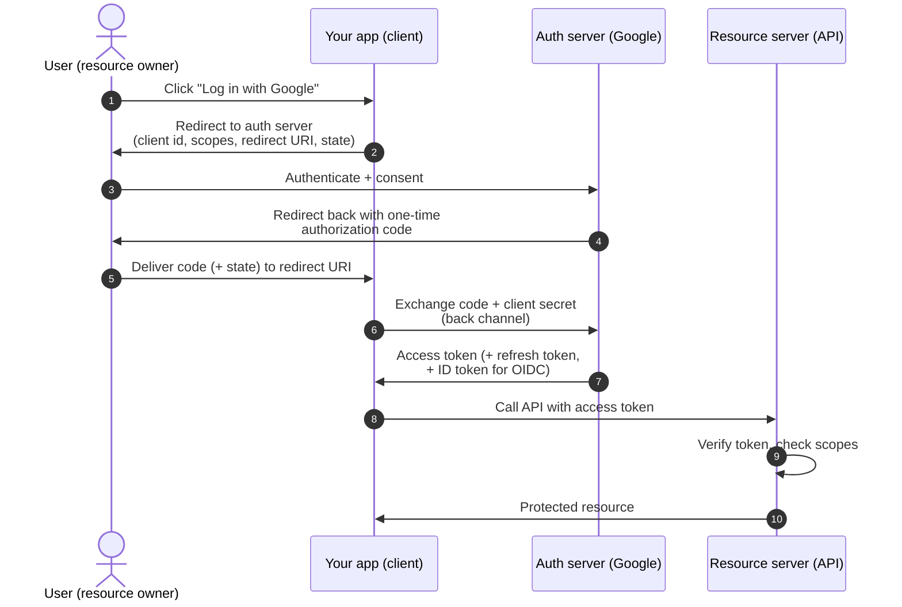

# Authentication & Authorization

> **Prerequisites:** [API Design](/synapse/system-design-from-first-principles/foundations/api-design), [Networking Essentials](/synapse/system-design-from-first-principles/foundations/networking-essentials) | **You'll be able to:** keep authentication and authorization as two separate design decisions; choose between server-side sessions and JWTs and defend the revocation trade-off; and reason about where an access check belongs — gateway, service, or between services.

## The problem (why this exists)

HTTP has no memory. Each request arrives at your server as a fresh stranger — the protocol was designed to be stateless, so nothing in a raw `GET /account` tells the server *whose* account this is or whether the caller is even allowed to see it. If you do nothing, every endpoint is wide open to the entire internet.

The naive fix is to attach a username and password to every request. That "works" for one afternoon, then reality arrives in three waves. First, sending the password on every call copies it into logs, proxies, and crash reports a hundred times a day — one leak and the account is gone, because unlike a session the password can't be quietly rotated behind the user's back. Second, you've conflated two different questions: *who is this?* and *what may they do?* A valid login does not mean the caller may delete another user's post. Third, you have no way to let a user log in with Google without handing Google's password to your server — which no one should ever do.

So the real problem splits cleanly in two, and keeping them split is the whole discipline of this lesson:

- **Authentication (authN)** — *proving who you are.* The system takes a credential and decides: this request belongs to user 12345, and I believe it.
- **Authorization (authZ)** — *deciding what you may do.* Given that you are user 12345, may you read this document, delete this order, hit this admin endpoint?

AuthN happens first and once; authZ happens on every protected action. Confusing them causes a huge fraction of real breaches — a system that authenticates flawlessly but authorizes carelessly will happily let a logged-in attacker read everyone else's data.

## Intuition first

Picture a members' club with a cloakroom.

**Authentication is the front door.** You show ID once. The doorman doesn't want to re-check your passport every time you cross a room, so he hands you a numbered coat-check ticket and writes your name next to that number in a ledger behind the desk. From then on you just flash the ticket. That ticket is a **session**: the proof lives on the *server* (the ledger), and you carry only a meaningless number.

There's a second style of ticket. Instead of a bare number, the doorman hands you a **sealed, tamper-proof card** that says "Bearer: Alice, Member, expires 9 PM," stamped with a wax seal only the club owns. Now any staff member can read the card and verify the seal *without walking back to the ledger*. That sealed card is a **token** — a JWT. The proof is self-contained; the club keeps no per-guest record.

The trade jumps out immediately. The ledger (session) can be crossed out the instant someone is thrown out — revocation is trivial, but every check costs a walk to the desk. The sealed card (JWT) needs no desk at all — but once handed out, it's valid until it expires, and there is no ledger entry to cross out. That single tension — **statelessly verifiable vs. instantly revocable** — is the through-line of everything below.

**Authorization is separate from all of this.** The ticket only says *who* you are. Whether you may enter the VIP lounge is a different rule the club applies *after* reading your ticket — and it belongs to the club, never to the ticket-holder. A guest who could grant themselves VIP access by editing their own card is exactly the bug we spend the back half of this lesson avoiding.

Hold onto three sentences: authN proves identity, authZ grants access, and a JWT is a signed "you are X" anyone can verify without a database — at the cost of not being able to tear it up early.

## How it works

### AuthN, part 1: passwords done right

Before any session or token exists, the user proves identity once — usually with a password. The single rule that matters at the design level: **you never store the password.** You store a value derived from it, so that a stolen database does not hand the attacker every account.

Store a **salted hash**. Hashing turns the password into a fixed fingerprint that can't be reversed; the salt is a unique random value mixed in per user so two people with the same password get different fingerprints and precomputed lookup tables are useless. Critically, use a **slow, purpose-built password hashing function** — bcrypt, scrypt, or Argon2 — *not* a fast general hash like SHA-256. The slowness is deliberate: it makes guessing at scale expensive `[web: OWASP Password Storage Cheat Sheet]`. Argon2 (specifically Argon2id) is the current first choice, with bcrypt a widely deployed and still-acceptable option `[web: OWASP Password Storage Cheat Sheet]`. To check a login you hash the submitted password with the stored salt and compare — the plaintext is never persisted anywhere.

<div style="border-left:4px solid #15448e;background:rgba(21,68,142,0.08);padding:0.6rem 1rem;border-radius:0 0.5rem 0.5rem 0;margin:1.25rem 0">

**Definition — salt vs. pepper vs. hash.** The *hash* is the one-way fingerprint. The *salt* is a unique, non-secret random value stored alongside each hash to defeat precomputation. (A *pepper* is an optional secret added to all hashes and kept outside the database.) Exact parameter choices — cost factors, memory sizes — are security-sensitive and change over time; treat published OWASP guidance as the source, not this lesson `[web: OWASP Password Storage Cheat Sheet]`.

</div>

Once identity is proven this once, we don't want to re-check the password on every request. That's what sessions and tokens are for.

### AuthN, part 2: sessions vs. tokens

**Server-side sessions.** On successful login the server generates a large random **session ID**, stores a record for it (user id, expiry, maybe roles) in a session store — often Redis or a database — and sends the ID back in a cookie. Each later request carries the cookie; the server looks the ID up, finds the record, and knows who you are. The ID itself is opaque and meaningless — all the truth lives server-side.

**Tokens (JWT).** A JSON Web Token is a self-contained credential in three dot-separated parts — a header, a **payload of claims** (e.g. `sub: 12345`, `role: member`, `exp: <time>`), and a **signature** `[web: RFC 7519]`. The server signs the header+payload with a secret (HMAC) or a private key (RSA/ECDSA). On each request the client sends the token; the server **recomputes the signature** and, if it matches, trusts the claims inside — *no store lookup required*. The claims are only Base64-encoded, not encrypted, so a JWT is readable by anyone; its integrity, not its secrecy, is what the signature protects `[web: RFC 7519]`.

Here is the difference that drives every design decision — how a single request gets verified under each model:



The session path touches a datastore on every request (the orange cylinder); the JWT path is pure local computation. That is the entire scaling argument for JWTs — and, read the other way, the entire revocation argument *against* them, because there is no record to delete.

**The revocation fix: short-lived access + refresh tokens.** Because a signed JWT can't be recalled before it expires, the standard mitigation is to make **access tokens short-lived** (minutes) and pair them with a longer-lived **refresh token** `[web: OAuth 2.0 — RFC 6749]`. The access token does the per-request work statelessly; when it expires the client quietly exchanges the refresh token for a new one. The refresh token *is* checked against server state, so revoking it (on logout, password change, or suspected theft) stops new access tokens from being minted — the blast radius shrinks to the few remaining minutes on the last access token. This is the pragmatic middle ground: near-stateless verification most of the time, a revocation lever where it counts.

### Delegated auth: OAuth 2.0 and OIDC ("Log in with Google")

You want users to sign in with Google without your server ever seeing their Google password. That is **delegated authorization**, and its standard is **OAuth 2.0** `[web: OAuth 2.0 — RFC 6749]`. OAuth was designed to delegate *access* (authorization); **OpenID Connect (OIDC)** is a thin identity layer on top that adds a signed **ID token** so you also learn *who* the user is — i.e. it turns OAuth into a login mechanism `[web: OpenID Connect Core]`.

Four roles: the **resource owner** (the user), the **client** (your app), the **authorization server** (Google's login/consent service), and the **resource server** (the API holding the user's data). The recommended flow for web and mobile apps is the **authorization code flow** — your app never touches the password or handles the user's raw credential; it receives a short-lived *code* that it exchanges, server-to-server, for tokens `[web: OAuth 2.0 — RFC 6749]`.



Two details carry the security. The **authorization code is one-time and short-lived**, and it is exchanged for tokens over a back channel where the client authenticates itself — so intercepting the code in the browser redirect isn't enough to steal tokens `[web: OAuth 2.0 — RFC 6749]`. The **`state` parameter** is an opaque value your app generates and checks on return, defeating cross-site request forgery on the callback `[web: OAuth 2.0 — RFC 6749]`. For public clients that can't hold a secret — mobile apps, SPAs — the flow is hardened with **PKCE**, which binds the code exchange to a proof only the original requester holds `[web: OAuth 2.0 — RFC 6749]`. The scopes requested (e.g. `email`, `calendar.read`) are exactly the authorization boundary — OAuth's original purpose — and the resource server enforces them on every call.

### AuthZ: who may do what

Authentication established *identity*. Authorization decides *permission*, and there are two dominant models.

**RBAC — role-based access control.** Users are assigned **roles** (`viewer`, `editor`, `admin`), roles carry **permissions** (`document:read`, `document:write`), and the check is "does this user's role include the permission this action needs?" It's simple, auditable, and maps to how organizations actually think ("give the new hire the editor role"). It strains when permissions depend on *context* — "editors may edit, but only documents in their own department, and only during business hours" — because you end up minting a combinatorial explosion of hyper-specific roles.

**ABAC — attribute-based access control.** The decision is a **policy** evaluated over **attributes** of the subject, the resource, and the environment: *allow if `user.department == resource.department` and `user.clearance >= resource.classification`*. ABAC expresses fine-grained, contextual rules without role explosion, at the cost of more complex policy evaluation and harder "what can Alice do?" auditing. Real systems frequently blend them — RBAC for coarse structure, attribute conditions for the fine print.

**Where the check lives.** This is the architectural decision. A **coarse** check — is this caller authenticated at all? does the token carry the right audience/scope? — is cheap and belongs at the edge, in the **API gateway** (see [Load Balancing & Gateways](/synapse/system-design-from-first-principles/building-blocks/load-balancing-and-gateways)), so unauthenticated traffic never reaches your services. But **fine-grained, resource-level** authorization — *may Alice edit **this** document?* — needs data only the owning service has (the document's owner, its department), so it belongs **inside the service** that holds the resource. The gateway can't know that Alice doesn't own document 88; the document service can. A common production pattern is: gateway authenticates and does coarse scope checks, each service does its own fine-grained authorization, and a shared policy component (or library) keeps the rules consistent.

### Service-to-service auth

Inside your network, service A calls service B. B still needs to answer "who is calling, and may they?" — the same two questions, one layer down. Two common answers, both tying into the [service mesh](/synapse/system-design-from-first-principles/production-engineering/service-discovery-and-mesh):

- **mTLS (mutual TLS).** Both sides present certificates; each verifies the other's identity cryptographically. The mesh (e.g. a sidecar layer) can issue, rotate, and enforce these certs automatically, giving every service a strong, verifiable identity without application code touching keys.
- **Signed service tokens.** A calling service presents a short-lived signed token (often a JWT with the *service* as the subject) that the callee verifies — the same stateless-verify idea, applied to machines instead of humans.

These connect directly to how services find and trust each other; the mesh is where identity, rotation, and policy for machine-to-machine traffic naturally live. (Conceptually a service token is just [encoded data](/synapse/system-design-from-first-principles/data-foundations/encoding-and-evolution) carried across a boundary and interpreted by the far side — the same evolution and compatibility concerns apply to its claims.)

## Trade-offs

The central choice is session vs. JWT for user authentication. Neither is "modern" or "legacy" — they trade different things.

| Dimension | Server-side session | JWT (access token) |
| --- | --- | --- |
| **State** | Stateful — server keeps a per-session record | Stateless — nothing stored; claims live in the token |
| **Revocation** | Instant — delete the record and it's dead | Hard — valid until `exp`; needs a denylist or short TTL + refresh to approximate |
| **Scale / verification cost** | A store lookup per request (network hop; shared store can bottleneck) | Local signature check; no lookup, easy to scale horizontally |
| **Size on the wire** | Tiny opaque ID | Larger — carries claims on every request |
| **Cross-domain / mobile / SPA** | Cookie-bound; extra work across domains | Portable — send in an `Authorization` header anywhere |
| **Use when** | You need immediate logout/ban, sensitive actions, simpler mental model, single trust domain | Many services must verify independently, you want stateless scaling, or you're already doing OAuth/OIDC |

A practical reading: default to **sessions** for a classic web app in one trust domain where instant revocation matters; reach for **JWTs** when independent services must each verify identity without a shared session store, and then *always* pair short-lived access tokens with revocable refresh tokens so you don't lose revocation entirely.

## Numbers that matter

Orientation figures, not law — tune to your threat model and follow current OWASP guidance `[web: OWASP Authentication Cheat Sheet]`.

- **Session ID / token entropy:** enough randomness that guessing is hopeless — think 128 bits of entropy in the identifier `[web: OWASP Session Management Cheat Sheet]`. *Rule of thumb, not from source:* never build a session ID from predictable data like a user id or timestamp.
- **Access token lifetime:** short — commonly on the order of minutes to an hour — so a leaked token self-expires quickly. *Rule of thumb, not from source:* 15 minutes is a frequently used starting point.
- **Refresh token lifetime:** long — days to weeks — but revocable and ideally rotated on each use so a stolen refresh token is detectable.
- **Password hashing cost:** deliberately tuned so a single verify takes a meaningful fraction of a second on your hardware — fast enough for a login, slow enough to make mass guessing expensive `[web: OWASP Password Storage Cheat Sheet]`.
- **Session store capacity:** at N concurrent users it holds ~N small records and takes one read per request — size it like any hot cache; see [Estimation & Numbers](/synapse/system-design-from-first-principles/foundations/estimation-and-numbers) and [Caching](/synapse/system-design-from-first-principles/building-blocks/caching).

## In production

Real systems rarely pick one model and stop. The common shape at scale is a **hybrid**: a login exchange (often OAuth/OIDC against an identity provider — Okta, Auth0, Google, Azure AD) issues a short-lived access token plus a refresh token; the access token is verified statelessly at the edge and inside services, while the refresh token — the revocable half — is checked against server state on renewal. Logout, password change, and "sign out everywhere" all work by invalidating refresh tokens and, where instant kill is required, consulting a small **token denylist** during access-token verification (reintroducing a little state exactly where revocation demands it).

The access check itself is increasingly pulled out of application code into **dedicated policy engines** — systems like Open Policy Agent let teams express authorization as versioned, testable policy rather than scattering `if user.role == ...` across services `[web: OWASP Authorization Cheat Sheet]`. Google's published "BeyondCorp" model pushes authorization to a per-request policy decision instead of trusting the network perimeter `[web: Google BeyondCorp]`.

For service-to-service traffic, **mTLS via a service mesh** is the production-standard way to give every workload a rotating cryptographic identity, so "which service is calling" is answered by the infrastructure, not by hand-rolled secrets. When it breaks it shows up in [observability](/synapse/system-design-from-first-principles/production-engineering/observability) as auth-failure spikes — which is why cert rotation and token expiry are first-class operational events, coordinated with your [deployment strategy](/synapse/system-design-from-first-principles/production-engineering/deployment-strategies).

## Pitfalls & interview traps

<div style="border-left:4px solid #da5233;background:rgba(218,82,51,0.08);padding:0.6rem 1rem;border-radius:0 0.5rem 0.5rem 0;margin:1.25rem 0">

⚠️ **The three that sink candidates.** *(1) "Just use JWTs everywhere"* — then the interviewer asks "how do you log someone out immediately?" and you have no answer, because a signed token can't be recalled before `exp`. Always have the short-TTL-plus-refresh (or denylist) story ready. *(2) Authorizing only in the client* — hiding an admin button in the UI is not authorization; the server must re-check every action, because anyone can call your API directly. *(3) Storing tokens insecurely* — a token in browser `localStorage` is readable by any injected script (XSS); sensitive credentials belong in protections like `HttpOnly`, `Secure` cookies, and you should never place tokens in URLs, where they leak into logs and referrers `[web: OWASP Authentication Cheat Sheet]`.

</div>

A few more that separate a senior answer from a junior one:

- **Conflating authN and authZ.** "The user is logged in" does not mean "the user may do this." Keep them as two sentences in your design, always. A logged-in user reading someone else's record is an authorization failure, not an authentication one.
- **Trusting JWT claims blindly.** The signature must actually be verified, with an algorithm you pin — historic vulnerabilities came from accepting a token that declared its own algorithm as "none" or downgraded RSA to HMAC. Verify integrity before trusting a single claim `[web: RFC 7519]`.
- **Missing scope checks.** A resource server must check that the token's *scope/audience* permits this call, not merely that it's validly signed. A valid token for a different purpose is not a blank check.
- **Fine-grained authZ at the gateway.** The gateway can't know Alice doesn't own document 88 — resource-level checks belong in the service that holds the resource.
- **Long-lived, non-rotating refresh tokens.** These become the real crown jewels; rotate them and treat reuse of an old one as a theft signal.

## Check yourself

```quiz
{"prompt": "A user clicks \"Log out\" and expects to be signed out instantly on all devices. Your system authenticates every request with a stateless, signed JWT access token (30-minute expiry) and nothing else. What actually happens?", "options": ["The user is signed out immediately everywhere, because logout deletes the token on the server", "Existing access tokens keep working until they expire (up to 30 minutes), because a signed JWT can't be recalled before exp", "The user can never be signed out, since JWTs never expire", "Logout fails with an error, because JWTs don't support logout at all"], "answer": "Existing access tokens keep working until they expire (up to 30 minutes), because a signed JWT can't be recalled before exp"}
```

```quiz
{"prompt": "Which statement correctly separates authentication from authorization?", "options": ["Authentication decides what you may do; authorization proves who you are", "Authentication proves who you are; authorization decides what you may do", "They are the same check performed twice for safety", "Authorization happens once at login; authentication happens on every request"], "answer": "Authentication proves who you are; authorization decides what you may do"}
```

```quiz
{"prompt": "You need many independent services to each verify a user's identity without sharing a central session store, but you must still support near-immediate logout. Which design best fits?", "options": ["Long-lived JWTs only, so every service verifies locally forever", "Server-side sessions in a single shared store that every service queries on every request", "Short-lived JWT access tokens for stateless per-service verification, paired with revocable refresh tokens for logout", "Send the username and password on every request so each service can re-check the password"], "answer": "Short-lived JWT access tokens for stateless per-service verification, paired with revocable refresh tokens for logout"}
```

```quiz
{"prompt": "In the OAuth 2.0 authorization-code flow for \"Log in with Google,\" why does your app receive a one-time authorization code in the browser redirect rather than the access token directly?", "options": ["Because the code is exchanged for tokens over a back channel where the client authenticates, so intercepting the redirect alone can't steal tokens", "Because access tokens are too large to fit in a URL", "Because Google's servers cannot issue tokens directly", "Because the code is the access token, just renamed"], "answer": "Because the code is exchanged for tokens over a back channel where the client authenticates, so intercepting the redirect alone can't steal tokens"}
```

<details>
<summary>Where should a coarse "is this request authenticated?" check live versus a fine-grained "may Alice edit *this* document?" check, and why?</summary>

The coarse check belongs at the **API gateway / edge**: it needs only the token itself (valid signature, right audience/scope, not expired), it's cheap, and rejecting unauthenticated traffic there keeps it off your services entirely. The fine-grained check belongs **inside the service that owns the resource**, because deciding whether Alice may edit document 88 requires data only that service holds — the document's owner, department, or state. The gateway has no way to know Alice doesn't own document 88; the document service does. Hence the standard split: authenticate + coarse-authorize at the edge, resource-level authorize in the service.

</details>

<details>
<summary>Your team stores JWTs in browser `localStorage` "so they're easy to attach to API calls." What's the risk, and what's the safer default?</summary>

`localStorage` is readable by any JavaScript running on the page, so a single cross-site-scripting (XSS) injection can exfiltrate the token and impersonate the user. The safer default for browser sessions is to keep the credential in an `HttpOnly`, `Secure`, `SameSite` cookie — `HttpOnly` hides it from scripts, `Secure` restricts it to HTTPS, and `SameSite` limits cross-site sending. You also never put tokens in URLs (they leak into server logs, browser history, and `Referer` headers). Convenience of access is exactly the property an attacker exploits `[web: OWASP Authentication Cheat Sheet]`.

</details>

<details>
<summary>Why is a fast hash like SHA-256 the wrong choice for storing passwords, and what do you use instead?</summary>

Password hashes are attacked by *guessing*: an attacker who steals the database tries billions of candidate passwords, hashing each and comparing. A fast hash lets them try enormous numbers per second. Purpose-built password hashing functions — Argon2id (preferred), scrypt, or bcrypt — are deliberately *slow* and (for Argon2/scrypt) memory-hard, so each guess costs meaningful time and memory, making mass guessing economically painful. Combined with a per-user salt (defeating precomputed tables), this is the standard. Exact cost parameters are security-sensitive and evolve — follow current OWASP guidance rather than hard-coding numbers `[web: OWASP Password Storage Cheat Sheet]`.

</details>

## PoC — Proof of concepts

The standards and the server behind "who are you, and what may you do":

- [OAuth 2.0](https://oauth.net/2/) — the authorization framework (RFC 6749/6750) and OIDC on top of
  it; the primary source for the flows this lesson names.
- [Keycloak](https://github.com/keycloak/keycloak) — a full open-source identity provider (it is the
  one Synapse itself uses): realms, clients, tokens and the authorization-code + PKCE flow, runnable.
- [JWT.io](https://jwt.io/) — decode and inspect a JSON Web Token live; the fastest way to see
  exactly what a bearer token carries and how its signature is checked.

## Sources

- `[web: OAuth 2.0 — RFC 6749]` — the OAuth 2.0 Authorization Framework: roles, the authorization-code flow, `state`, refresh tokens, and PKCE (RFC 7636) hardening for public clients.
- `[web: RFC 7519]` — JSON Web Token (JWT): structure (header/claims/signature), signed claims, and the requirement to verify the signature and pin the algorithm.
- `[web: OpenID Connect Core]` — OIDC identity layer on OAuth 2.0; the ID token that turns delegated authorization into authentication ("Log in with Google").
- `[web: OWASP Authentication Cheat Sheet]` · `[web: OWASP Session Management Cheat Sheet]` · `[web: OWASP Password Storage Cheat Sheet]` · `[web: OWASP Authorization Cheat Sheet]` — defensive practice: session entropy, token storage, salted slow password hashing (Argon2id/bcrypt), and where authorization checks belong.
- `[web: Google BeyondCorp]` — per-request authorization instead of perimeter trust, as a production example of pushing authZ to a policy decision point.
- DDIA2 ch. 5 (encoding & evolution) — a signed service token is encoded data crossing a boundary; the same compatibility concerns apply to its claims (used only as a conceptual link, not for security specifics).
