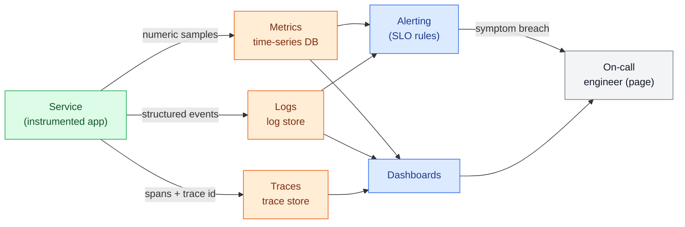
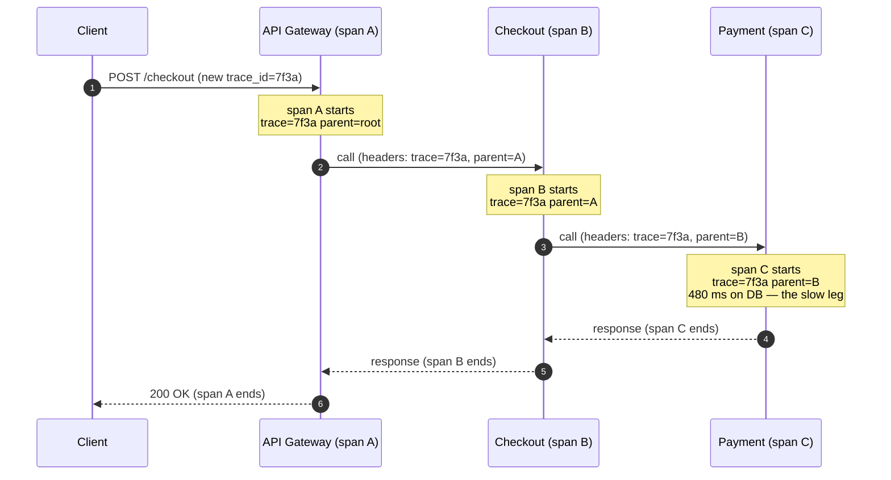

# Observability

> **Prerequisites:** [Latency, Throughput & Percentiles](/synapse/system-design-from-first-principles/foundations/latency-throughput-percentiles), [Nonfunctional Requirements](/synapse/system-design-from-first-principles/foundations/nonfunctional-requirements) | **You'll be able to:** pick the right signal (metric, log, or trace) for a given question; define an SLO with an error budget from percentile targets; and design alerts that page on user-facing symptoms instead of every CPU spike.

## The problem (why this exists)

It is 3 a.m. and checkouts are failing. A dashboard shows the error rate climbing, but the dashboard cannot tell you *why*. Is it the payment service? The database it talks to? A single bad host? A dependency three hops away that started returning slow responses? You have thousands of machines, dozens of services, and a request that touches ten of them before a user ever sees an error. The system is running — you just have no idea what it is doing.

This is the gap **observability** closes. A system is observable when you can answer questions about its internal state *from the outside*, using the data it already emits, **without shipping new code to add a print statement**. The distinction from plain "monitoring" matters: monitoring answers questions you knew to ask in advance ("is CPU above 90%?"); observability lets you ask questions you did *not* anticipate ("why are checkouts from this one region slow only for logged-in users?"). At small scale you can SSH into the one box and read the log. At scale, you cannot — the box is one of thousands, the request spans services owned by different teams, and the failure is intermittent. You need the system to tell you what happened, in a form you can slice and aggregate after the fact.

DDIA frames this as part of **operability** — one of the three pillars of maintainability — and is blunt about the stakes: *"good operations can often work around the limitations of bad (or incomplete) software, but good software cannot run reliably with bad operations"* [DDIA2 p.53]. Monitoring, observability, and predictable behavior are named as concrete things a well-run data system must provide so that operators can keep it healthy [DDIA2 p.54]. You cannot fix what you cannot see.

## Intuition first

Think about diagnosing a car that is behaving strangely. Three kinds of information help, and they trade off against each other.

The **dashboard gauges** — speed, RPM, fuel, temperature — are always on, cheap to read, and perfect for spotting a *trend*: the temperature needle is creeping up. That is a **metric**: a number sampled over time. It tells you *that* something is wrong and roughly where, but not the story.

The **mechanic's notes** — "10:42, heard a knock under load; 10:45, smell of coolant" — are rich, specific, timestamped events. That is a **log**: a discrete record of something that happened, with as much context as you cared to write down. Logs answer "what exactly happened at this moment?" but there is one per event, so at a busy garage the notebook fills fast.

The **GPS trip trace** — the exact route the car took, where it stopped, how long each leg took — is a **trace**: the path of one journey through the whole system, end to end. When a request passes through ten services, a trace is the only signal that shows you the *whole path* and which leg was slow.

The beginner takeaway you should hold onto: **metrics for trends, logs for detail, traces for the path across services.** You reach for a metric to notice a problem and watch it over time; you reach for a log to read the specifics of one event; you reach for a trace to follow one request across service boundaries. These are the **three pillars of observability**, and mature systems emit all three, wired to dashboards you watch and alerts that wake you up.

## How it works

Each pillar is a different shape of data with a different cost profile. Understanding the shape is what lets you choose correctly under pressure.

### Metrics — numbers over time

A **metric** is a numeric measurement recorded as a time series: a name, a value, a timestamp, and a small set of key–value **labels** (or "dimensions") like `service=checkout, region=us-east, status=500`. Because each data point is just a few numbers, metrics are extraordinarily cheap to store and, crucially, cheap to **aggregate** — you can sum, average, or compute a rate across millions of points in milliseconds. This is what makes them the substrate for dashboards and alerts: "requests per second by status code over the last hour" is one fast query. Metrics are typically pre-aggregated at collection into counters (monotonically increasing totals), gauges (a value that goes up and down, like queue depth), and **histograms** (bucketed distributions, the basis for computing percentiles). They live in a purpose-built **time-series database** — the storage engine and its trade-offs are covered in [Specialized Stores](/synapse/system-design-from-first-principles/building-blocks/specialized-stores).

Two disciplines tell you *which* metrics to emit so you are not drowning in noise. The **RED method** — Rate, Errors, Duration — is the request-centric view for any service: how many requests per second, how many are failing, and how long they take (as a latency distribution). The **USE method** — Utilization, Saturation, Errors — is the resource-centric view for anything with finite capacity (CPU, disk, a connection pool): how busy it is, how much work is queued waiting, and its error count [web: Tom Wilkie, "The RED Method"; web: Brendan Gregg, "The USE Method"]. RED tells you the user is suffering; USE often tells you *why*. A service that emits its RED metrics and the USE metrics of its critical resources is diagnosable from its dashboard alone most of the time.

<div style="border-left:4px solid #15448e;background:rgba(21,68,142,0.08);padding:0.6rem 1rem;border-radius:0 0.5rem 0.5rem 0;margin:1.25rem 0">

**Definition — cardinality.** The cardinality of a metric is the number of distinct label combinations it produces. `http_requests{service, region, status}` with 5 services × 4 regions × 6 status codes = 120 time series. Add a `user_id` label with a million users and you have a *million* series per metric — each one separately stored and indexed. High cardinality is the number-one way metrics costs explode.

</div>

### Logs — discrete events with context

A **log** is a record of a single discrete event, emitted at the moment it happens, carrying whatever context the code chose to attach. Where a metric collapses reality to a number, a log preserves the specifics: *this* user, *this* order id, *this* stack trace, *this* downstream error message. That richness is exactly what you need when a metric has told you *that* checkouts are failing and you need to know *why this particular one* did.

The non-negotiable modern practice is **structured logging**: emit each event as a machine-parseable object (JSON key–value pairs) rather than a free-text string. `{"level":"error","order_id":"A1","svc":"payment","err":"timeout","trace_id":"7f3a"}` can be filtered, grouped, and joined by a log store; `"payment failed for order A1"` cannot, without brittle regex. Structured logs are what make a log store queryable at scale.

The catch is **cost at volume**. Every event is stored in full, so log volume scales with traffic, and at high request rates the ingestion, indexing, and storage bill dwarfs that of metrics. The standard lever is **sampling**: keep all error and warning logs (rare and precious), but retain only, say, 1% of successful-request logs (common and largely redundant). Well-designed sampling keeps the signal — you almost always have an example of the failure — while cutting the bill by orders of magnitude.

### Traces — one request across many services

Once you decompose a monolith into [microservices](/synapse/system-design-from-first-principles/production-engineering/service-architecture), a single user action fans out across many independent services, each with its own logs and metrics. A per-service view can no longer answer "where did *this request* spend its time?" — the request's story is scattered across ten machines. **Distributed tracing** reassembles it.

The mechanism rests on two ideas. A **span** represents one unit of work — one service handling one operation — recording a start time, a duration, and metadata (which service, which operation, success or failure). A **trace** is the tree of all spans belonging to one request, linked by a shared **trace id**. When the first service receives the request it generates a trace id; every time it calls a downstream service it **propagates** that trace id (and the current **span id** as the parent) in the request headers. Each service creates its own span under that parent and passes the context further down. The result is a causal tree: you can see that the request spent 12 ms in the gateway, 8 ms in checkout, and then *480 ms* waiting on the payment service's database — the slow leg is now obvious, and you know exactly which team to page.

The industry-standard wire format and instrumentation for this is **OpenTelemetry (OTel)**, which defines how trace context is encoded in headers and propagated across process boundaries, so services written in different languages and owned by different teams still stitch into one coherent trace [web: OpenTelemetry documentation, "Traces" & "Context Propagation"]. Because storing every span of every request is expensive, tracing is almost always **sampled** — either head-based (decide at the entry point, e.g. keep 1%) or tail-based (decide after the request finishes, so you can preferentially keep the slow and failed ones).

The three pillars are not independent silos. The connective tissue is shared identifiers — the same `trace_id` on a log line, a trace, and (as an exemplar) a metric bucket — which lets you pivot from "the p99 latency metric spiked" to "here is a trace of one of those slow requests" to "here is the error log from the span that was slow." That pivot is the daily work of debugging a distributed system.



Here is what a single traced request looks like as it crosses three services, each span nested under the one that called it, all sharing trace id `7f3a`:



### Turning signals into promises: SLI, SLO, error budget

Signals are worthless until you decide what "working" *means* as a number. This is the **SLI / SLO / error-budget** framework, and it is where percentiles from the [latency lesson](/synapse/system-design-from-first-principles/foundations/latency-throughput-percentiles) become operational.

An **SLI** (Service Level *Indicator*) is a metric that measures one aspect of the user's experience — for example, "the fraction of HTTP requests that return a non-error response in under 300 ms." An **SLO** (Service Level *Objective*) is a target for that indicator over a window: "99.9% of valid requests succeed within 300 ms, measured over 28 days." DDIA gives exactly this shape — an SLO might require a median under 200 ms, a p99 under 1 s, and at least 99.9% of valid requests returning non-error responses [DDIA2 p.41–42]. Note *why* the target is a percentile, not an average: the mean hides the tail, and the tail is where your most valuable users often live — Amazon specified internal response-time requirements at the **99.9th percentile** precisely because the slowest requests tend to come from customers with the most data [DDIA2 p.40–41]. An **SLA** (Service Level *Agreement*) is the contract wrapped around an SLO, adding consequences (refunds, credits) if it is missed [DDIA2 p.42]; the SLO is your internal engineering target, usually stricter than the SLA.

The quietly powerful idea is the **error budget**. If your SLO is 99.9% success, then 0.1% of requests are *allowed* to fail — that 0.1% is a budget you get to spend. It reframes reliability from an impossible absolute ("never fail") into a rate you manage. Burn the budget slowly and everything is fine. Burn it fast — a bad deploy torches half of it in an hour — and that is your signal to stop shipping features and stabilize. Because a stable system that never ships is also a failure, the error budget becomes the shared currency between the pressure to release and the need for reliability: while budget remains, ship; when it is exhausted, the release freeze is automatic and not a negotiation [web: Google SRE Book, "Service Level Objectives" & "Embracing Risk"].

## Trade-offs

The three pillars answer different questions at wildly different costs. Choosing the wrong one — a log for a trend, a metric for a one-off detail — is how teams either go blind or blow their budget.

| Pillar | Cost at volume | Cardinality tolerance | Best for |
| --- | --- | --- | --- |
| **Metrics** | Cheapest — pre-aggregated numbers, storage flat in traffic | **Low** — cost explodes with distinct label combinations (per-user labels are fatal) | Trends, dashboards, alerting; "is it broken and by how much, over time?" |
| **Logs** | Expensive — one full record per event, scales with traffic | **High** — arbitrary context per event is the whole point | The specifics of one event; "*why* did this exact request fail?" |
| **Traces** | Expensive — many spans per request; almost always sampled | **High** — rich per-span metadata | The path across services; "*where* did this request spend its time / fail?" |

The practical rule: **detect** with metrics (cheap, always-on, aggregatable), then **diagnose** with traces (find the slow/failing hop) and logs (read the specifics of that hop). Trying to build dashboards out of logs is slow and costly; trying to capture per-request detail in metric labels detonates cardinality. Use each for its shape.

## Numbers that matter

- **Percentiles, not averages.** Quote p50 (typical experience), p99, and sometimes p999 — never the mean, which hides the tail. A p95 of 1.5 s means 5 of every 100 requests take *longer* than 1.5 s [DDIA2 p.40].
- **Tail-latency amplification.** If one backend call has a 1% chance of exceeding your latency budget, a request that fans out to 100 such calls in parallel must wait for the slowest — so roughly **63%** of end-user requests will be slow (1 − 0.99¹⁰⁰). The more services per request, the more the tail dominates — a direct argument for tracing [DDIA2 p.41].
- **Aggregating percentiles.** You cannot average p99s across hosts or minutes — *"averaging percentiles is mathematically meaningless; the right way is to add the histograms"* [DDIA2 p.42]. Emit histograms and aggregate those; approximation structures like t-digest, HdrHistogram, and DDSketch do this efficiently [DDIA2 p.42].
- **The "nines," as a budget.** 99.9% availability = ~43 minutes of allowed downtime per 30-day month; 99.99% = ~4.3 minutes. Each extra nine costs ~10× — the same diminishing-returns curve Amazon hit optimizing the 99.99th percentile, which it found too expensive for the benefit [DDIA2 p.41]. Sizing your SLO is sizing your error budget.
- **Sampling ratios.** Traces and success-logs are commonly kept at ~1%; errors and warnings at 100%. The exact ratio is a knob between cost and the chance you have an example of a rare failure.

## In production

Real systems run all three pillars, wired together, with the SLO framework governing behavior on top.

Google's Site Reliability Engineering practice is the canonical playbook. Its **"Monitoring Distributed Systems"** chapter names **four golden signals** — latency, traffic, errors, and saturation — as the minimum every user-facing system should watch; note the overlap with RED (latency/traffic/errors) plus saturation from USE [web: Google SRE Book, "Monitoring Distributed Systems"]. Its **"Service Level Objectives"** chapter is the source of the error-budget discipline: teams pick an SLO deliberately below 100%, and the budget it implies governs release velocity — spend it and you may ship, exhaust it and you freeze [web: Google SRE Book, "Service Level Objectives"]. The deeper point SRE makes is cultural: reliability is a *product feature you budget for*, not an absolute you promise and then quietly break.

On the tooling side, the ecosystem has largely standardized. **Prometheus** (pull-based metrics scraping with a purpose-built TSDB) plus **Grafana** (dashboards) is the de-facto open-source metrics stack. **OpenTelemetry** has become the vendor-neutral standard for instrumenting all three signals and propagating trace context across service and language boundaries, so you are not locked into one backend [web: OpenTelemetry documentation]. Distributed tracing itself traces its lineage to Google's **Dapper** paper, which introduced the span/trace-id propagation model everything since has followed. Logs commonly land in an Elasticsearch/OpenSearch or Loki store for structured querying.

A concrete pattern worth internalizing: an SLO breach should be measured **on the client side** wherever possible, because that captures queueing and network delays the server never sees — head-of-line blocking means a few slow requests hold up others, and only the client observes the full response time [DDIA2 p.39]. And observability is not free real estate: at large scale the observability pipeline itself becomes a significant system — its own storage, its own cost center, its own failure modes — which is exactly why sampling, cardinality discipline, and retention policies are first-class engineering decisions, not afterthoughts.

## Pitfalls & interview traps

<div style="border-left:4px solid #da5233;background:rgba(218,82,51,0.08);padding:0.6rem 1rem;border-radius:0 0.5rem 0.5rem 0;margin:1.25rem 0">

⚠️ **Alert on symptoms, not causes.** The classic failure is paging a human for every CPU spike, every disk at 80%, every transient blip. A CPU at 95% is not a problem *if users are unaffected* — it might be perfectly healthy batch work. Paging on causes produces **alert fatigue**: engineers drown in noise, learn to ignore the pager, and miss the one alert that mattered. The fix is to page on **user-facing symptoms** — an SLO breach, i.e. the error budget burning too fast — because that is, by definition, the set of things a human urgently needs to fix. Causes belong on dashboards you consult *after* a symptom alert fires, not on the pager [web: Google SRE Book, "Monitoring Distributed Systems"].

</div>

Other traps interviewers probe:

- **High-cardinality metrics.** Putting `user_id`, `request_id`, or a raw URL with path parameters into a metric label multiplies your time-series count without bound and can take down your metrics backend. Those belong in **logs or traces** (which tolerate high cardinality), never in metric labels. If asked "how would you track per-user latency," the answer is traces/logs, not a per-user metric.
- **Averages instead of percentiles.** Saying "average latency is 200 ms" invites the follow-up "and your p99?" A healthy-looking mean routinely hides a brutal tail. Always reason in percentiles, and never average them across sources — add histograms [DDIA2 p.40–42].
- **Confusing the three pillars.** "I'll grep the logs to build a dashboard" (slow, expensive — use metrics) or "I'll add a metric per request id" (cardinality bomb — use traces). Interviewers listen for whether you pick the signal that *fits the question*.
- **Logs without structure or trace ids.** Free-text logs you cannot join to a trace turn debugging into archaeology. Structured logs carrying the `trace_id` are what make the metric → trace → log pivot possible.
- **An SLO of 100%.** Promising perfect reliability leaves no error budget, makes every deploy a bet-the-company event, and is unachievable anyway. The senior answer picks a deliberate target below 100% and manages the budget.

## Check yourself

```quiz
{"prompt": "Checkouts are failing intermittently and you need to know which downstream service in a 6-service request path is causing the slow leg for a specific failing request. Which pillar answers this most directly?", "options": ["Metrics", "Logs", "Traces", "A CPU dashboard"], "answer": "Traces"}
```

```quiz
{"prompt": "Your SLO is 99.9% of requests succeeding, measured over 28 days. A bad deploy this morning caused a spike that consumed 70% of the month's error budget in one hour. What does the error-budget discipline say you should do?", "options": ["Nothing — you are still within the 99.9% SLO for the month", "Halt feature releases and prioritize stabilizing reliability until the budget recovers", "Immediately tighten the SLO to 99.99%", "Delete the alert so it stops paging"], "answer": "Halt feature releases and prioritize stabilizing reliability until the budget recovers"}
```

```quiz
{"prompt": "A teammate proposes adding a `user_id` label (millions of distinct users) to your `http_request_duration` metric so you can chart latency per user. What is the main problem?", "options": ["Metrics cannot store durations", "It creates millions of time series (cardinality explosion), which can overwhelm the metrics backend and cost", "Percentiles cannot be computed from durations", "user_id is not a valid label name"], "answer": "It creates millions of time series (cardinality explosion), which can overwhelm the metrics backend and cost"}
```

```quiz
{"prompt": "Which alerting policy best avoids alert fatigue while still catching real problems?", "options": ["Page on-call whenever any host's CPU exceeds 85%", "Page on-call for every ERROR log line", "Page on-call when a user-facing SLI breaches its SLO (error budget burning too fast); keep cause-level signals on dashboards", "Disable paging and rely on users to report outages"], "answer": "Page on-call when a user-facing SLI breaches its SLO (error budget burning too fast); keep cause-level signals on dashboards"}
```

<details>
<summary>Why is p99 latency, not average latency, the right basis for a latency SLO — and why can't you average p99s across your ten servers?</summary>

The average collapses the whole distribution into one number and is dominated by the many fast requests, so it hides the slow **tail** — yet the tail is what frustrates users, and the slowest requests often come from your most valuable, data-heavy customers (Amazon targets the 99.9th percentile for exactly this reason) [DDIA2 p.40–41]. A percentile like p99 states a guarantee about the worst 1% directly. You cannot average percentiles across servers because a percentile is a property of a *distribution*, not a value that combines linearly — "averaging percentiles is mathematically meaningless" [DDIA2 p.42]. To aggregate correctly, have each server emit a **histogram** and add the histograms, then read the percentile off the combined distribution (t-digest / HdrHistogram / DDSketch do this efficiently) [DDIA2 p.42].

</details>

<details>
<summary>You have metrics, logs, and traces all wired up. Walk through how you'd use all three to debug a "checkout latency spiked at 09:15" report.</summary>

Start with **metrics**: the RED dashboard confirms the p99 duration for the checkout service jumped at 09:15 and shows error rate and traffic — you now know *that* it is real, *how bad*, and *when*. Pivot to **traces**: pull a sample of slow traces from that window (tail-based sampling helps here) and read the span tree to find *which hop* ate the time — say the payment service's DB span went from 8 ms to 480 ms. Pivot to **logs**: filter the payment service's structured logs by the `trace_id` from that slow trace to read the *specifics* — perhaps a connection-pool-exhausted error, pointing at a USE saturation problem on the pool. Metrics detected, traces localized, logs explained. The shared `trace_id` is what makes the pivots possible.

</details>

## PoC — Proof of concepts

The three pillars — metrics, logs, traces — in the open-source stack that defines them today:

- [Prometheus](https://github.com/prometheus/prometheus) — the de-facto metrics system: the pull
  model, the time-series data model and PromQL, all of which this lesson's metrics section describes.
- [OpenTelemetry](https://github.com/open-telemetry/opentelemetry-specification) — the vendor-neutral
  standard for traces, metrics and logs; the spec that lets instrumentation outlive any one backend.
- [Grafana](https://github.com/grafana/grafana) — the visualization and alerting layer over all of
  it; where dashboards and SLO burn-rate alerts actually live.

## Sources

- DDIA2 ch. 2 pp. 38–42 (response-time percentiles, tail-latency amplification, SLI/SLO/SLA, histograms — the percentile/SLO grounding); pp. 53–54 (operability, monitoring, and observability as maintainability).
- [web: Google SRE Book, "Monitoring Distributed Systems"](https://sre.google/sre-book/monitoring-distributed-systems/) — four golden signals; symptom-based alerting.
- [web: Google SRE Book, "Service Level Objectives"](https://sre.google/sre-book/service-level-objectives/) and "Embracing Risk" — SLI/SLO and the error-budget discipline.
- [web: Tom Wilkie, "The RED Method"](https://grafana.com/blog/2018/08/02/the-red-method-how-to-instrument-your-services/) — Rate, Errors, Duration for request-driven services.
- [web: Brendan Gregg, "The USE Method"](https://www.brendangregg.com/usemethod.html) — Utilization, Saturation, Errors for resources.
- [web: OpenTelemetry documentation](https://opentelemetry.io/docs/concepts/signals/) — traces, spans, and context propagation across services.
- Cross-links: [Latency, Throughput & Percentiles](/synapse/system-design-from-first-principles/foundations/latency-throughput-percentiles) · [Nonfunctional Requirements](/synapse/system-design-from-first-principles/foundations/nonfunctional-requirements) · [Specialized Stores](/synapse/system-design-from-first-principles/building-blocks/specialized-stores) · [Service Architecture](/synapse/system-design-from-first-principles/production-engineering/service-architecture).
