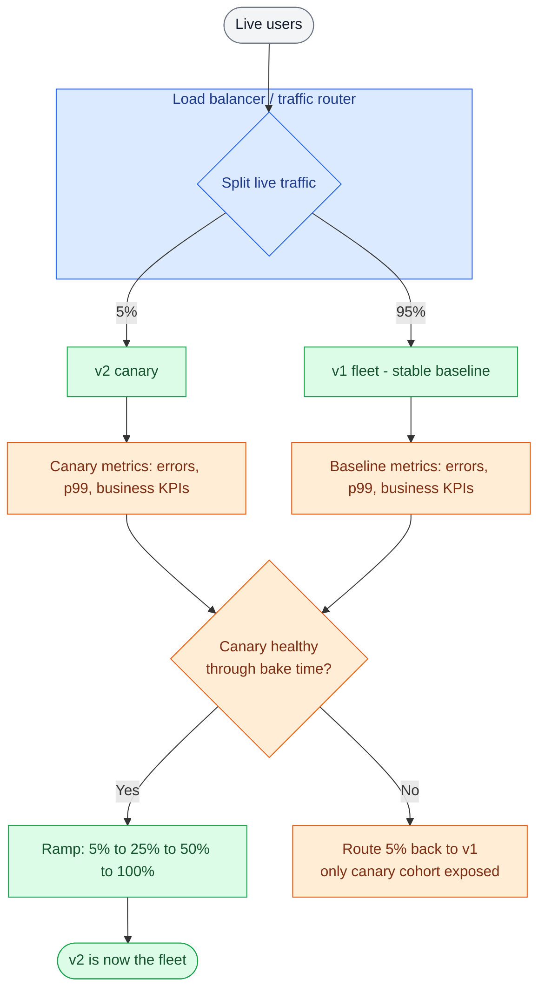

# Deployment Strategies

> **Prerequisites:** [Encoding & Schema Evolution](/synapse/system-design-from-first-principles/data-foundations/encoding-and-evolution), [Nonfunctional Requirements](/synapse/system-design-from-first-principles/foundations/nonfunctional-requirements) | **You'll be able to:** explain why old and new code always run simultaneously during a rollout and what that forces on your data formats; choose between rolling, blue-green, and canary for a given risk profile; and sequence an expand/contract schema migration under live traffic with no downtime.

## The problem (why this exists)

You have version 1 of a service running on forty machines behind a load balancer, serving live traffic right now. You have version 2 built, tested, and ready. How do you get from one to the other?

The naive answer — stop all forty machines, swap the binary, start them again — has two fatal problems. The first is obvious: for the seconds or minutes it takes, the service is **down**, and every request fails. The second is subtler and far more dangerous: version 2 is new code. If it has a bug that only shows up under real production load — a memory leak, a bad query, a mishandled edge case — you have just deployed that bug to **100% of users at once**, and rolling back means another full stop-the-world swap while the incident burns.

So you can't stop the world. You have to replace the running system *while it keeps running*. And the moment you accept that, you inherit a hard truth that this entire lesson is built around: **during any rollout, old code and new code run at the same time.** For some window — seconds for a fast rolling deploy, hours or days for a careful canary or a feature-flagged release — some of your machines answer requests with v1 while others answer with v2. They share the same database. They consume from the same queues. A v2 machine writes a record that a v1 machine reads a millisecond later; a v1 client calls a v2 server; a v2 producer publishes an event that a v1 consumer must handle.

This is exactly the coexistence problem from [Encoding & Schema Evolution](/synapse/system-design-from-first-principles/data-foundations/encoding-and-evolution). DDIA states it plainly: because code changes cannot happen instantaneously, server-side systems use **rolling upgrades** — deploying to a few nodes at a time — so old and new code, and old and new data formats, *coexist* in the running system [DDIA2 p.161]. To keep working, the system must preserve compatibility in **both** directions at once: **backward compatibility** (new code reads data written by old code) and **forward compatibility** (old code reads data written by new code) [DDIA2 p.162]. That theory was abstract when you learned it. This is the lesson where it collects the bill. A deployment strategy is only as safe as the compatibility of the two versions it runs side by side.

## Intuition first

Imagine you have to replace every lane of a busy highway with fresh pavement — but you are not allowed to close the highway. You cannot dynamite all four lanes and pour new concrete; cars are on them. So you coif one lane at a time: close lane 1, repave it, reopen it, move to lane 2. While you work, cars flow on the other lanes. Crucially, for the whole duration, **old lanes and new lanes carry traffic simultaneously**, and a car must be able to drive from an old lane straight onto a new one without falling into a pothole at the seam. The new pavement has to be *compatible* with the old at every boundary.

That is the entire mental model of live deployment. You never stop-and-swap; you **ease the new version in**, a slice of traffic or a slice of the fleet at a time, and you make sure the seams hold. The strategies in this lesson are just different answers to two questions:

1. **How do you shift from old to new** — replace machines gradually (rolling), stand up a whole second copy and flip (blue-green), or trickle a tiny fraction of traffic to the new version and watch (canary)?
2. **How do you decouple "the code is deployed" from "the feature is live"** — so you can ship dark and turn things on later (feature flags)?

And underneath all of them sits the hardest case, the one where the seam is not code but *data*: changing the database schema while both versions are reading and writing it. You cannot atomically change the schema and the code across a whole fleet in one instant, so you sequence the change into small, individually-safe steps. Hold onto the beginner takeaway: **you can't just stop-and-swap a live system; you ease the new version in, and every version has to tolerate the ones running beside it.**

## How it works

Think of the deployment strategies as a ladder, climbing from "simple and cheap but blunt" to "safe and precise but complex." You climb as high as the change's risk demands.

### Rolling deploy — replace instances gradually

The default. Instead of swapping all forty machines at once, you take them out of the load balancer rotation a few at a time, upgrade them to v2, health-check them, put them back, and move on to the next batch. At any instant only a small slice is down for its swap, so the service as a whole never stops. This is DDIA's rolling upgrade exactly: a staged rollout, a few nodes at a time, monitored, with no downtime [DDIA2 pp.161–162]. Kubernetes ships this as the default Deployment strategy, governed by `maxUnavailable` (how many pods can be down at once) and `maxSurge` (how many extra pods it may spin up above the desired count) [web: Kubernetes docs, "Deployments — Rolling Update"].

Rolling is cheap — you need only a little spare capacity for the batch in flight, not a second fleet. But it has two costs. During the roll, v1 and v2 are **both live and mixed**, so they must be mutually compatible (back to the seam problem). And rollback is slow: to undo v2 you have to roll v1 back out the same gradual way, batch by batch, which is exactly what you do not want when v2 is actively causing an incident.

### Blue-green — two full environments, flip the traffic

Stand up a *complete* second copy of production. "Blue" is the current live environment running v1; "green" is an identical environment running v2, fully deployed and warmed up but receiving no user traffic. You smoke-test green in isolation. When you're satisfied, you flip the router — usually the load balancer or DNS — so **all** traffic goes to green in one cut. Blue sits idle but intact [web: Martin Fowler, "BlueGreenDeployment"].

The prize is **instant rollback**: if green misbehaves, you flip the router straight back to blue, which is still running v1 exactly as before. Recovery is a routing change, not a redeploy. The price is **double the resources** — for the duration of the cutover you are paying for two full production environments — and the fact that the flip is all-or-nothing: the moment you cut, 100% of users are on v2, so a bug that passed your smoke tests still hits everyone. Blue-green also does not spare you the data seam: blue and green share the same database (you rarely duplicate production data), so v1 and v2 are still reading and writing the same store and still owe each other compatibility.

### Canary — route a small percentage, watch, then ramp or roll back

Named for the canary in a coal mine: you send a small, sacrificial fraction of live traffic to the new version and watch its metrics before committing. Deploy v2 alongside v1, route perhaps 5% of real users to it, and compare the canary's error rate, latency percentiles, and business metrics against the v1 baseline. If the canary stays healthy through a **bake time**, you ramp — 5% → 25% → 50% → 100% — re-checking at each step. If it degrades, you route that traffic straight back to v1 and only the small canary cohort was ever exposed [web: Martin Fowler, "CanaryRelease"; web: Google SRE Book, "Canarying Releases"].

Canary is where deployment meets [Observability](/synapse/system-design-from-first-principles/production-engineering/observability): the decision to ramp or roll back is only as good as the SLO metrics you compare against, and mature setups automate the comparison (a statistical check on the canary-vs-baseline signals) rather than eyeballing a dashboard. The flow:



The benefit is that you cap the **blast radius**: a bug reaches 5% of users for a few minutes, not everyone for as long as it takes to notice. The cost is that canary is the slowest and most operationally involved of the three — you need traffic-splitting infrastructure, a solid baseline, good metrics, and the patience to bake at each step.

### Feature flags — decouple deploy from release

The three strategies above all conflate two events: *deploying* the code and *releasing* the behavior. **Feature flags** (feature toggles) split them apart. You wrap the new behavior in a runtime conditional — `if flag("new_checkout") { ... } else { ... }` — and ship the code with the flag **off**. The new code is now deployed to production but *dark*: it runs on every machine yet does nothing user-visible. Later, independent of any deploy, you flip the flag on — for internal users first, then 1% of customers, then a region, then everyone — from a control plane, with no new rollout [web: Martin Fowler & Pete Hodgson, "Feature Toggles (Feature Flags)"].

This buys three things. **Ship dark, release later:** merge and deploy incrementally all week, turn the feature on when it's ready. **Per-cohort rollout:** enable by user segment, which is how you run A/B tests and gradual releases at the *feature* level rather than the *fleet* level. And a **kill switch**: if the feature misbehaves, flip it off in seconds — faster than any rollback, because nothing redeploys. The cost is that every flag is a branch in your code and your testing matrix; flags that never get cleaned up rot into permanent, tangled conditionals ("flag debt").

### The hard one: schema and database migrations under live traffic

Every strategy so far shifts *code*. Data is harder, and it's where the coexistence problem bites hardest. Here's why an atomic swap is impossible: you cannot change the database schema *and* every machine's code in the same instant. There is always a window where the schema is in one state and part of the fleet expects another. If you `ALTER TABLE` to rename or drop a column that the still-running old code depends on, that old code starts throwing the moment the ALTER lands — instant, self-inflicted downtime. And it cuts the other way too: DDIA's Figure 5-1 hazard is that **old code still writing the old format** can silently drop or clobber a field the new code added, losing data [DDIA2 pp.162–163].

The way out is the **expand/contract** pattern (also called **parallel change**): never make a breaking change in one step. Instead, evolve through a sequence of individually-safe, backward-*and*-forward-compatible steps, so that at every moment both the currently-deployed code and the next version can operate against the schema as it stands [web: Martin Fowler, "ParallelChange"]. The canonical case — splitting a `full_name` column into `first_name` / `last_name` — runs like this:

```d2
direction: right
title: "Stage 1 — Steady state (before)" {near: top-center; shape: text; style.font-size: 20}
app: "App v1" {style: {fill: "#dcfce7"; stroke: "#16a34a"}}
db: "users table\nfull_name" {style: {fill: "#ffedd5"; stroke: "#ea580c"}}
app -> db: "read + write full_name"
```

```d2
direction: right
title: "Stage 2 — EXPAND: add new columns (additive, nullable)" {near: top-center; shape: text; style.font-size: 20}
app: "App v1 (unchanged)" {style: {fill: "#dcfce7"; stroke: "#16a34a"}}
db: "users table\nfull_name\n+ first_name (null)\n+ last_name (null)" {style: {fill: "#ffedd5"; stroke: "#ea580c"}}
app -> db: "still reads + writes full_name"
note: "New columns are nullable, so old code ignores them. No rewrite, no downtime." {shape: text; style.font-size: 14}
```

```d2
direction: right
title: "Stage 3 — Deploy v2: dual-write + backfill" {near: top-center; shape: text; style.font-size: 20}
app: "App v2\nwrites BOTH" {style: {fill: "#dcfce7"; stroke: "#16a34a"}}
backfill: "Backfill job" {style: {fill: "#f3e8ff"; stroke: "#9333ea"}}
db: "users table\nfull_name (read)\nfirst_name / last_name" {style: {fill: "#ffedd5"; stroke: "#ea580c"}}
app -> db: "writes full_name AND first/last; still reads full_name"
backfill -> db: "populates first/last for old rows"
```

```d2
direction: right
title: "Stage 4 — Switch reads to the new columns" {near: top-center; shape: text; style.font-size: 20}
app: "App v3\nreads new, still writes both" {style: {fill: "#dcfce7"; stroke: "#16a34a"}}
db: "users table\nfull_name (write only)\nfirst_name / last_name (read)" {style: {fill: "#ffedd5"; stroke: "#ea580c"}}
app -> db: "reads first/last; keeps writing full_name for safety"
```

```d2
direction: right
title: "Stage 5 — CONTRACT: stop writing + drop old column" {near: top-center; shape: text; style.font-size: 20}
app: "App v4\nnew columns only" {style: {fill: "#dcfce7"; stroke: "#16a34a"}}
db: "users table\nfirst_name / last_name" {style: {fill: "#ffedd5"; stroke: "#ea580c"}}
app -> db: "reads + writes first/last; full_name dropped"
```

Read the stages as a slideshow. **Expand** first (stage 2): add the new columns *additively* — nullable, with no code depending on them yet. Adding a nullable column is the one migration DDIA notes most databases can do cheaply, without rewriting existing rows, filling nulls on read [DDIA2 p.179]. Because the change is additive, old code neither knows nor cares — forward compatibility for free. Then **deploy v2 that dual-writes** (stage 3): every write goes to both the old `full_name` and the new columns, so no matter which version wrote a row, both representations are present. A **backfill** job walks the existing rows and populates the new columns for data written before the migration — this is "data outlives code" made concrete: the old rows are still in their original encoding until you explicitly rewrite them [DDIA2 p.179]. Once backfill completes and every row has both, **switch reads** to the new columns (stage 4) while *still* dual-writing, so a rollback to stage-3 code is safe. Finally, when you're confident, **contract** (stage 5): stop writing the old column and drop it. Each arrow between stages is a small, reversible deploy; at no point does a running version see a schema it can't handle.

### Rollback vs roll-forward

When a deploy goes wrong you have two moves. **Rollback** — revert to the previous known-good version — is the default reflex and the reason blue-green and canary are prized. But rollback is *only safe if the old code can still operate on the current state of the data*. This is the deep reason the migration order above matters: because each step is backward-compatible, you can roll the code back a step without the schema betraying you. Once you've **contracted** — dropped `full_name` — you can no longer roll back to code that reads it. That's why the destructive step comes last and only after a long soak.

**Roll-forward** — ship a new fix on top — is the alternative when rollback is impossible (you've already dropped the old column) or when the bug is trivial to patch. The judgment call: roll back for anything you don't fully understand under incident pressure (fast, low-risk, buys time); roll forward when reverting would itself be destructive or when the fix is obviously correct. Tie this into [Resilience & Incidents](/synapse/system-design-from-first-principles/production-engineering/resilience-and-incidents): a deploy is a leading cause of incidents, and a fast, rehearsed rollback path is a core part of limiting their blast radius.

## Trade-offs

| Strategy | Gives you | Costs you | Use when |
| --- | --- | --- | --- |
| **Rolling** | No downtime; minimal extra capacity (one batch in flight) | Slow rollback (undo batch by batch); v1+v2 mixed the whole time so both must be compatible; no early blast-radius cap | The default for low-to-moderate-risk changes on a fleet with spare capacity |
| **Blue-green** | Instant rollback (flip router back to blue); test green in isolation before the cut | Double the infrastructure during cutover; all-or-nothing flip exposes 100% at once; shared DB still needs compatibility | You need a fast, clean rollback and can afford a second full environment; cutover is a routing change |
| **Canary** | Smallest blast radius (bug hits ~5% briefly); metric-driven go/no-go; gradual, reversible ramp | Slowest to fully roll out; needs traffic-splitting infra, a good baseline, and solid SLO metrics | High-risk changes, large user base, and you have the observability to judge canary health |

Feature flags are orthogonal — they layer on top of any of these to separate *deploy* from *release*, giving a per-cohort rollout and a sub-second kill switch that no code-shifting strategy can match.

## Numbers that matter

These are operational rules of thumb, not source-derived constants — treat them as starting points and tune with real data (see [Estimation & Numbers](/synapse/system-design-from-first-principles/foundations/estimation-and-numbers)).

- **Canary traffic share:** commonly start at **1–5%** of live traffic, then ramp through roughly 5% → 25% → 50% → 100%. The share must be large enough that a real regression shows up above the noise in your metrics, and small enough that a bug is contained. *Rule of thumb, not from source.*
- **Bake time per step:** long enough to accumulate statistically meaningful data and to catch slow-burn failures (memory leaks, cache fill, cron-triggered paths) — often minutes for a small service, up to an hour or more per step for a critical one. *Rule of thumb, not from source.*
- **Blue-green resource cost:** ~**2×** production capacity for the duration of the cutover (two full environments live at once). Real cost.
- **Rolling `maxSurge` / `maxUnavailable`:** a typical Kubernetes default is 25% each — up to 25% extra pods spun up and 25% unavailable during the roll — trading rollout speed against capacity headroom [web: Kubernetes docs].
- **Backfill throughput:** the backfill in an expand/contract migration must be **rate-limited** so it doesn't saturate the database and starve live traffic — chunk the rows and throttle. A migration that backfills tens of millions of rows at full speed is a self-inflicted outage.

## In production

Real systems make these strategies concrete. **Kubernetes** ships rolling updates as the default Deployment strategy (`RollingUpdate` with `maxSurge`/`maxUnavailable`), and the ecosystem layers progressive delivery on top: **Argo Rollouts** and **Flagger** drive automated canary and blue-green rollouts by talking to a service mesh or ingress to shift traffic in weighted steps and auto-analyze metrics [web: Argo Rollouts docs; web: Flagger docs]. **Netflix** built **Spinnaker** with **Kayenta** for **automated canary analysis** — a statistical judge that compares canary and baseline metrics and gates the promotion, so humans don't eyeball dashboards [web: Netflix Tech Blog, "Automated Canary Analysis at Netflix"]. This is [Service Discovery & Mesh](/synapse/system-design-from-first-principles/production-engineering/service-discovery-and-mesh) paying off: the mesh's weighted traffic-splitting is exactly what makes fine-grained canaries possible.

**Feature flags** are a mature product category — LaunchDarkly and similar platforms, plus in-house systems like **Facebook's Gatekeeper**, which is how large web companies "dark launch": ship code that's live in production but gated off, then ramp exposure by cohort. The classic example is launching a heavy new backend path to internal employees, then a small percent of users, watching load, and widening — deploy and release fully decoupled.

For **schema migrations at scale**, the online-schema-change tooling exists precisely because a naive `ALTER TABLE` locks the table: GitHub's **gh-ost** and Percona's **pt-online-schema-change** perform large MySQL schema changes without long locks by building a shadow table, backfilling, and cutting over [web: GitHub Engineering, "gh-ost"]. On the framework side, Rails' **strong_migrations** and similar linters block dangerous, non-additive migrations in code review before they ever reach production. The through-line is the same everywhere: additive expand, backfill under throttle, cut over, contract last.

## Pitfalls & interview traps

<div style="border-left:4px solid #da5233;background:rgba(218,82,51,0.08);padding:0.6rem 1rem;border-radius:0 0.5rem 0.5rem 0;margin:1.25rem 0">

⚠️ **The number-one self-inflicted outage: a non-additive schema change shipped *with* the code that needs it.** You bundle `ALTER TABLE users DROP COLUMN full_name` (or a rename) into the same release as the v2 code that stops using it, and deploy them together. The instant the migration runs, every v1 machine still in the rolling fleet — and any request in flight — tries to read `full_name` and throws. You have manufactured downtime out of a change that *felt* atomic in your head but is anything but across a live fleet. The fix is always expand/contract: additive change first, drop the old column in a *separate, later* deploy, long after no running code references it.

</div>

Other traps interviewers probe:

- **Forgetting that old code still writes the old format.** Even after you deploy v2, the rolling window means v1 machines are still writing old-format rows. If v2 assumes every row is new-format, it breaks on the ones v1 just wrote. This is DDIA's Figure 5-1 hazard, and it's why dual-write and defensive reads exist [DDIA2 pp.162–163].
- **Long-lived connections and in-flight work.** WebSocket sessions, streaming RPCs, and long-running jobs pinned to a v1 instance don't just vanish when you drain it. Rolling and blue-green both need a **connection-draining** grace period, or you cut users off mid-request.
- **Unthrottled backfill.** Running the backfill at full speed saturates the database and takes down the live traffic you were trying to protect. Chunk and rate-limit.
- **Canary sample too small or wrong metrics.** 0.1% of traffic to the canary may never surface a regression that only appears under real load mix; and if you only watch CPU while the bug is a rise in p99 latency or a drop in checkout success, the canary passes and you promote a broken build. Canary is only as good as the SLOs it's judged against.
- **Irreversible migrations blocking rollback.** Once you've dropped a column or done a one-way data transform, "just roll back" is off the table — you're forced to roll forward under pressure. Keep the destructive step last and reversible for as long as you can.

<details>
<summary>Why can't blue-green's shared database save you from the compatibility problem?</summary>

Because blue and green almost always point at the **same** production database — you duplicate the *compute*, not the *data* (duplicating a live, mutating dataset consistently is its own hard problem). So the instant green (v2) starts writing and blue (v1) is still live during the flip window, both versions are reading and writing the same store. If v2's writes are unreadable by v1, flipping *back* to blue on a rollback now exposes blue to data it can't handle. Blue-green gives you instant *code* rollback; it does nothing for *schema* compatibility. That still requires expand/contract.

</details>

<details>
<summary>When would you pick blue-green over canary, and vice versa?</summary>

Pick **canary** when the change is risky, your user base is large, and you have the observability to judge canary health automatically — you want the smallest possible blast radius and are willing to roll out slowly. Pick **blue-green** when you value a fast, clean, all-or-nothing rollback over a graduated exposure — for example a change you've validated thoroughly in a staging-identical green environment and mainly want an instant "undo" for — and you can afford the doubled infrastructure. Many mature setups combine them: canary to validate, then a blue-green-style flip for the final cut, with feature flags layered on top for per-cohort control.

</details>

## Check yourself

```quiz
{"prompt": "During a rolling deploy of v2 across a 40-node fleet, why must v1 and v2 be both backward- and forward-compatible with each other's data?", "options": ["Because the load balancer cannot route to two versions at once", "Because for the duration of the roll, some nodes run v1 and some run v2, sharing one database — so a record written by either version may be read by the other", "Because the database schema changes atomically when the deploy starts", "Because rollback is impossible once v2 is deployed"], "answer": "Because for the duration of the roll, some nodes run v1 and some run v2, sharing one database — so a record written by either version may be read by the other"}
```

```quiz
{"prompt": "You must ship a high-risk rewrite of the checkout service to millions of users and you have solid SLO dashboards and traffic-splitting infrastructure. Which strategy best limits the blast radius of a hidden bug?", "options": ["Blue-green: flip 100% of traffic after smoke-testing green", "Rolling: replace nodes a batch at a time", "Canary: route ~5% of live traffic to v2, compare its metrics to the baseline, and ramp only if it stays healthy", "Stop-and-swap during a low-traffic window"], "answer": "Canary: route ~5% of live traffic to v2, compare its metrics to the baseline, and ramp only if it stays healthy"}
```

```quiz
{"prompt": "In an expand/contract migration to split full_name into first_name/last_name, when is it finally safe to DROP the full_name column?", "options": ["Immediately, in the same deploy that adds the new columns", "After the new columns are added but before any backfill", "Only after all code has switched to reading and writing the new columns, the backfill is complete, and no running version still references full_name", "As soon as v2 starts dual-writing to both old and new columns"], "answer": "Only after all code has switched to reading and writing the new columns, the backfill is complete, and no running version still references full_name"}
```

```quiz
{"prompt": "What is the primary thing feature flags give you that rolling, blue-green, and canary deploys do not?", "options": ["Zero-downtime deploys", "Decoupling deploy from release — ship the code dark, then enable the behavior per-cohort with a sub-second kill switch, no redeploy", "Automatic database schema migration", "Instant rollback of the deployed binary"], "answer": "Decoupling deploy from release — ship the code dark, then enable the behavior per-cohort with a sub-second kill switch, no redeploy"}
```

<details>
<summary>Your teammate proposes deploying the code that reads new columns in the SAME release that runs the backfill. What breaks, and what's the correct ordering?</summary>

If the reading code deploys before the backfill finishes, it will read new columns that are still `NULL` for all the old rows the backfill hasn't reached yet — returning blank names. The correct ordering is: **expand** (add nullable columns) → **deploy dual-write** so all *new* writes populate both → **backfill** old rows under a throttle → *verify every row now has the new columns* → **only then switch reads** to the new columns → **contract**. Reads must never switch until backfill is provably complete.

</details>

<details>
<summary>Why is "roll back" not always available, and what do you do instead?</summary>

Rollback is only safe while the previous version can still operate on the current data. Once you've done a destructive or one-way step — dropped a column, transformed data irreversibly — the old code can no longer function against the new schema, so reverting the binary would break it. In that situation you must **roll forward**: ship a corrective patch on top. This is precisely why expand/contract keeps every step reversible and defers the single destructive step (the drop) to the very end, after a long soak — to preserve the rollback option for as long as possible.

</details>

## PoC — Proof of concepts

Blue-green, canary and progressive rollout, as the controllers that actually perform them:

- [Argo Rollouts](https://github.com/argoproj/argo-rollouts) — a Kubernetes controller for blue-green
  and canary with automated analysis and rollback; the strategies in this lesson as runnable CRDs.
- [Kubernetes](https://github.com/kubernetes/kubernetes) — the built-in rolling update and readiness
  gates every strategy builds on; the baseline to understand first.
- [Istio](https://github.com/istio/istio) — traffic-weight shifting at the mesh, which is how a canary
  sends "5% of requests" to the new version independently of pod counts.

## Sources

- DDIA2 ch. 5 pp. 161–162 (rolling upgrades; old and new code coexist; backward + forward compatibility required in both directions)
- DDIA2 ch. 5 pp. 162–163 (Figure 5-1 forward-compatibility data-loss hazard: old code dropping fields written by new code)
- DDIA2 ch. 5 p. 179 (adding a nullable column without rewriting rows; "data outlives code"; migrating large datasets is expensive and deferred)
- [web: Martin Fowler, "BlueGreenDeployment"] · [web: Martin Fowler, "CanaryRelease"] · [web: Martin Fowler, "ParallelChange" (expand/contract)] · [web: Martin Fowler & Pete Hodgson, "Feature Toggles (Feature Flags)"]
- [web: Google SRE Book, "Canarying Releases"]
- [web: Kubernetes docs, "Deployments — Rolling Update" (maxSurge/maxUnavailable)]
- [web: Netflix Tech Blog, "Automated Canary Analysis at Netflix" (Spinnaker/Kayenta)] · [web: Argo Rollouts docs] · [web: Flagger docs]
- [web: GitHub Engineering, "gh-ost: online schema migrations for MySQL"] · Percona pt-online-schema-change
