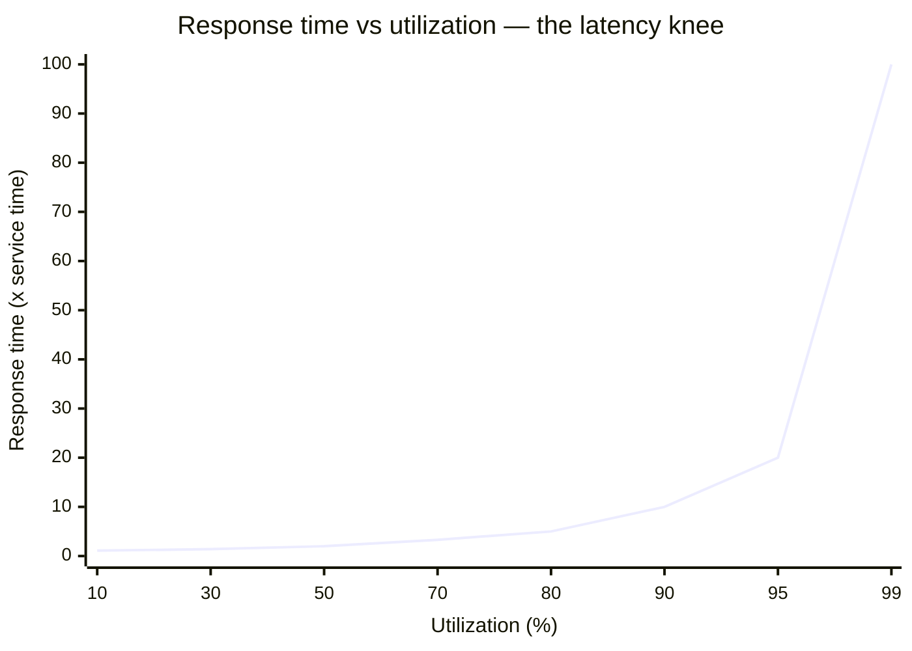
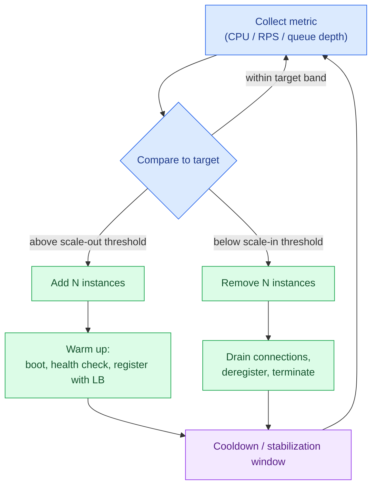

# Capacity & Autoscaling

> **Prerequisites:** [Estimation & the Numbers](/synapse/system-design-from-first-principles/foundations/estimation-and-numbers), [Nonfunctional Requirements](/synapse/system-design-from-first-principles/foundations/nonfunctional-requirements) | **You'll be able to:** size a fleet from a per-node capacity number plus headroom; explain why you can't run a server at 100% utilization; and reason about scaling lag, flapping, and why a stateful tier is far harder to autoscale than a stateless one.

## The problem (why this exists)

You launch a service. Traffic is a gentle 2,000 requests per second, three boxes handle it with room to spare, and everyone goes home happy. Then a marketing push lands at 9 a.m. and load jumps to 12,000 requests per second in ninety seconds. The three boxes saturate. Latency, which sat comfortably at 40 ms, climbs to 400 ms, then to two seconds, then requests start timing out. By the time you have manually launched more machines and they have finished booting, the spike has already turned into an outage that trended on social media.

The opposite failure is quieter but just as real. Terrified of that outage, you provision for the worst peak you can imagine and run forty machines around the clock. Ninety percent of the day they sit at 8% CPU, and at the end of the month finance asks why the cloud bill tripled to serve traffic that three machines could have handled most of the time.

Capacity planning is the discipline of having **enough machines — no more, no less — as load changes**. Too few is an outage; too many is money set on fire. Autoscaling is the automation that tries to track the moving target so a human doesn't have to. Neither is magic, and the failure modes of both are where most of the interesting engineering lives.

## Intuition first

Start with one machine. Ask a single question: *how much load can this one node carry while still meeting our latency target?* Call that number its **per-instance capacity**. If one node serves 4,000 requests per second at an acceptable p99, and you expect a peak of 12,000, you need at least three nodes — and, as we'll see, rather more than three, because you never want to run a node at the very edge of what it can do.

That's the whole beginner-level story: **add machines when the fleet is busy, remove them when it's idle**. The load is shared across the fleet, so more machines means each one carries less. A stateless web tier makes this almost trivial — any request can go to any node, so adding a node instantly adds capacity.

The two things beginners underestimate are these. First, **you can't run a machine at 100%** — long before that, latency explodes, because requests start waiting in line behind other requests. Second, **adding a machine is not instant** — a new instance takes minutes to boot, warm its caches, and start accepting traffic, so a scaler that reacts to a spike is always running a little behind reality. Everything sophisticated about capacity planning is a consequence of those two facts.

## How it works

### Step 1 — Measure per-instance capacity

Per-instance capacity is not a spec-sheet number; it is the load at which *your* workload on *this* instance type still meets *your* latency SLO. You find it by load-testing a single node: push synthetic traffic up in steps, watch the latency percentiles (this is exactly why we measure p99, not the average — a healthy average can hide a tail that has already fallen off a cliff), and record the throughput at the point where p99 crosses your target. That throughput — say 4,000 requests/second per node at p99 < 150 ms — is your unit of sizing.

The number is workload-specific. A node that serves 4,000 RPS of cached reads might serve only 400 RPS of a request that does an uncached join, and 40 RPS of one that runs an expensive aggregation. Capacity is measured per *request type*, or against a representative blend that matches production.

<div style="border-left:4px solid #15448e;background:rgba(21,68,142,0.08);padding:0.6rem 1rem;border-radius:0 0.5rem 0.5rem 0;margin:1.25rem 0">

**Definition — headroom.** The gap you deliberately leave between the load you plan for and the maximum a node can carry. If a node maxes out at 4,000 RPS but you plan to run each at 2,400, you are keeping **40% headroom**. Headroom absorbs spikes, node failures, and the latency blow-up near saturation.

</div>

### Step 2 — Why you can't run at 100% (the latency knee)

Here is the single most important idea in this lesson. As a server's utilization rises, response time does not rise smoothly and linearly — it stays flat and low across most of the range, then **shoots up almost vertically as you approach full utilization**. DDIA makes exactly this point: response time stays low at low load but rises sharply as throughput nears hardware capacity, because of **queueing** — an arriving request has to wait while the CPU finishes earlier ones [DDIA2 ch. 2 p. 37]. And a system's behavior near the edge is far worse than near the middle: "a system with spare capacity drains queues easily, whereas a highly utilized system builds long queues quickly" [DDIA2 ch. 9 p. 354].

The shape of that curve comes from queueing theory. For an idealized single-server queue (the M/M/1 model), mean response time equals the service time divided by `(1 − ρ)`, where `ρ` is utilization. That factor `1/(1−ρ)` is brutal near the top:

| Utilization ρ | Response-time multiplier `1/(1−ρ)` |
| --- | --- |
| 50% | 2× service time |
| 80% | 5× |
| 90% | 10× |
| 95% | 20× |
| 99% | 100× |

*(M/M/1 idealization — real systems with many cores and bursty traffic differ in the exact numbers, but the knee is universal. `[web: queueing theory, M/M/1]`)*

Going from 50% to 90% utilization roughly triples your effective machine efficiency on paper — but it multiplies queueing delay fivefold, and the last few percent are catastrophic. This is *why headroom exists*: you run each node at 50–70% of its measured capacity not because you're wasteful but because the region above ~80% is where latency becomes unpredictable and a small traffic bump tips you over the knee into a brownout.



The practical takeaway: pick a **target utilization** (commonly 50–70% for a latency-sensitive tier) that keeps you on the flat part of the curve, and size the fleet so peak load lands you there — not at the knee. `[web: AWS/Kubernetes autoscaling guidance; rule of thumb]`

### Step 3 — Size for peak with headroom

Now the arithmetic. Fleet size ≈ *peak load ÷ (per-instance capacity × target utilization)*, then add spare nodes to survive the failures you expect.

Worked example: peak 12,000 RPS; per-node capacity 4,000 RPS; target utilization 60% → effective 2,400 RPS/node → 12,000 ÷ 2,400 = **5 nodes** to carry peak on the flat part of the curve. If you also want to survive one node failing during that peak (**N+1**), you run 6. If your instances live across three availability zones and you must survive a whole zone going dark, you provision so the surviving two zones can carry peak — closer to N+50%.

### Step 4 — Vertical vs horizontal scaling

There are two ways to get more capacity. **Vertical scaling (scaling up)** means moving to a bigger machine — more cores, more RAM, more disk. **Horizontal scaling (scaling out)** means adding more machines of the same size and spreading load across them. DDIA frames these as shared-memory (one big box) versus shared-nothing (many independent nodes coordinating in software) [DDIA2 ch. 2 p. 51].

Vertical scaling is simplest — no distributed-systems complexity, no sharding — and for a small system a single powerful machine often beats a complicated cluster. But it has a ceiling (the biggest instance money can buy), its cost grows faster than linearly (a machine with 2× the resources costs much more than 2×), and a single box is a single point of failure [DDIA2 ch. 2 p. 51]. Horizontal scaling is the distributed default because it can scale close to linearly, lets you pick cheap commodity hardware, makes it easy to add and remove resources as load changes, and spreads fault tolerance across machines and datacenters [DDIA2 ch. 2 p. 51]. Its price is that you must now shard your data and swallow distributed-systems complexity — which is exactly what makes autoscaling a *stateful* tier hard (Step 6).

### Step 5 — Reactive autoscaling: the control loop

The most common autoscaler is **reactive**: it watches a metric, and when the metric crosses a threshold it changes the number of instances. The metric might be average CPU, requests per second per instance, or — best of all for a queue-fed worker tier — queue depth or backlog age.

The loop runs continuously:



Two design choices dominate. **Target-tracking** autoscalers (AWS EC2 Auto Scaling target tracking, Kubernetes' Horizontal Pod Autoscaler) are given a target value — "keep average CPU at 60%" — and the controller computes the desired replica count directly: `desired = ceil(current_replicas × current_metric / target_metric)`. `[web: Kubernetes HPA algorithm]` **Step/threshold** scaling instead fires discrete actions when an alarm breaches ("if CPU > 75% for 3 minutes, add 2 instances").

The **cooldown** (AWS) or **stabilization window** (Kubernetes) is what stops the loop from oscillating. After a scaling action the controller waits before acting again, giving new instances time to take load and the metric time to settle. Kubernetes, for example, defaults to a conservative scale-*down* stabilization window (several minutes) while scaling *up* quickly — the asymmetry is deliberate: being slow to remove capacity is cheap insurance, being slow to add it is an outage. `[web: Kubernetes HPA stabilization]`

### Step 6 — Predictive & scheduled scaling, and the stateful problem

Reactive scaling always lags — it can only respond *after* the metric moves. If your load is predictable, you can get ahead of it. **Scheduled scaling** adds capacity on a clock: if traffic reliably ramps at 8 a.m. every weekday, scale out at 7:45. **Predictive scaling** uses a model trained on historical load (many diurnal, weekly systems are highly regular) to pre-provision before the forecasted peak. Predictive and reactive are complementary — predictive handles the known daily wave, reactive catches the surprises on top.

The hardest dimension is **what you are scaling**. A **stateless** tier — web servers, API front-ends, workers that hold no durable data — is easy: any node is interchangeable, so adding one instantly adds capacity and removing one loses nothing but in-flight requests (which you drain first). A **stateful** tier — a database, a sharded cache, anything that *owns* data — is painful, because adding a node means **data has to move**. You can't just boot a new database replica and have it serve traffic; it must first receive its share of the data, and rebalancing a live, sharded store is a careful, throughput-consuming operation (this is exactly the rebalancing problem covered in [Sharding & Consistent Hashing](/synapse/system-design-from-first-principles/distributed-data/sharding-and-consistent-hashing)). That is why the standard architecture pushes state down and out: keep the compute tier stateless and horizontally autoscalable, and scale the stateful tier deliberately, rarely, and with a human in the loop.

## Trade-offs

| Option | Gives you | Costs you | Use when |
| --- | --- | --- | --- |
| **Vertical (scale up)** | Simplicity — no sharding, no distributed complexity; higher single-node performance | Hard ceiling; super-linear cost; single point of failure | Small/early systems; a single node still comfortably fits the load |
| **Horizontal (scale out)** | Near-linear scaling; commodity hardware; fault tolerance across nodes/zones; elastic add-remove | Requires sharding + distributed-systems complexity | The distributed default — anything that must grow past one big box |
| **Reactive autoscaling** | No forecast needed; tracks any load pattern, including surprises | Always lags; can't outrun a sudden spike; risks flapping | Load is variable and hard to predict |
| **Predictive / scheduled** | Capacity is ready *before* the peak; no warm-up gap on known waves | Wrong when the future doesn't match the past; needs regular, learnable patterns | Strong diurnal/weekly seasonality (known 8 a.m. ramp, Black Friday) |

## Numbers that matter

Every figure below is attributed; treat the rules of thumb as starting points to validate against your own load tests, not laws.

- **Per-instance capacity is the unit of sizing.** As reference ceilings for modern cloud hardware: an application server handles on the order of **100k+ concurrent connections** with 8–64 cores and up to 25 Gbps of network. `Rule of thumb, not from source.` A single relational node sustains roughly **up to 50k read TPS and 10–20k write TPS** before you shard; a cache instance does **100k+ ops/sec at sub-millisecond reads**; a message-queue broker up to **~1M messages/sec**. A plain Postgres node handles **20k+ simple writes/sec** — a number candidates routinely underestimate, then over-engineer a queue in front of. `Rule of thumb, not from source.`
- **Target utilization / headroom: 50–70%.** Keep each latency-sensitive node at roughly 50–70% of its measured capacity so you stay on the flat part of the latency curve; that implies **30–50% headroom**. `[web: AWS/Kubernetes autoscaling guidance; rule of thumb]`
- **The latency knee.** Response-time multiplier is `1/(1−ρ)`: **2× at 50% utilization, 5× at 80%, 10× at 90%, 20× at 95%, 100× at 99%** (M/M/1 idealization) `[web: queueing theory]`. This is the quantitative form of DDIA's qualitative claim that queueing delay rises sharply as throughput nears capacity [DDIA2 ch. 2 p. 37; ch. 9 p. 354].
- **Scaling lag is measured in minutes.** A fresh container/instance typically takes **30–60 seconds just to start**, and often minutes more to warm caches, JIT-compile, establish connection pools, and pass health checks before it carries real load. A metric-driven scaler adds its own detection delay (a 1–3 minute alarm window is common). The end-to-end reaction time — spike detected → new capacity serving — is frequently **3–5 minutes**. `Rule of thumb, not from source.`
- **Load can be bursty.** DDIA's own case study assumes an average of **5,800 posts/second spiking to 150,000/second** — a ~26× peak-to-average ratio [DDIA2 ch. 2 p. 34]. Size for the peak, not the average; the ratio between them is precisely what makes elasticity valuable.
- **The cost dimension.** Provisioning for peak means paying for idle capacity most of the time; cloud elasticity lets you scale up and down with demand instead [DDIA2 ch. 1 p. 13]. DDIA puts the cloud framing sharply: "capacity planning becomes financial planning, and performance optimization becomes cost optimization" [DDIA2 ch. 1 p. 18].

## In production

Autoscaling in the real world is a **control system**, and control systems misbehave in characteristic ways. The teams that run large fleets treat it as such.

**AWS EC2 Auto Scaling** and the **Kubernetes Horizontal Pod Autoscaler** are the two most common reactive implementations. Both are target-tracking by default: you declare a target (CPU %, or a custom metric like RPS-per-pod or queue-depth-per-pod) and the controller converges the replica count toward it `[web: AWS Auto Scaling; Kubernetes HPA]`. Mature setups deliberately scale *out* aggressively and scale *in* slowly, because the cost of a spare instance for ten extra minutes is trivial next to the cost of being one instance short during a spike.

The **cold-start problem** shapes real architecture. Because a new instance is useless for its first minute or more, teams keep **pre-warmed pools** of ready instances, over-provision ahead of known events rather than trusting reactive scaling to catch them, and invest heavily in shrinking start-up time (smaller images, lazy warm-up, snapshot-restore). In serverless environments (AWS Lambda) the cold start is the dominant latency concern for spiky traffic, which is why "provisioned concurrency" — pre-warmed function instances — exists as a paid feature. `[web: AWS Lambda provisioned concurrency]`

**Queue-based load leveling** is the standard way to survive a spike you can't scale into fast enough. Put a durable queue in front of a worker tier and let the backlog absorb the burst; workers drain it at their sustainable rate and autoscale on *queue depth* rather than CPU. The users don't get instant results, but the system doesn't fall over — it degrades to "slower" instead of "down." This is the same instinct behind DDIA's note that during load spikes, timeline deliveries can be enqueued and processed with temporary delay while reads stay fast [DDIA2 ch. 2 p. 36].

Finally, the **stateful tier** is almost never autoscaled reactively in production. Databases are scaled through planned operations — adding read replicas, resharding during a maintenance window, or relying on a system explicitly designed for online rebalancing (DynamoDB's internal partition splits, Cassandra's vnodes). "Scale the database when CPU hits 80%" is not a strategy; by the time the alarm fires, moving the data would take hours. The production pattern is a stateless compute tier that autoscales freely against a stateful tier that grows on a human's schedule.

## Pitfalls & interview traps

<div style="border-left:4px solid #da5233;background:rgba(218,82,51,0.08);padding:0.6rem 1rem;border-radius:0 0.5rem 0.5rem 0;margin:1.25rem 0">

⚠️ **Autoscaling cannot outrun a sudden spike, and misconfigured autoscaling can amplify an outage.** A reactive scaler needs minutes to detect load and boot capacity; a spike that arrives in seconds saturates you *before* the first new instance is ready — so treat autoscaling as a way to track slow trends and recover, not as spike protection. For spikes you need pre-warmed capacity, a queue to absorb the burst, or load shedding. And without a cooldown, an autoscaler can **flap**: it scales out, the metric drops, it scales in, the metric spikes, it scales out again — thrashing the fleet, and each new-but-cold instance briefly *raises* latency, which can trick the scaler into adding still more. Always set cooldowns / stabilization windows.

</div>

A few more traps interviewers probe:

- **Scaling on the wrong metric.** Average CPU is a poor proxy for a service that's memory-bound, I/O-bound, or blocked on a downstream dependency — CPU stays low while latency climbs. Scale on the signal that actually reflects saturation (queue depth for workers, RPS or p99 for request-serving tiers).
- **The bottleneck moves.** Autoscaling the web tier just pushes the load onto the database, which is the tier you *can't* easily scale. Adding stateless capacity in front of a saturated stateful tier makes things worse, not better.
- **Downstream stampede.** When the fleet scales out, every new instance opens fresh connections and cold caches, hammering the database and cache exactly when load is already high — a self-inflicted thundering herd.
- **Confusing 100% CPU with "at capacity."** Because of the latency knee, a tier is effectively out of usable capacity well before 100% — often around 70–80%. A candidate who sizes a fleet assuming nodes run at 100% has under-provisioned by a wide margin.
- **Forgetting the cost lever.** In an interview, naming autoscaling as a *cost* optimization (pay for peak only during peak) as well as a reliability one signals seniority — over-provisioning is money, under-provisioning is an outage.

## Check yourself

```quiz
{"prompt": "A latency-sensitive service runs each node at 95% CPU utilization to save money. Under the M/M/1 model, roughly how does response time compare to running at 50%?", "options": ["About the same — utilization doesn't affect latency until 100%", "Roughly 2x higher", "Roughly 10x higher", "Effectively unbounded — 100% is the only real limit"], "answer": "Roughly 10x higher"}
```

```quiz
{"prompt": "Why can't you safely run a server at 100% utilization?", "options": ["The OS reserves the last few percent of CPU for itself", "Queueing delay grows as 1/(1-utilization), so response time explodes as utilization approaches 100%", "Cloud providers throttle instances above 90% CPU", "Above 100% the server returns errors instead of responses"], "answer": "Queueing delay grows as 1/(1-utilization), so response time explodes as utilization approaches 100%"}
```

```quiz
{"prompt": "Traffic jumps from 3,000 to 15,000 RPS in 45 seconds. A reactive autoscaler is configured with a 2-minute alarm window and instances that take ~60s to boot and warm. What happens?", "options": ["The autoscaler absorbs the spike seamlessly", "The service is saturated for several minutes before new capacity is ready — autoscaling can't outrun the spike", "The autoscaler scales down because the average is still low", "Nothing — reactive scaling reacts instantly"], "answer": "The service is saturated for several minutes before new capacity is ready — autoscaling can't outrun the spike"}
```

```quiz
{"prompt": "Which tier is hardest to autoscale reactively, and why?", "options": ["The stateless web tier, because it has the most traffic", "A sharded database tier, because adding a node requires moving data (rebalancing), which is slow and throughput-heavy", "The load balancer, because it sees all requests", "The CDN, because edge nodes are far away"], "answer": "A sharded database tier, because adding a node requires moving data (rebalancing), which is slow and throughput-heavy"}
```

<details>
<summary>You measure a single node at 4,000 RPS at your p99 target. You expect a peak of 20,000 RPS, want to run nodes at 60% utilization, and must survive one node failing during peak. How many nodes?</summary>

Effective capacity per node = 4,000 × 0.60 = **2,400 RPS**. Nodes to carry peak = 20,000 ÷ 2,400 = 8.33 → **9 nodes**. Add one for N+1 failure tolerance during peak → **10 nodes**. If you also had to survive an entire availability zone, you'd provision so the surviving zones alone can carry peak — materially more than 10.

</details>

<details>
<summary>Your worker tier autoscales on CPU. During a traffic burst it scales out, latency briefly gets worse, then it scales back in, and the cycle repeats every few minutes. What's happening and how do you fix it?</summary>

This is **flapping**. Newly launched instances are cold — they briefly *raise* latency and CPU while warming, which the scaler misreads as "still overloaded," so it keeps reacting. Meanwhile the scale-in threshold is too close to the scale-out threshold, so the fleet oscillates. Fixes: add a **cooldown / stabilization window** (especially on scale-in), widen the gap between scale-out and scale-in thresholds (hysteresis), scale on a **more stable metric** like queue depth or backlog age rather than instantaneous CPU, and exclude warming instances from the metric until they pass health checks.

</details>

## Sources

DDIA2 ch. 2 pp. 34–52 (load, throughput vs. response time & queueing, scalability, vertical vs. horizontal / shared-nothing) · DDIA2 ch. 9 p. 354 (queueing delay near maximum capacity) · DDIA2 ch. 1 pp. 13, 18 (cloud elasticity; "capacity planning becomes financial planning") · `[web: Kubernetes Horizontal Pod Autoscaler algorithm & stabilization window]` · `[web: AWS EC2 Auto Scaling target tracking; AWS Lambda provisioned concurrency]` · `[web: queueing theory, M/M/1 response-time model]`
