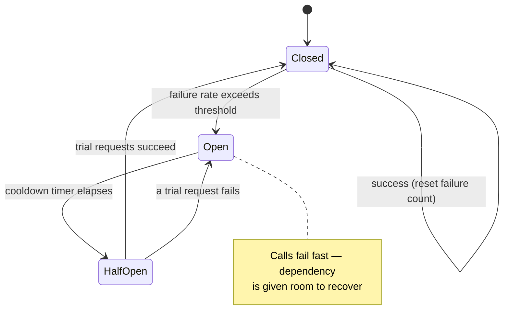
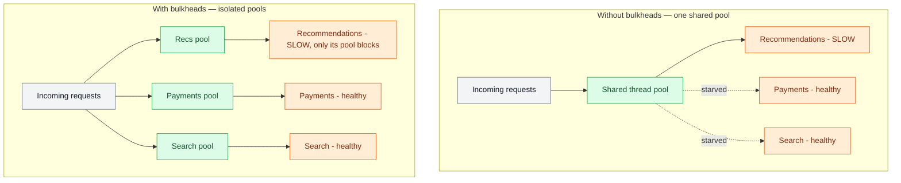

# Resilience & Incident Response

> **Prerequisites:** [Faults, Clocks & Time](/synapse/system-design-from-first-principles/distributed-data/faults-clocks-and-time), [Nonfunctional Requirements](/synapse/system-design-from-first-principles/foundations/nonfunctional-requirements) | **You'll be able to:** place a circuit breaker and a bulkhead in a design and say what each one protects against; explain why naive retries turn a blip into an outage; and run an incident from detection through a blameless postmortem.

## The problem (why this exists)

Here is the uncomfortable truth this whole module has been building toward: **at scale, something is always broken.** A cluster of 10,000 disks loses roughly one disk *every day* from normal wear [DDIA2 p.44]. Machines crash, kernels hit leap-second bugs, a dependency three hops away starts returning slow responses, a config change ships at 2 p.m. and takes out a region. DDIA puts it plainly: *"in a large enough system, one-in-a-million events happen every day"* [DDIA2 p.345]. You do not get to choose a world where nothing fails — only whether one failure stays small or takes everything with it.

Consider a concrete cascade. Your product service calls a recommendations service to decorate each page. One day recommendations gets slow — not down, just slow, responses climbing from 20 ms to 5 seconds. Your product service was written to wait for the answer, so its threads pile up. Within a minute every request thread is blocked on a recommendations call that will never usefully return. Your product service — which could have happily served pages *without* recommendations — is now completely down. One slow, non-essential dependency just took out an essential service. The fault did not stay a fault; it **escalated into a failure** [DDIA2 p.43].

This lesson is about refusing to let that happen, and what you do when it happens anyway. It has two halves. The first is **resilience**: design-time patterns that contain the blast radius of a failure — timeouts, retries done correctly, circuit breakers, bulkheads, load shedding, backpressure — plus **chaos engineering**, breaking things on purpose so you find the weaknesses before your users do. The second is **incident response**: the human runbook for when the pager goes off — detect, triage, mitigate before you understand root cause, then run a *blameless* postmortem so the organization actually learns. The beginner takeaway to hold from the start: **assume things fail, contain the blast radius, and learn from every outage.**

## Intuition first

Think about how a building is designed to survive a fire. Nobody believes fires will never start — the entire design assumes one *will*. So the building is divided into **fire compartments** with fire doors between them: a fire in one wing is contained long enough for people to escape and the rest to survive. There are **circuit breakers** in the electrical panel that trip and cut power to a shorting circuit rather than let it burn the place down. There are **sprinklers** that shed the problem locally. And after any incident there is an **investigation** whose goal is not to fire the person who left the stove on, but to understand why the building let a stove fire spread — and fix *that*.

Every resilience pattern in this lesson is one of those building features, translated to software:

- A **timeout** is the decision to stop waiting. If a dependency does not answer in, say, 500 ms, you give up rather than block forever — because without timeouts, one stuck dependency drinks all your threads. But a timeout can *not* tell you whether the request was lost, the node is dead, or it is merely slow and will process you later [DDIA2 p.348]. You are guessing under uncertainty — which is why the patterns that follow matter.
- A **retry** is trying again after a transient failure. Networks drop packets; a retry papers over the blip. But retries are the most dangerous pattern here, because *everyone* retries at once, turning a small stumble into a stampede.
- A **circuit breaker** is the electrical panel: after a dependency fails enough times, you *stop calling it entirely* for a while — you "trip the breaker" — so you stop pouring requests into a hole and give it room to recover.
- A **bulkhead** is the fire compartment (the name comes from the watertight compartments in a ship's hull — one breached compartment floods, the ship floats). You isolate resource pools so that traffic to a failing dependency can only ever consume *its* slice of your threads, never all of them.
- **Load shedding and graceful degradation** are the sprinklers: under overload you deliberately drop non-essential work and serve a *degraded* response — a page without recommendations, search without personalization — rather than fail completely.

The unifying idea, and the beginner's whole mental model, is **blast radius**. A resilient system is not one where nothing fails; it is one where a failure is *contained* — the compartment doors hold, the breaker trips, and the fire stays in one wing.

## How it works

### Timeouts: never wait forever

Every remote call needs a deadline. The subtlety is choosing it. Too long and you hold resources hostage waiting on a corpse; too short and you declare healthy-but-slow dependencies dead, retry a request that actually succeeded, and add load exactly when the system is struggling [DDIA2 p.352]. There is no universal right answer — real networks have unbounded delay, so the clean formula "response always arrives within `2d + r`" (max network delay `d` plus max processing time `r`) does not hold in an asynchronous network [DDIA2 pp.352–353]. In practice you set the timeout above a high percentile of the observed round-trip-time distribution, or better, adapt it continuously (the Phi Accrual failure detector in Cassandra and Akka does exactly this) [DDIA2 p.355]. A timeout should be derived from the dependency's observed p99, not a number someone typed once and forgot.

### Retries: exponential backoff **and jitter**

Retrying a transient failure is correct. Retrying *naively* is how you manufacture an outage. Picture a dependency that hiccups for one second. A thousand clients all fail, and all retry immediately. That synchronized wave of retries lands at the same instant, doubling the load just as the dependency is trying to recover, which causes more failures, which cause more retries. The system can get stuck in an overloaded state that persists *even after the original trigger is gone* — DDIA names this a **retry storm** leading to **metastable failure**: the system stays wedged in a bad equilibrium until something forces a reset [DDIA2 p.38].

Two fixes, and you need **both**:

1. **Exponential backoff.** Wait longer between each attempt — 100 ms, then 200, then 400, then 800 — thinning the retry rate so a struggling dependency is not hammered.
2. **Jitter** (randomization). Backoff alone is not enough: a thousand clients that failed at the same instant will back off by the *same* amount and retry in another synchronized wave. A random component *spreads the retries out in time* so they arrive smoothly instead of in spikes. AWS's analysis is the canonical reference — without jitter, competing clients cluster and contend; with full jitter, the same clients complete faster with far less contention [web: AWS Architecture Blog, "Exponential Backoff And Jitter"]. DDIA lists the same mitigations for retry-driven overload: exponential backoff, *randomized/jittered* intervals, circuit breakers, token buckets, load shedding, and backpressure [DDIA2 p.38].

Also cap retries and make retried operations **idempotent** — because a timeout never tells you whether the first attempt actually landed [DDIA2 p.349], a retry can duplicate work unless the operation is safe to repeat.

### The circuit breaker: stop hammering a corpse

Backoff slows an individual client's retries. A **circuit breaker** goes further: it stops calls to a failing dependency *entirely* for a while, giving it room to recover and giving your own service a fast, cheap failure instead of a slow, resource-draining one. The pattern was popularized by Michael Nygard in *Release It!* and is now everywhere [web: Michael Nygard, "Release It!", circuit breaker & bulkhead patterns]. It is a small state machine wrapped around a dependency:

- **Closed** — normal operation. Calls flow through. The breaker counts failures. If the failure rate crosses a threshold, it trips to *open*.
- **Open** — the breaker is tripped. Calls **fail immediately** without touching the dependency (you return a fallback or a fast error). This is the key move: you are no longer pouring requests into a hole. After a cooldown timer, the breaker moves to *half-open*.
- **Half-open** — a trial. The breaker lets a *small number* of test requests through. If they succeed, the dependency has recovered and the breaker returns to *closed*. If they fail, it snaps back to *open* and waits again.



The circuit breaker is the *signature* resilience pattern because it converts a slow, cascading failure into a fast, contained one. When the breaker is open, your service degrades predictably (missing recommendations) instead of collapsing (every thread blocked) — and it protects the *downstream* service from being pounded while it is trying to come back.

### Bulkheads: isolate the pools

A circuit breaker reacts *after* failures accumulate. A **bulkhead** prevents the contagion structurally, up front. Instead of one shared pool of worker threads (or connections) that every dependency draws from, you partition the pool: recommendations gets its own bounded slice, payments gets its own, search gets its own. Now if recommendations goes slow and its threads all block, it can exhaust *only its own compartment*. The essential services keep their threads. One flooded compartment; the ship still floats.



Bulkheads cost you utilization — each pool is sized for its own peak, so you hold more idle capacity than one shared pool would. That is the price of isolation, and it is worth it for the dependencies whose failure you cannot afford to spread.

### Graceful degradation, load shedding, and backpressure

The last family is about behavior under *overload* — more load than you can serve, regardless of any single dependency failing. You have, fundamentally, three choices when work arrives faster than you can handle it, and DDIA lays them out in exactly these terms for a messaging system: **drop, buffer, or apply backpressure** [DDIA2 p.489].

- **Load shedding** is *dropping* on purpose: when you are near capacity, proactively reject or skip work — ideally the *least* important work first — rather than let queues grow unbounded and topple everything [DDIA2 p.38]. Shedding non-essential requests keeps the essential ones fast.
- **Graceful degradation** is serving a *reduced* response instead of an error: the page without the recommendation rail, the feed without personalization, read-only mode when writes are unavailable. This is the availability side of the CAP trade-off made concrete — you choose to stay *available* with a degraded answer rather than fail (see [CAP & PACELC, Honestly](/synapse/system-design-from-first-principles/distributed-data/cap-and-pacelc-honestly)).
- **Backpressure** is *pushing back*: signaling upstream to slow down rather than accepting work you cannot handle. TCP flow control is the textbook example — a bounded buffer that forces the sender to wait [DDIA2 p.489]. Queues between services (see [Queues & Brokers](/synapse/system-design-from-first-principles/building-blocks/queues-and-brokers)) are where you tune drop-vs-buffer-vs-backpressure explicitly.

### Chaos engineering: break it on purpose

All of the above is theory until you *test* it under real failure. The problem, as DDIA notes, is that many critical bugs are actually bugs in the error-handling code — the code that only runs when something breaks, and therefore the code that is least exercised and least trusted [DDIA2 p.44]. **Fault injection** — deliberately triggering faults — exercises that machinery so you gain real confidence it works [DDIA2 p.44]. Doing this against a *production* (or production-like) system is **chaos engineering** [DDIA2 p.385].

Netflix pioneered the practice with **Chaos Monkey**, which randomly terminates production instances during business hours, forcing engineers to build services that treat instance loss as a *normal* event rather than an emergency [web: Netflix, "Chaos Monkey" / principlesofchaos.org]. The "Principles of Chaos Engineering" frame it as a controlled experiment: hypothesize a steady state, inject a real-world fault (kill a node, add latency, partition the network), and see whether the system holds. Tooling has matured past random killing — Jepsen has been extraordinarily effective at finding correctness bugs in widely-used distributed databases by injecting network partitions [DDIA2 pp.385–386]. The point is cultural as much as technical: **you find the weakness on your terms, in daylight, with the team watching — not at 3 a.m. when it finds you.**

## Trade-offs

Every resilience pattern buys containment at a cost. The engineering judgment is knowing which one a given failure mode calls for.

| Pattern | Protects against | Cost |
| --- | --- | --- |
| Timeout | A stuck dependency draining your threads while you wait forever | Too-short timeouts falsely kill slow-but-healthy calls and trigger needless retries [DDIA2 p.352] |
| Retry + backoff + jitter | Transient blips (dropped packets, brief unavailability) | Without jitter, synchronized retries cause a retry storm / metastable failure [DDIA2 p.38]; needs idempotency |
| Circuit breaker | Cascading failure from repeatedly calling a down/slow dependency | Tuning thresholds; an open breaker means *deliberate* unavailability of that feature |
| Bulkhead | One dependency's failure consuming *all* shared resources | Lower utilization — each isolated pool is sized for its own peak |
| Load shedding | Overload driving unbounded queues and total collapse | You reject some real work; must rank requests by importance |
| Graceful degradation | A partial failure becoming a total outage | Engineering the reduced-functionality path and keeping it tested |
| Backpressure | Fast producers overwhelming slow consumers | Slows the whole pipeline; upstream must handle the "slow down" signal |
| Chaos engineering | Untested failure paths — the error-handling code that never runs | Risk and effort of injecting real faults; needs mature observability first |

The patterns compose. A well-designed call has a timeout, wraps retries with backoff+jitter, sits behind a circuit breaker, runs inside a bulkhead, and degrades gracefully when the breaker is open — the whole arrangement validated by chaos experiments.

## Numbers that matter

- **Failure is constant at scale:** ~2–5% of magnetic disks fail per year, so a 10,000-disk fleet expects **~1 disk failure per day**; ~1 in 1,000 machines has a CPU core that occasionally computes a wrong result [DDIA2 pp.44–45]. Your design assumes this baseline, not zero.
- **Networks fail routinely:** one medium datacenter study saw **~12 network faults per month**, half isolating a single machine and half a whole rack [DDIA2 p.350]. Cross-region round trips have been observed spiking to **several minutes** at high percentiles — messages must be assumed arbitrarily delayable [DDIA2 p.350], which is *why* timeouts are guesses.
- **Humans are the leading cause:** in a study of large internet services, **operator configuration changes were the top cause of outages**, with hardware faults implicated in only 10–25% of cases [DDIA2 p.47]. This is the single most important number in this lesson: it means resilience investment should target *change safety* (gradual rollouts, fast rollback) at least as much as hardware redundancy — see [Deployment Strategies](/synapse/system-design-from-first-principles/production-engineering/deployment-strategies).
- **Fault tolerance is always bounded:** you tolerate a *specific* number and type of faults (at most two disks, one of three nodes) — tolerating *any* number is nonsensical [DDIA2 p.44]. Name the fault budget.

## In production

Resilience patterns are the standard toolkit of every large operator. Netflix built its resilience story around the circuit breaker (its **Hystrix** library, since superseded, made the pattern mainstream) and around **Chaos Monkey** and the broader Simian Army, deliberately killing production instances so that instance loss is a non-event [web: Netflix, "Chaos Monkey"]. The circuit-breaker and bulkhead patterns themselves come from Michael Nygard's *Release It!*, distilled from real production outages [web: Michael Nygard, "Release It!"]. These are load-bearing, not decorative: a service mesh (see [Service Discovery & Mesh](/synapse/system-design-from-first-principles/production-engineering/service-discovery-and-mesh)) typically implements timeouts, retries with backoff, and circuit breaking *in the sidecar*, so every call gets them without per-service code.

But patterns only cover the design-time half. The other half is what happens when the pager fires — and here the authority is Google's **Site Reliability Engineering** book, whose incident-management chapter codifies the practice most of the industry now follows [web: Google SRE Book, "Managing Incidents"]. The shape of a well-run incident:

- **Detect.** You alert on **SLO breach** — user-facing *symptoms* (error rate, latency past your p99 target), not every internal cause like a CPU spike. This is why the observability lesson insists on symptom-based alerting ([Observability](/synapse/system-design-from-first-principles/production-engineering/observability)). A page should mean "users are hurting," not "a metric moved."
- **Triage and assign severity.** Classify the blast radius (a SEV-1 total outage vs. a SEV-3 degraded feature) so the response is proportional. Severity drives who gets pulled in and how loudly.
- **Establish roles.** Google's model separates the **Incident Commander** (who runs the response and holds the state — *not* necessarily the person fixing it), the **Operations lead** (who makes changes), and the **Communications lead** (who keeps stakeholders informed) [web: Google SRE Book, "Managing Incidents"]. Clear roles prevent the classic failure where five engineers all debug the same thing and nobody coordinates.
- **Mitigate before you understand root cause.** This is the discipline that separates mature responders from novices: **stop the bleeding first.** If a deploy caused it, roll back *now* — you do not need to understand the bug to know the previous version worked. Restore service, *then* investigate. Chasing root cause while users suffer is a rookie error.

### The blameless postmortem

After the incident is resolved comes the part that determines whether you ever stop repeating it. DDIA is unambiguous: blaming "human error" is counterproductive because it is a *symptom* of a problem in the **sociotechnical system**, not a root cause [DDIA2 p.47]. When operator config changes are the leading cause of outages, the answer is not "be more careful" — it is better tooling, rollback mechanisms, gradual rollouts, and interfaces that make the right action easy [DDIA2 p.47]. The mechanism for learning this way is the **blameless postmortem**: a review that encourages full disclosure *without fear of punishment*, so the organization can understand what actually happened and fix the system [DDIA2 p.48].

Google's SRE practice operationalizes exactly this: a postmortem is blameless when it focuses on *contributing causes* rather than *individuals*, treats the engineer who typed the command as a source of information rather than a target, and produces concrete, owned, tracked action items [web: Google SRE Book, "Postmortem Culture: Learning from Failure"]. DDIA even warns against the *simplistic* postmortem conclusion — "Bob should have been more careful," "we should rewrite it in Haskell" — and says to instead learn how the sociotechnical system really works from the people who operate it daily [DDIA2 p.48]. The output of a good postmortem is not a scapegoat; it is a shorter list of ways the *system* let a human mistake become an outage.

## Pitfalls & interview traps

<div style="border-left:4px solid #da5233;background:rgba(218,82,51,0.08);padding:0.6rem 1rem;border-radius:0 0.5rem 0.5rem 0;margin:1.25rem 0">

⚠️ **The two failures that turn a blip into an outage.** *Technically:* retries **without backoff and jitter** are not resilience — they are an amplifier. A one-second hiccup plus synchronized immediate retries becomes a self-sustaining retry storm that keeps the system wedged in a **metastable failure** state long after the original trigger cleared [DDIA2 p.38]. If you add retries in an interview and do not say "with exponential backoff *and jitter*, capped, and idempotent," a good interviewer will make you cause the outage yourself. *Culturally:* a blame culture is the same failure at the human layer — punish the engineer who ran the command and everyone stops disclosing, so the organization never learns and the outage recurs [DDIA2 pp.47–48]. Blame kills the feedback loop exactly the way a retry storm kills the service.

</div>

Other traps interviewers reach for:

- **Timeouts that lie.** A timeout does not mean the request failed — the remote node may still process it later [DDIA2 p.348]. Retrying a non-idempotent operation after a timeout can double-charge a customer. Idempotency keys are the fix.
- **Health checks miss gray failures.** A **limping / fail-slow** node passes its health check but is too slow to do useful work — a NIC dropping to a trickle, a GC-thrashing process [DDIA2 p.381]. "Is it up?" is the wrong question; "is it *serving within SLO*?" is the right one. This is why circuit breakers key on *failure/latency rate*, not on a liveness ping.
- **Retry amplification across layers.** If the client retries, the gateway retries, *and* the service retries, one user request becomes 8+ dependency calls. Retries should live at *one* layer (usually the outermost) or be explicitly budgeted per layer.
- **"We'll add chaos testing later."** Chaos engineering requires mature observability first — if you cannot *see* steady state, you cannot tell whether an experiment broke it. Observe, then break.

## Check yourself

```quiz
{"prompt": "A dependency hiccups for one second. A thousand clients all fail and immediately retry with no backoff and no jitter. Why does this frequently make the outage far worse than the original one-second blip?", "options": ["The retries carry corrupted data that crashes the dependency", "The synchronized retry wave doubles load exactly as the dependency tries to recover, which can wedge the system in a self-sustaining overloaded (metastable) state long after the trigger clears", "Retries bypass the load balancer and hit a single node", "TCP cannot handle more than 1000 simultaneous connections"], "answer": "The synchronized retry wave doubles load exactly as the dependency tries to recover, which can wedge the system in a self-sustaining overloaded (metastable) state long after the trigger clears"}
```

```quiz
{"prompt": "A circuit breaker is in the OPEN state. A request arrives for the protected dependency. What happens?", "options": ["The request is queued until the dependency recovers", "The request is sent to the dependency but with a shorter timeout", "The call fails fast without touching the dependency (returning a fallback or fast error), giving the dependency room to recover", "The breaker immediately sends ten test requests to check recovery"], "answer": "The call fails fast without touching the dependency (returning a fallback or fast error), giving the dependency room to recover"}
```

```quiz
{"prompt": "Your product service shares one thread pool across all its downstream calls. The (non-essential) recommendations service goes slow and its calls block. Which pattern would have prevented recommendations from taking down the entire product service?", "options": ["A longer timeout on the recommendations call", "A bulkhead: give each dependency its own bounded pool so a slow one can only exhaust its own compartment", "More aggressive retries on recommendations", "A stronger consistency model for the recommendations data"], "answer": "A bulkhead: give each dependency its own bounded pool so a slow one can only exhaust its own compartment"}
```

```quiz
{"prompt": "During a live outage, you discover a deploy 20 minutes ago correlates with the error spike, but you don't yet understand the bug. What is the correct first move?", "options": ["Keep the current version running and debug the root cause thoroughly before touching anything", "Roll back to the previous known-good version now to stop the bleeding, then investigate root cause", "Post the postmortem before mitigating so stakeholders are informed", "Restart every machine in the fleet simultaneously"], "answer": "Roll back to the previous known-good version now to stop the bleeding, then investigate root cause"}
```

<details>
<summary>Why isn't exponential backoff <em>alone</em> enough — why do you also need jitter?</summary>

Because a thousand clients that failed at the *same instant* will compute the *same* backoff delay and retry in another synchronized wave. Backoff thins the average retry rate but preserves the synchronization; the load still arrives in spikes. **Jitter** adds a random component to each client's wait so the retries spread out smoothly in time. AWS's analysis showed full jitter lets competing clients complete faster with far less contention. You need both: backoff to reduce the rate, jitter to de-synchronize it [DDIA2 p.38; web: AWS Architecture Blog].
</details>

<details>
<summary>What makes a postmortem "blameless," and why does the blamelessness actually matter for reliability?</summary>

A blameless postmortem focuses on the *contributing causes in the sociotechnical system* rather than on the individual who typed the command, and treats that person as the best source of information rather than a target for punishment. It matters because "human error" is a symptom, not a root cause — when config changes are the *leading* cause of outages, the fix is better tooling, rollback, and gradual rollout, not "be more careful." And crucially: the moment you punish disclosure, people stop disclosing, the feedback loop dies, and the same outage recurs. Blamelessness is what keeps the organization *learning* [DDIA2 pp.47–48; web: Google SRE, "Postmortem Culture"].
</details>

<details>
<summary>Your on-call gets paged because a single host's CPU hit 95%. Users are fine. What's wrong with this alert, and what should page instead?</summary>

It pages on a *cause*, not a *symptom*. A CPU spike on one host among thousands may have zero user impact — the load balancer routes around it, or it self-corrects. Paging a human for it causes alert fatigue, which is how real pages get ignored. You should alert on **SLO breach**: user-facing error rate or latency past your p99 target. Those mean "users are actually hurting." Causes belong on dashboards you consult *during* an incident, not on the pager [DDIA2 p.41; see Observability].
</details>

## PoC — Proof of concepts

The resilience patterns, a way to test them, and the culture that closes the loop:

- [Resilience4j](https://github.com/resilience4j/resilience4j) — circuit breaker, retry, bulkhead and
  rate limiter as composable decorators; this lesson's patterns as a library you can read.
- [Chaos Mesh](https://github.com/chaos-mesh/chaos-mesh) — inject faults (pod kills, network delay,
  partitions) into a live cluster; the way to find out whether your resilience actually holds.
- [Google SRE — Postmortem Culture](https://sre.google/sre-book/postmortem-culture/) — the blameless
  postmortem, the practice that turns an incident into a permanent fix rather than a repeat.

## Sources

- DDIA2 ch. 2 pp. 43–48 (fault vs. failure, fault tolerance & bounded fault budgets, hardware/software fault rates, humans & reliability, blameless postmortems) · pp. 37–38 (retry storms, metastable failure, load shedding, backpressure, circuit breakers)
- DDIA2 ch. 9 pp. 345–357 (partial failure, timeouts under unbounded delay, cascading failure, false-positive death declarations) · p. 375 (fencing tokens vs. STONITH) · p. 381 (limping / fail-slow nodes) · pp. 384–386 (fault injection, chaos engineering, Jepsen)
- DDIA2 ch. 12 p. 489 (overload responses: drop, buffer, backpressure)
- [web: AWS Architecture Blog, "Exponential Backoff And Jitter"] — backoff+jitter reduces contention and retry storms
- [web: Michael Nygard, "Release It!"] — circuit breaker and bulkhead patterns, from production outages
- [web: Netflix, "Chaos Monkey" / principlesofchaos.org] — production fault injection; instance loss as a normal event
- [web: Google SRE Book, "Managing Incidents"] — incident command, roles (IC / Ops / Comms), mitigate-before-root-cause
- [web: Google SRE Book, "Postmortem Culture: Learning from Failure"] — blameless postmortem practice and tracked action items
