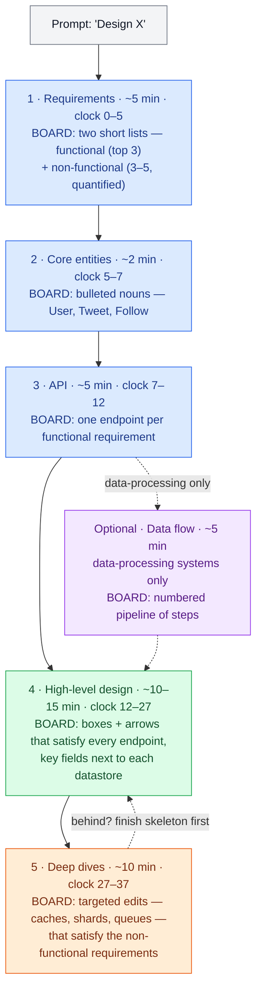
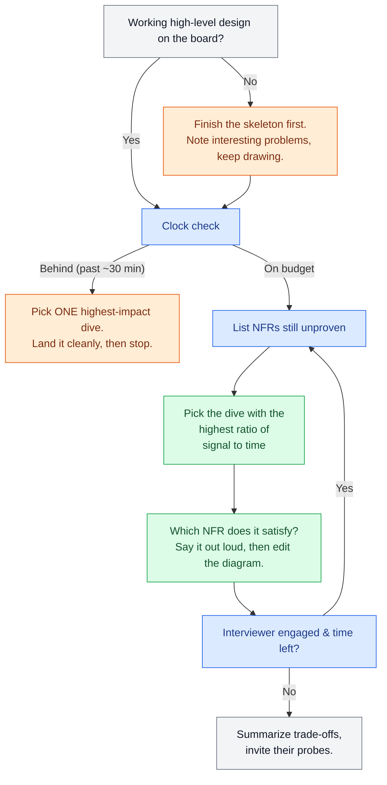

# The Delivery Framework

> **Prerequisites:** [The Interview at 10,000 Feet](/synapse/system-design-from-first-principles/foundations/the-interview-at-10000-feet), [Thinking in Trade-offs](/synapse/system-design-from-first-principles/foundations/thinking-in-tradeoffs) | **You'll be able to:** run all five stages of a design interview on the clock; know what to write on the board and say aloud at each; recover when you fall behind; and choose deep dives that signal your level.

## The problem (why this exists)

The single most common reason mid-level candidates fail a system-design interview is not that they lack knowledge — it is that they never deliver a complete, working system inside the slot. On the feedback form this shows up as the vague phrase "time management," and it quietly ends more loops than any gap in distributed-systems theory. The cause, visible across thousands of mock interviews, is blunt: the problem usually isn't that you need to work twice as fast. It's that you spent your scarce minutes on the wrong things — polishing one clever corner while the rest of the system stayed a blank whiteboard.

You already met this framework from 10,000 feet in the Foundations module. That preview gave you the shape: five stages, a clock, and one navigation rule. This lesson is the full treatment — the version you actually run under pressure. It answers the questions the preview left open: what do I physically write on the board at each stage? What do I *say* to the interviewer while I write it? What do I do when I glance at the clock and I'm eight minutes behind? And how do I pick deep dives that make a staff engineer nod instead of shrug? By the end you should be able to walk into any product-design interview and drive it start to finish without ever wondering "what now?"

## Intuition first

Strip away the nerves and a design interview is a collaboration under a stopwatch. The interviewer is pretending to be a colleague sketching a system with you; their real deliverable is a hire/no-hire recommendation they must defend to a committee with concrete evidence. So your job is not "know things." It is to *generate evidence*, on a clock, across the few competencies on their rubric — problem navigation, high-level design, technical excellence, and communication.

The framework is the discipline that keeps you generating that evidence in the right order. Think of the whiteboard as a map you are drawing. A cartographer does not ink one mountain range in loving detail before the coastline exists; they sketch the whole territory first, then add detail where the terrain is interesting. Requirements establish *what land you're mapping*. Core entities name *the features on it*. The API defines *its borders*. The high-level design draws *the whole coastline*. Deep dives zoom into *the two or three interesting ranges*. Do it in that order and you always have a complete map to hand the interviewer, however the clock runs out.

There is a second, underrated benefit that matters more than it sounds: the framework is a fallback path. Nearly everyone freezes at some point. When each stage's output feeds directly into the next — requirements feed entities, entities feed the API, the API feeds the design — a blank mind always has an obvious next move. You are never stranded, because the previous artifact tells you what to do next.

## How it works

The framework is five stages plus one optional insert. Each stage has a budget, a concrete artifact you leave on the board, and a running narration you keep up while you draw. Here is the whole arc, with the cumulative clock and what physically ends up on the whiteboard at each step.



### Stage 1 — Requirements (~5 minutes)

You write two short lists and nothing else. **Functional requirements** are "users should be able to…" statements. Drive them like a product conversation: ask targeted questions ("does the system need to support X?", "what happens when Y?") and converge on the **top three**. This is the most important discipline of the whole stage — the rest of the interview exists to satisfy exactly the list you commit to here, so every extra requirement is a promise you now have to keep. Many of these systems have dozens of features; your job is to find the three that matter and ignore the rest. Top companies score prioritization directly.

**Non-functional requirements** are "the system should be…" statements — availability versus consistency, scale, latency, durability. They only earn their place if they are *quantified* and *specific to this system*. "The system should be low latency" is filler; nearly every system should be. "Feed rendering under 200 ms" and "scale to 100M+ DAU, prioritizing availability over consistency" are real design constraints that will drive your deep dives. Use a mental checklist to find them — consistency vs availability (CAP), scale and read/write ratio, latency on the expensive operations, durability, fault tolerance, security and compliance — and pick the **3–5** that actually shape *this* design. ([Nonfunctional Requirements](/synapse/system-design-from-first-principles/foundations/nonfunctional-requirements) makes these sharp.)

What you say aloud matters here. Announce that you'll defer capacity math: "I'll skip up-front estimation and do the math later, at the specific points where a number would change the design." Interviewers read that as maturity, not evasion — because calculating QPS and storage only to conclude "so, it's a lot" produces zero signal.

### Stage 2 — Core entities (~2 minutes)

Two minutes, a bulleted list of nouns, and a sentence of narration. For a Twitter-like system: `User`, `Tweet`, `Follow`. This is not a schema — resist the urge to list columns. You don't yet know what you don't know, and fields are far cheaper to add next to the database once the high-level design reveals what each request actually reads and writes. Say it out loud: "Here's my first-draft list of entities; I'll flesh out fields as the design tells me what each request touches." One quiet signal rides along here — some interviewers watch whether you pick *good names*, because naming is a small tell for clear thinking.

### Stage 3 — API (~5 minutes)

Now define the contract between your system and its clients, usually one endpoint per functional requirement. Default to **REST** with plural resource nouns (`POST /tweets`, `POST /users/{userId}/follows`); reach for GraphQL only when diverse clients need to shape their own payloads, or RPC/gRPC only for performance-critical internal calls. ([API Design](/synapse/system-design-from-first-principles/foundations/api-design) covers the decision.) Don't overthink it — the protocol is rarely the point.

Two things to narrate. First, walk each endpoint back to the functional requirement it satisfies, so the interviewer sees the mapping. Second, hit the one security tell interviewers always notice: identity comes from the **auth token**, never from a user-supplied ID in the request body. That's why the tweet endpoint has no `userId` in its payload but the follow endpoint has one in its *path* — the actor is the authenticated user; the target is a parameter.

*(Optional insert — Data flow, ~5 minutes: only for data-processing systems like a web crawler or an analytics pipeline. Before drawing boxes, list the sequence of transformations from input to output as a numbered pipeline: fetch seeds → parse HTML → extract links → dedupe → store → repeat. Skip it entirely for standard product designs — most interviews don't need it.)*

### Stage 4 — High-level design (~10–15 minutes)

Now you draw. Boxes and arrows — clients, load balancers, services, databases, caches, queues — that satisfy the API you just wrote, built up **one endpoint at a time**. This is the core of the interview and the stage where most candidates either quietly succeed or quietly fail.

The discipline is aggressive minimalism: build the *simplest complete working system* that satisfies the **functional** requirements, and nothing more. As you draw, you will constantly spot places begging for a cache, a queue, a shard, a read replica. **Do not add them yet.** Say the magic sentence — "I'd probably want a cache here for read latency; let me note it and come back in deep dives" — write a small marker on the board, and keep moving. Layering complexity now is the single fastest way to run out of clock with a half-drawn system.

Narrate data flow continuously: for each endpoint, trace the request from client to response and say what *state* changes — which row is written, which cache is invalidated, which queue gets a message. When a request hits the database, that's the moment to jot the two or three *relevant* fields next to it (not `name`, `email`, `password_hash` — the interviewer assumes those; write the ones that matter to *this* design, like `Tweet.createdAt` for feed ordering). Keeping fields next to the datastore that owns them makes the schema easy to evolve as you iterate.

### Stage 5 — Deep dives (~10 minutes)

Now harden the skeleton. With a complete working design on the board, spend the final stretch making it *good*: (a) satisfy each non-functional requirement, (b) handle edge cases, (c) hunt and fix bottlenecks, and (d) respond to the interviewer's probes. For a Twitter-like design, this is where feed fan-out (push vs pull) and caching strategy finally get their due — the genuinely interesting problems you deliberately walked past. Each deep dive is a small, targeted edit to the existing diagram, not a redraw.

Who *initiates* the dives is the clearest seniority signal in the whole interview. A mid-level candidate is expected to be *prompted* — the interviewer points at the single database and asks "how does this hold at 100M DAU?" A senior candidate is expected to identify the two or three sharpest problems themselves and *lead* the discussion, pulling from the non-functional list they wrote in stage 1. More on steering this below.

## Trade-offs

The scarce resource is minutes, and how you spend them is itself a design decision — arguably the most consequential one you make. The governing rule is a single sentence: **breadth first, then depth where the interesting problems are.** Everything below is a corollary about where to spend minutes you can't get back.

| Where you can spend the minute | Gives you | Costs you | Spend it here when |
| --- | --- | --- | --- |
| Breadth first, targeted depth after (the framework) | A complete working system by ~minute 27, then depth where it counts | Discipline — you must walk past fascinating problems and note them | Default, always |
| Depth first on the first hard problem | An early depth signal | The most common failure mode: clock dies before a complete system exists | Only if the interviewer explicitly steers you there |
| Extra requirements / longer entity list | Feels thorough | Prioritization is scored *down*; every requirement is a promise | Never — three functional, 3–5 non-functional, stop |
| Up-front capacity math | The comfort of an old ritual | ~5 minutes to conclude "it's a lot," changing nothing | Only when the number changes the architecture (e.g. does the top-K heap fit on one node?) |
| A second or third deep dive | More technical-excellence evidence | Risk of running the clock out mid-thought | After the first dive lands cleanly and a working design is already on the board |

How much depth is "enough" is calibrated by level, which the next section quantifies — but the ordering above never changes regardless of level.

## Numbers that matter

These are the framework's budgets for a standard 45-minute slot. The discipline that makes them work is keeping stages 1–3 lean so stages 4–5 inherit the bulk of the clock.

| Quantity | Value |
| --- | --- |
| Requirements | ~5 min (cumulative 0–5) |
| Core entities | ~2 min (5–7) |
| API | ~5 min (7–12) |
| Data flow (optional, data-processing only) | ~5 min |
| High-level design | ~10–15 min (12–27) |
| Deep dives | ~10 min (27–37) |
| Functional requirements to commit to | top 3 |
| Non-functional requirements | 3–5, quantified |
| Breadth : depth mix, mid-level | ≈ 80 : 20 |
| Breadth : depth mix, senior | ≈ 60 : 40 |

The budgets sum to roughly 32–37 minutes, not 45 — and that slack is deliberate. *Rule of thumb, not from source:* a "45-minute" interview yields about 35–40 minutes of real design time after introductions, a minute of clarifying the prompt, and closing questions. Treat the missing minutes as your buffer, not as free time to fill. For the estimation technique itself and the latency/capacity figures worth memorizing, see [Estimation & the Numbers](/synapse/system-design-from-first-principles/foundations/estimation-and-numbers).

The other number to internalize is a checkpoint, not a budget: **you should have a complete, working high-level design on the board by roughly minute 27.** If you don't, you are behind, and the recovery move is always the same — stop adding, finish the skeleton, and compress deep dives. A shallow-but-complete design beats a deep-but-partial one every time, because "no working system" usually means "no offer."

## In production

The framework is not one rigid script; real interviewers flex it along two axes, and calibrating to them live is itself a senior skill.

**By interview type.** *Product design* ("design Slack's backend," "design a news feed") is the most common shape and exactly what this framework targets: requirements-heavy, with deep dives on scaling reads/writes and data modeling. *Infrastructure design* ("design a rate limiter," "design a distributed message queue") shifts the weight deeper in the stack — functional requirements are often thin, and the interview lives in the non-functional constraints and system-level mastery: consensus, durability, partitioning, exactly-once semantics. There you compress stages 1–3 hard and let deep dives dominate. *Object-oriented design* (an Amazon staple) and *frontend design* are different games this book doesn't cover. Ask early — "is this more of a product design or an infra design?" — and rebalance your budgets accordingly.

**By level and by company.** Design interviews are rare for entry-level, common at mid-level, and the default at senior and staff. Everyone must deliver a complete working system, but the depth expectation moves: a mid-level candidate might run ≈80% breadth / 20% depth and be *prompted* into every deep dive; a senior candidate runs closer to 60/40 and is expected to *lead* the dives from their own non-functional list; a staff candidate is additionally judged on whether they surface the *non-obvious* bottleneck and reason about operational reality — failure modes, cost, migration, blast radius. Companies also weight the four rubric competencies (problem navigation, high-level design, technical excellence, communication & collaboration) differently, but across companies they converge on those four. The top-level goal never changes: give the interviewer enough concrete evidence to walk into the debrief and *advocate* for hiring you.

The best real-world signal that you've internalized the framework is that you stop thinking about it. Like a musician who has drilled scales, you run the stages without narrating them to yourself, which frees your attention for the actual design and for reading the interviewer. The case studies are where that drilling happens — every one of them is a full run of all five stages. [URL Shortener](/synapse/system-design-from-first-principles/case-studies/url-shortener) is the cleanest first rep; [News Feed](/synapse/system-design-from-first-principles/case-studies/news-feed) and [Ticketmaster](/synapse/system-design-from-first-principles/case-studies/ticketmaster) show the framework under load, where deep-dive selection carries the interview.

### Steering the deep dives — the seniority lever

The mechanical part of the framework — the stages, the clock — gets you to a passing bar. What separates levels is deep-dive *selection*: which two or three problems you choose to open, and why. The move that reads as senior is to derive the dives from the non-functional requirements you committed to in stage 1, and to make the derivation explicit. "I said availability over consistency and sub-200ms feeds; the tension between those two lives in the fan-out path, so let me start there." That single sentence demonstrates navigation, technical excellence, and communication at once — and it's why the requirements stage, five minutes long, quietly determines the quality of the deep dives twenty minutes later. When you're deciding whether a working design is done enough to start diving, and which dive to open first, this is the decision you're running:



Notice the loop rejoins the non-functional list each time: every dive is anchored to a requirement, and when the interviewer stays engaged you go back for the next-highest-impact one. That's the difference between a candidate who *demonstrates depth on demand* and one who *free-associates about caches*.

## Pitfalls & interview traps

<div style="border-left:4px solid #da5233;background:rgba(218,82,51,0.08);padding:0.6rem 1rem;border-radius:0 0.5rem 0.5rem 0;margin:1.25rem 0">

⚠️ **The classic failure: depth before a working skeleton.** Layering caches, queues, and shards onto a half-drawn design is the single most common way candidates burn the clock with no complete system to show — and no complete system usually means no offer. When you spot the interesting problem in stage 4, *note it aloud, write a marker, and keep drawing the skeleton.* Dive only once the whole thing works end to end.

</div>

The other traps are individually cheaper but they compound. A **requirements laundry list** — ten features instead of three — actively hurts, because prioritization is scored and every extra requirement is a promise to keep. **Unquantified non-functional requirements** ("it should be scalable") are filler; attach a number and a subsystem. **Capacity-math theater** — computing QPS and storage up front only to conclude "it's a lot" — spends five minutes for zero signal; defer it to the decision points that actually need it. Writing a **full schema during core entities** front-loads guesswork you'll throw away; columns belong next to the database once the design shows what each request touches. In deep dives, **talking over the interviewer** is a double loss: they have specific signals to collect and monologuing forfeits both their probes and your collaboration score — leave them room, and treat every interruption as a gift that tells you what they want to see. And one logistical trap that costs real minutes: not asking the recruiter which **whiteboarding tool** you'll use, then fumbling an unfamiliar canvas live. Practice on the actual tool beforehand.

The subtlest trap is over-indexing on the framework itself. It is scaffolding, not a cage. If the interviewer redirects you — "skip the API, I want to see the storage layer" — follow them instantly. An interviewer's steer outranks the framework every single time; rigidly finishing your stage while they wait reads as poor collaboration, the exact opposite of what the structure is meant to demonstrate.

## Check yourself

```quiz
{"prompt": "You're 28 minutes into a 45-minute product-design interview. Your high-level design is only about two-thirds drawn — several API endpoints still have no backing components. You've just thought of an elegant sharding scheme. What does the delivery framework say to do?", "options": ["Start the sharding deep dive while the idea is fresh", "Finish wiring up the remaining endpoints into a complete working skeleton first, then dive", "Go back and add two more non-functional requirements to justify the sharding", "Do capacity estimation to prove sharding is needed"], "answer": "Finish wiring up the remaining endpoints into a complete working skeleton first, then dive"}
```

```quiz
{"prompt": "Two candidates deliver complete, working designs for the same prompt. What most distinguishes the senior candidate's performance in the deep-dives stage?", "options": ["Naming more technologies during the high-level design", "Finishing the requirements stage in under three minutes", "Proactively identifying and leading the two or three sharpest dives from their own non-functional list, at roughly a 60/40 breadth-to-depth mix", "Writing a more complete database schema during core entities"], "answer": "Proactively identifying and leading the two or three sharpest dives from their own non-functional list, at roughly a 60/40 breadth-to-depth mix"}
```

```quiz
{"prompt": "During stage 4, you realize a read-through cache would help feed latency, but you're only halfway through drawing the design. What's the framework-correct move?", "options": ["Add the cache and its invalidation logic now, while you remember the details", "Say 'I'd add a cache here for read latency' aloud, write a marker on the board, and keep building the skeleton", "Stop and recompute QPS to size the cache", "Remove feed latency from your non-functional requirements to simplify"], "answer": "Say 'I'd add a cache here for read latency' aloud, write a marker on the board, and keep building the skeleton"}
```

```quiz
{"prompt": "The prompt is 'design a distributed rate limiter' — an infrastructure-design interview. How should you rebalance the standard budgets?", "options": ["Spend longer on functional requirements, since infra systems have the most features", "Compress requirements, entities, and API, and let deep dives on algorithms, consistency, and durability dominate the clock", "Skip the high-level design entirely and go straight to deep dives", "Keep the exact same budgets as a product-design interview"], "answer": "Compress requirements, entities, and API, and let deep dives on algorithms, consistency, and durability dominate the clock"}
```

<details>
<summary>You glance at the clock: it's minute 32 and your high-level design still has a gap. How do you recover?</summary>

Stop adding anything new and finish the skeleton — get every functional requirement backed by at least a box and an arrow, even a crude one. A complete-but-shallow design scores far better than a deep-but-partial one, because "no working system" is the failure mode that sinks the whole interview. Announce the trade-off honestly: "Let me make sure the whole thing works end to end, then I'll deep-dive the most important piece with the time left." Then pick exactly one deep dive — the highest-impact one from your non-functional list — land it cleanly, and summarize what you'd do next if you had more time. Naming the remaining dives without executing them still demonstrates navigation.

</details>

<details>
<summary>Mid-way through your high-level design, the interviewer interrupts: "How would this hold up at 100M DAU?" What now?</summary>

Answer briefly and directly, without defensiveness — probes are how interviewers collect signal, and responsiveness is scored under communication and collaboration. Point at where the skeleton breaks (say, the single database), name the fix category (sharding, read replicas, a cache), then offer a path: "Can I finish the working design and make scaling the first deep dive?" If they'd rather go deep right now, follow them — their redirect outranks the framework. Either way you've shown you can see the bottleneck, which is most of what the probe was testing.

</details>

<details>
<summary>When is up-front capacity estimation actually worth five of your minutes?</summary>

Only when the number would change the architecture. The canonical example: for a top-K trending-topics system, estimating the number of distinct topics decides whether a min-heap fits on a single instance or must be sharded across many — that estimate reshapes the design, so it earns its minutes. "100M DAU, therefore lots of QPS" changes nothing and earns none. State at the requirements stage that you'll do math at the specific decision points that need it; interviewers read the deferral as maturity.

</details>

## PoC — Proof of concepts

There is no code for a *delivery framework* — the "proof" is worked examples that apply the same
requirements → estimate → API → high-level → deep-dive arc this lesson teaches:

- [System Design Primer](https://github.com/donnemartin/system-design-primer) — full worked designs
  (Pastebin, Twitter timeline, web crawler) you can trace the framework through, step by step.
- [karanpratapsingh/system-design](https://github.com/karanpratapsingh/system-design) — a linear
  course that models the same structured walk end to end.
- [awesome-system-design-resources](https://github.com/ashishps1/awesome-system-design-resources) —
  problems, patterns and case studies to rehearse the framework against.

## Sources

Original synthesis on interview delivery and calibration; this book's own framing.
