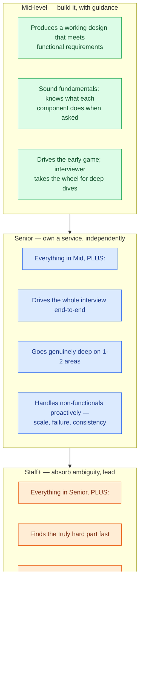

# Level Calibration

> **Prerequisites:** [The Delivery Framework](/synapse/system-design-from-first-principles/interview-playbook/delivery-framework), [Nonfunctional Requirements](/synapse/system-design-from-first-principles/foundations/nonfunctional-requirements) | **You'll be able to:** name the four competencies every rubric scores; predict how a mid, senior, and staff answer to the *same* question differ; self-diagnose your level and deliberately signal the next one.

## The problem (why this exists)

Two candidates walk out of the same interview — "Design Dropbox" — having drawn almost the same boxes on the whiteboard. One gets a strong hire; the other gets a no-hire. They both produced a working design. So what separated them?

The uncomfortable truth is that **there is no single passing bar in a system design interview.** The question is a constant; the bar is a variable that slides with the level you're being interviewed for. A high-level design that earns a mid-level engineer a clear pass is a *disappointment* from a staff candidate. The interviewer isn't grading the whiteboard — they're grading it against an internal rubric calibrated to a specific level.

This trips people up in both directions. Junior candidates over-index on drawing more boxes, thinking breadth is the goal, and never go deep enough to signal senior. Experienced engineers under-prepare, assuming their years of experience will "show" — then spend forty minutes narrating a competent-but-generic design and get dinged for never going deep on anything. Both failed to calibrate: to understand *what "good" looks like at the level they're targeting* and to deliberately produce that signal.

This lesson makes the sliding bar explicit. Once you can see the rubric the interviewer is using, you can aim at it on purpose.

<div style="border-left:4px solid #15448e;background:rgba(21,68,142,0.08);padding:0.6rem 1rem;border-radius:0 0.5rem 0.5rem 0;margin:1.25rem 0">

The leveling framework in this lesson — four scored dimensions, and the 80/20, 60/40, 40/60 breadth-depth splits with their per-level bars — is this book's clearest articulation of how real interview rubrics actually scale, and it's the throughline for every calibration lesson that follows.

</div>

## Intuition first

Forget rubrics for a second. Imagine you're the interviewer, and your only job at the end is to write one sentence: *"I would trust this person to own \_\_\_\_ on my team."* Fill in the blank and you've basically found the level.

- For a **mid-level** hire, the blank is *"a well-scoped feature, with guidance."* You need confidence they can take a defined problem, build something that works, and reason competently when you point at a weak spot. You expect to lead them there. You are the senior engineer in the room and they are pairing with you.

- For a **senior** hire, the blank is *"an entire component or service, independently."* You need confidence they'll drive the design without you holding the pen, that they'll go genuinely deep in the areas that matter, and that they'll spot the non-functional concerns (scale, failure, consistency) before you have to ask. You're a peer looking over their shoulder, not a guide.

- For a **staff** hire, the blank is *"an ambiguous, cross-cutting problem — and the people around it."* You need confidence they'll walk into a vague prompt, find the genuinely hard part faster than you did, make a contentious call and defend it, and connect the design back to operational and organizational reality. You're a colleague being convinced, sometimes being taught something.

Notice what changed as the level rose: not *whether* they produced a working design — everyone must clear that — but **how much they drove, how deep they went, and how much ambiguity they could absorb.** That's the whole game. The rest of this lesson is just the precise vocabulary for those three shifts.

## How it works

Every company writes its own rubric, but they're strikingly similar — they specify the same underlying competencies with different words. Distilled, they come down to **four dimensions every system design interview scores**:

1. **Problem Navigation.** Can you take a big, ambiguous problem, break it into manageable pieces, prioritize the *important* ones, and move through them to a solution? This is often the single most important dimension and the one most candidates struggle with. The classic failure modes are: not exploring the problem enough to gather real requirements, burning time on trivial parts instead of the interesting ones, and getting stuck on a piece with no way forward.

2. **High-Level Design.** With the problem broken down, can you actually solve each piece and compose them into a coherent whole? This is where your grasp of core concepts shows. Failure modes: not knowing the concepts well enough to solve a piece, ignoring scaling and performance, and "spaghetti design" — a solution that technically works but nobody can follow.

3. **Technical Excellence** (sometimes "technical depth"). Do you know current technologies and how to apply them with well-recognized patterns? Failure modes: not knowing what's available, not knowing how to apply it to *this* problem, and not recognizing common patterns and best practices.

4. **Communication and Collaboration.** An interview is a proxy for what it's like to work with you. Can you explain complex ideas clearly, respond well to feedback, and collaborate to solve the problem? Failure modes: can't communicate complex concepts clearly, gets defensive or argumentative on feedback, gets lost in the weeds and can't work *with* the interviewer.

These four dimensions are constant across levels. What changes is **the bar on each one** — and above all, how the emphasis shifts between breadth (touching every part of the system) and depth (going to the bottom of the hard parts).

Here is the ladder. Each rung *keeps everything below it* and adds a new demand:



The single most important thing to read off this ladder: **the floor never moves.** Every level, from mid to staff, must deliver a working design that satisfies the requirements. The most common reason to *fail* a system design interview at any level is not delivering a working system — usually because of a lack of structure in the approach (which is exactly what the [Delivery Framework](/synapse/system-design-from-first-principles/interview-playbook/delivery-framework) exists to fix). Seniority is what you build *on top of* that floor, not a substitute for it. A dazzling deep dive into consensus that leaves the design incomplete is a no-hire at every level.

Let's put the per-dimension bars side by side. Read each column as "what a passing answer looks like at this level":

| Dimension | Mid-level | Senior | Staff+ |
| --- | --- | --- | --- |
| **Problem Navigation** | Scopes requirements with prompting; may need the interviewer to surface the interesting parts | Independently identifies and prioritizes the important pieces | Finds the *truly* hard part fast in an ambiguous prompt; may re-steer the whole conversation toward it |
| **High-Level Design** | Functional design; components are abstractions they have surface familiarity with | Solid design plus advanced principles (blob storage, CDNs) applied correctly | Design is a vehicle for judgment; breezes the routine parts to spend time on what's interesting |
| **Technical Excellence** | Knows *what* each component does when probed | Deep, hands-on knowledge in 1-2 areas; can justify trade-offs from experience | Practical, battle-tested knowledge; knows which tech to use in practice, not just theory |
| **Communication** | Communicates clearly; may pair with the interviewer | Articulates pros/cons of choices; proactive about bottlenecks | Treats the interviewer as a peer; can teach, can defend, can be convinced |
| **Who drives** | Mixed — drives early, interviewer drives deep dives | Candidate drives end-to-end | Candidate drives; interviewer intervenes only to *focus*, never to *steer* |
| **Proactivity** | Reactive to probing questions; reasons well when prompted | Anticipates challenges, suggests improvements unprompted | Anticipates *and* preemptively solves; independently recognizes core challenges |

The rows on **who drives** and **proactivity** are the ones candidates most often misjudge. A senior candidate who waits to be asked "how would you scale the reads?" has already signaled mid-level, no matter how good the answer is once prompted. The *timing* of the insight — did you bring it up, or did the interviewer have to drag it out of you? — is itself the signal.

## Trade-offs

The central trade-off in a system design interview is **breadth versus depth**, and the right balance is set entirely by your target level. You have a fixed budget — roughly 45 minutes — and you spend it either touching more of the system (breadth) or going deeper into fewer parts (depth). You cannot maximize both.

The balance is best quantified with a memorable heuristic:

| Level | Breadth | Depth | What it means in the room |
| --- | --- | --- | --- |
| **Mid-level** | ~80% | ~20% | Cover the whole system at a high level; go deep only where the interviewer pushes you |
| **Senior** | ~60% | ~40% | Complete design, then a real deep dive into the 1-2 areas that matter most |
| **Staff+** | ~40% | ~60% | Breeze the routine parts; spend the majority of your time in the hard, interesting depths |

<div style="border-left:4px solid #195045;background:rgba(25,80,69,0.08);padding:0.6rem 1rem;border-radius:0 0.5rem 0.5rem 0;margin:1.25rem 0">

💡 **Insight.** Depth is not "more boxes." It's going to the *bottom* of one box — walking the interviewer through the failure modes, the alternatives you rejected and *why*, the exact consistency or durability implication, the specific technology and how it behaves under load. A staff candidate spends 60% of the interview in three or four such dives; a mid candidate spends 20% because the interviewer led them there.

</div>

The trade-off cuts both ways, and both directions are real failure modes:

| You over-invest in... | You signal... | Because... |
| --- | --- | --- |
| **Breadth** (all breadth, no depth) | *below* your target if you're senior/staff | You proved you can name components, not that you can reason about them under pressure — the exact thing seniority is supposed to add |
| **Depth** (deep dive before a working design exists) | *no-hire at any level* | You violated the floor — an incomplete design fails everyone, and a premature deep dive is how you run out of clock before finishing |

The art is *sequencing*: get to a complete, working high-level design first (protecting the floor), then deliberately spend your remaining budget on depth proportional to your level. The [Delivery Framework](/synapse/system-design-from-first-principles/interview-playbook/delivery-framework) is built around exactly this sequence — high-level design first, deep dives second.

Here's the breadth/depth split made visual — the same 45-minute budget, sliced three ways:

```d2
direction: right
classes: {
  breadth: {style: {fill: "#dbeafe"; stroke: "#2563eb"}}
  depth:   {style: {fill: "#ffedd5"; stroke: "#ea580c"}}
}
mid: Mid-level {
  b: "Breadth ~80%" {class: breadth}
  d: "Depth ~20%" {class: depth}
}
senior: Senior {
  b: "Breadth ~60%" {class: breadth}
  d: "Depth ~40%" {class: depth}
}
staff: "Staff+" {
  b: "Breadth ~40%" {class: breadth}
  d: "Depth ~60%" {class: depth}
}
mid -> senior -> staff: "bar rises" {style.stroke: "#6b7280"}
```

As you move up, the blue (breadth) block shrinks and the orange (depth) block grows — but neither ever disappears. Even a staff candidate needs enough breadth to produce a complete design; even a mid candidate needs *some* depth to prove the components aren't just names.

## Numbers that matter

The figures below are rules of thumb from this book's leveling framework, not hard cutoffs — but they're the numbers that actually anchor how interviewers calibrate.

- **The breadth/depth splits: 80/20 → 60/40 → 40/60.** Mid, senior, staff. The most-cited numbers in the whole framework. Memorize them and use them to plan how you'll spend the clock.
- **The interview clock: ~45 minutes of design.** From the [Delivery Framework](/synapse/system-design-from-first-principles/interview-playbook/delivery-framework): roughly Requirements ~5 min, Core Entities ~2 min, API ~5 min, High-Level Design ~10-15 min, Deep Dives ~10 min. Your level determines how you weight the last two phases — a staff candidate compresses the high-level design to buy more deep-dive time; a mid candidate does the reverse.
- **Deep dives: 1-2 areas at senior, 3-4 at staff.** A senior candidate is expected to go deep in the one or two areas where they have real hands-on experience. A staff candidate is expected to carry several such dives and to have chosen them deliberately.
- **Where the interview happens by level:** most entry-level roles have *no* system design interview at all; it appears at mid-level and becomes the *norm* at senior and above. If you're interviewing for senior, assume this round is decisive, not a formality.

A worked example of the split, using "Design Dropbox" (see [Dropbox](/synapse/system-design-from-first-principles/case-studies/dropbox)), with Meta's ladder notation `[web: levels.fyi]` used illustratively — exact ladders vary by company:

- **Mid (E4):** cleanly define the API and data model; land a high-level design that handles upload, download, and share. *Not* expected to know pre-signed URLs, direct-to-S3 transfer, or chunking up front — but expected to reason toward them when the interviewer asks "you're uploading the file twice, how do we avoid that?"
- **Senior (E5):** breeze the high-level design so there's time to go deep on *uploading large files* specifically — proactively weighing several options and arriving at a reasoned solution; many will name multipart upload and explain how it works.
- **Staff+:** deep-dive the complex scenarios, possibly steer the conversation toward a facet they find most interesting, and articulate the trade-offs between solutions fluently — treating the interviewer as a peer.

Same question. Three completely different uses of the same 45 minutes.

## In production

Interview rubrics don't exist in a vacuum — they're proxies for what companies actually need at each level, and the calibration shifts across companies and interview loops in ways worth knowing.

**Interview *type* changes the emphasis.** A **Product Design** interview ("design the backend for Slack") leans on high-level design and problem navigation. An **Infrastructure Design** interview ("design a rate limiter" or "design a message broker") sits deeper in the stack and weights technical depth — consensus, durability, low-level mechanics — much more heavily, so the depth bar effectively rises for everyone. The same seniority label demands more depth in an infra loop than a product loop. **Object-Oriented / Low-Level Design** and **Frontend Design** interviews are different beasts again, scoring class structure or client architecture rather than distributed backends.

**Leveling maps to internal ladders.** The "E4 / E5" notation above is Meta's; Google has L3-L7, Amazon SDE I-III and Principal, and so on (illustrative; exact ladders vary by company and change over time). The mid/senior/staff buckets in this lesson are the portable abstraction over all of them. When a recruiter tells you the level you're being assessed for, translate it into "am I being graded on the 80/20, 60/40, or 40/60 bar?" — that's the calibration that matters, whatever the ladder calls it.

**Down-leveling and up-leveling happen at the rubric.** Many companies interview you at a target level but let a strong performance *up-level* you, or a weak one *down-level* you to an offer at the rung below. The four competencies are how that decision gets made: a candidate interviewing for staff who produces a clean, complete, senior-quality design but never finds the truly hard part or drives the ambiguity is a textbook down-level to senior — a hire, but not at the level they walked in for.

**Some questions have a level ceiling.** Not every question can be asked at every level. "Design a URL shortener" or "Design LeetCode" are on the easier side — a staff+ candidate is rarely asked them, because there isn't enough inherent hard part to fill a 60%-depth interview. Harder, more open prompts (a real-time system with contention, a globally-distributed store) are chosen precisely because they *have room* for staff-level depth. If you're handed an "easy" question at a senior+ loop, that's a signal to manufacture depth yourself — find the scaling wall, the consistency edge case, the failure mode — because the interviewer is waiting to see whether you can.

## Pitfalls & interview traps

The traps here are mostly about *miscalibration* — aiming at the wrong bar, or violating the floor while chasing the ceiling.

<div style="border-left:4px solid #da5233;background:rgba(218,82,51,0.08);padding:0.6rem 1rem;border-radius:0 0.5rem 0.5rem 0;margin:1.25rem 0">

⚠️ **The yellow flags that cap your score at *any* level.** These are not seniority-specific — they pull down a mid and a staff candidate alike, and any one of them can turn a hire into a no-hire regardless of how deep you went elsewhere:

- **No working design.** You never reached a complete solution that satisfies the requirements. The single most common cause of failure, usually from a lack of structure. Everything else is secondary to this.
- **Unstructured approach.** Jumping around, no clear sequence, scope creep, getting stuck with no way forward. The interviewer can't follow you, and can't tell whether you'd be lost on a real problem.
- **Hand-waving the hard part.** Glossing over the one genuinely difficult piece of the problem — "and then we just cache it" — with no mechanism, no trade-off, no failure analysis. This is fatal at senior+ because the hard part *is* the interview.

</div>

Beyond the score-cappers, the level-specific traps:

- **The over-broad senior.** You produce a competent tour of the entire system and never go deep on anything. You've delivered a *mid-level* answer with senior years on your résumé — a down-level or a no-hire. Fix: pick your 1-2 deep dives *deliberately* and signal you're going there.
- **The premature deep-diver.** You find the interesting part in minute 8 and dive in before a working end-to-end design exists. You run out of clock, the design is incomplete, and you hit the number-one failure mode. Fix: protect the floor first — complete high-level design, *then* depth.
- **The passive expert.** You clearly know a lot, but you wait to be asked. Every insight the interviewer has to extract is proactivity you didn't demonstrate — and proactivity is precisely what separates senior from mid and staff from senior. Fix: narrate what you're *about* to check before they ask ("before I move on, let me stress-test the write path under a hot partition").
- **The defensive candidate.** You treat feedback as an attack and argue instead of incorporating. This tanks the Communication dimension outright and reads as "hard to work with" — a career-level red flag, not just a leveling one.
- **Mistaking name-dropping for depth.** Listing Kafka, Redis, Cassandra, and Flink is breadth, not depth. Depth is explaining *why this one, how it behaves under load, and what breaks*. Interviewers probe exactly here — see [Traps & Follow-ups](/synapse/system-design-from-first-principles/interview-playbook/traps-and-followups).

## Check yourself

```quiz
{"prompt": "Two candidates design the same feed system. Candidate A cleanly covers ingestion, storage, fan-out, and delivery at a high level, and answers deep questions well *when asked*. Candidate B covers the same components but proactively stops to say 'the hard part here is fan-out for celebrity accounts — let me go deep on that' and works through several approaches unprompted. Both produced a working design. What most likely distinguishes B as the stronger *senior* answer?", "options": ["B drew more components than A", "B independently drove the interview and went deep proactively, rather than waiting to be led", "B used more brand-name technologies", "B finished faster than A"], "answer": "B independently drove the interview and went deep proactively, rather than waiting to be led"}
```

```quiz
{"prompt": "A candidate targeting Staff+ finds the interesting distributed-locking problem in minute 8 and spends the next 30 minutes deep in it — brilliantly. But they never completed a high-level design covering the full set of functional requirements. What's the most likely outcome?", "options": ["Strong hire — depth is what staff is graded on", "No-hire or down-level — they violated the floor by never delivering a working design", "Strong hire — staff candidates are allowed to skip the high-level design", "It depends entirely on how good the locking discussion was"], "answer": "No-hire or down-level — they violated the floor by never delivering a working design"}
```

```quiz
{"prompt": "Which breadth/depth split best matches a senior-level candidate?", "options": ["~80% breadth / ~20% depth", "~60% breadth / ~40% depth", "~40% breadth / ~60% depth", "~50% breadth / ~50% depth"], "answer": "~60% breadth / ~40% depth"}
```

```quiz
{"prompt": "You're handed 'Design a URL shortener' in a senior loop — a question often considered on the easy side. What's the best calibration move?", "options": ["Answer at mid-level depth since the question is easy", "Rush through it to prove you find it trivial", "Manufacture depth yourself — surface the scaling wall, hot-key problem, or consistency edge case the interviewer is waiting to see you find", "Ask for a harder question"], "answer": "Manufacture depth yourself — surface the scaling wall, hot-key problem, or consistency edge case the interviewer is waiting to see you find"}
```

<details>
<summary>You keep passing the "does it work?" bar but getting "leaning no-hire" at senior. What's the most likely gap, and how do you fix it?</summary>

You're almost certainly clearing the floor (a working design) but delivering it as *breadth* — a competent tour with no real depth and little proactivity. That's a mid-level signal. Two concrete fixes: (1) after your high-level design, explicitly name the 1-2 hardest parts and announce you're going deep on them, then actually go to the bottom — rejected alternatives, failure modes, specific tech behavior under load. (2) Move the insight *earlier* than the interviewer's question. Proactivity is timing: bring up the hot partition, the consistency edge, the scaling wall *before* you're asked. Depth + proactivity is the entire delta from mid to senior.

</details>

<details>
<summary>How do you self-assess which level you're currently performing at, and deliberately level up?</summary>

Record or mock a full 45-minute problem and grade yourself on the four dimensions against the per-level table above. Ask three diagnostic questions: (1) *Did I drive, or did the interviewer?* If they surfaced the interesting parts, you're performing at mid. (2) *Did I go to the bottom of anything, or just touch everything?* All breadth is mid; 1-2 real deep dives is senior; several deliberate ones plus finding the hardest part fast is staff. (3) *Was I proactive or reactive?* Insights you volunteered count; insights that had to be extracted don't. To level up, target the specific gap: to reach senior, practice driving and depth; to reach staff, practice ambiguity — take open prompts and race to identify the single hardest part, then defend a contentious call. The fastest feedback loop is mock interviews with a senior+ engineer who can tell you exactly which bar you're hitting. See [The Practice Ladder](/synapse/system-design-from-first-principles/interview-playbook/practice-ladder).

</details>

## Sources

Original synthesis on interview delivery and calibration; this book's own framing.
