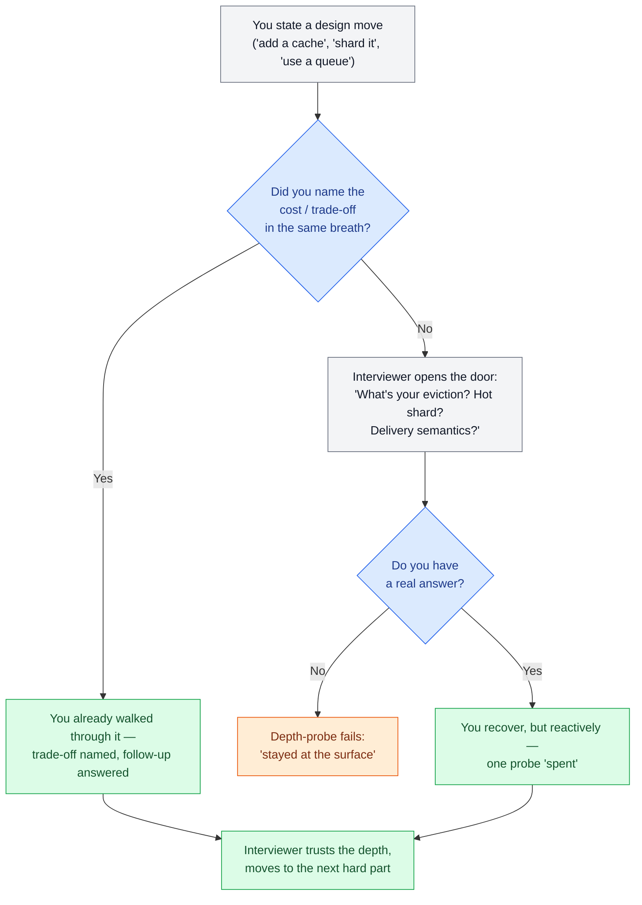
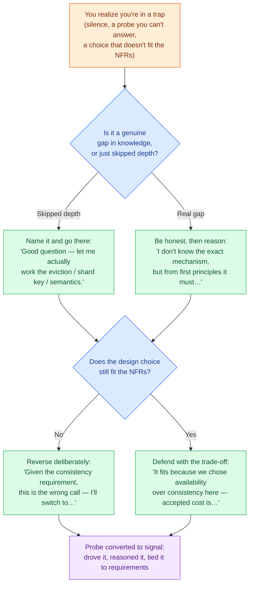

# Traps & Follow-ups

> **Prerequisites:** [The Delivery Framework](/synapse/system-design-from-first-principles/interview-playbook/delivery-framework), [The Interview at 10,000 Feet](/synapse/system-design-from-first-principles/foundations/the-interview-at-10000-feet) | **You'll be able to:** (1) name the eight cross-cutting mistakes that quietly cost candidates the offer and catch yourself committing them live; (2) pre-empt the predictable follow-up question behind every buzzword you say; (3) recover deliberately when you realize you're standing in a trap.

## The problem (why this exists)

Two candidates give the "same" answer. One passes, one doesn't.

Both said "add a cache." Both said "shard the database." Both drew the same five boxes. On paper the transcripts look nearly identical — and yet one got a strong-hire and the other got a no-hire with the note *"stayed at the surface, couldn't go deep."* What separated them wasn't knowledge of a component the other lacked. It was two things this lesson is entirely about: the first candidate **didn't step on the recurring traps** that make an interviewer stop trusting you, and when they said a load-bearing word like "cache" or "queue," they **answered the follow-up before it was asked**.

Here is the uncomfortable truth about senior design interviews: the interviewer is not grading your diagram. They are running a *depth probe*. Every buzzword you drop is a door, and behind each door is the exact same question the interviewer has asked fifty times — "what's your eviction policy?", "what's your shard key?", "what are your delivery semantics?". The candidates who pass are not the ones who avoid the doors. They are the ones who walk through unprompted, because they knew the door was there.

This lesson is the consolidated field guide to both halves. Every module in this book ends with a "Pitfalls & interview traps" section; this is where they converge into one reference you can drill against the night before. The traps are the *how you lose*; the follow-up ladder is the *what they'll ask next* — and each rung links to the lesson in this book that actually answers it, so a weak spot becomes a click, not a shrug.

## Intuition first

Think of the interview as a conversation with a very specific rhythm: **you make a claim, the interviewer tests its depth, you either have a real answer or you visibly don't.** That test is not adversarial trickery. It's the only signal the interviewer has. Anyone can memorize that Ticketmaster "needs a distributed lock." The question "what happens when the lock holder crashes while holding it?" is the one that reveals whether you *understand* locks or *recite* them.

So there are two skills, and they are mirror images. The **defensive** skill is not tripping — not over-engineering, not hand-waving, not forgetting the write path. The **offensive** skill is anticipation — hearing yourself say "queue" and immediately continuing "...at-least-once delivery, so consumers must be idempotent; ordering only within a partition; and a dead-letter queue after N retries" *without being asked*. When you do that, you've collapsed three follow-up rounds into one breath, and the interviewer's mental model of you shifts from "knows the words" to "has actually built this."

The beginner takeaway is a checklist you can hold in your head. The expert takeaway is that the checklist becomes reflex: you no longer *decide* to name the trade-off of a cache, the word "cache" simply *comes bundled* with its cost. That reflex is what "senior" sounds like out loud.

## How it works

The mechanism has two parts: a **catalogue of the cross-cutting traps** (the mistakes that cost points regardless of which system you're designing), and a **follow-up ladder** (the specific next question behind each specific topic). Learn the first to stop losing; learn the second to start winning.

### The eight cross-cutting traps

These are distilled from the "Pitfalls & interview traps" sections across this book, ordered roughly by how often they sink an otherwise-competent candidate.

**Trap 1 — Premature optimization before a working design.** You jump to consistent hashing and multi-region replication before a single request flows end-to-end. The interviewer can't evaluate a scaling story for a system that doesn't yet work. *Fix: get the naive design breathing first — one path, request to response — then scale the part the numbers say is hot.* This is the single most common mid-level failure: optimizing a bottleneck you haven't demonstrated exists.

**Trap 2 — Hand-waving the actually-hard part.** Every problem has a crux — the ticket double-booking, the feed fan-out, the exactly-once payment. Weak candidates spend twenty minutes on the CRUD they're comfortable with and thirty seconds on the crux. Interviewers notice you spent your time where it was *easy*, not where it was *hard*. *Fix: name the crux out loud in the first five minutes and budget most of your deep-dive time there.*

**Trap 3 — Ignoring the non-functional requirements.** You design for correctness and never state the numbers that shape the design: how many users, what read:write ratio, what latency target, availability-vs-consistency. A design untethered from its NFRs is a design the interviewer can't pin down. *Fix: derive the NFRs explicitly up front — see [Nonfunctional Requirements](/synapse/system-design-from-first-principles/foundations/nonfunctional-requirements) — and let them drive every later choice.*

**Trap 4 — A single point of failure left unaddressed.** One database, one coordinator, one queue with no replica — and no acknowledgement that it's a SPOF. It's fine to *start* with a single node; it is not fine to never notice it. *Fix: when you draw a single box on a critical path, say "this is a SPOF; here's how I'd make it redundant" — even if you don't build it out.*

**Trap 5 — "Just add a cache / queue" without saying what it costs.** The lethal one, because it *sounds* competent. Adding a cache buys read throughput and costs you a consistency problem (staleness, invalidation, stampede). Adding a queue buys burst absorption and costs you delivery semantics, ordering, and end-to-end latency. Naming the lever without naming its price is the tell of someone who's read the blog post but not paid the bill. *Fix: every component you add, state what it gives and what it costs in one breath.*

<div style="border-left:4px solid #195045;background:rgba(25,80,69,0.08);padding:0.6rem 1rem;border-radius:0 0.5rem 0.5rem 0;margin:1.25rem 0">

💡 **Insight.** Traps 5 and the entire follow-up ladder are the same phenomenon viewed from two sides. "Just add a cache" is a trap *because* it invites the follow-up "what's your invalidation and stampede story?" — and if you volunteer the answer, the trap becomes a strength. Pre-empting the follow-up is how you disarm the trap.

</div>

**Trap 6 — Forgetting the write path / consistency.** You design a beautiful read path — caches, replicas, CDN — and never say how writes propagate, what a reader sees right after their own write, or what happens under concurrent writes. Read-heavy systems seduce candidates into forgetting that writes are where the correctness lives. *Fix: trace a write end-to-end and state the consistency guarantee a client can rely on — see [Replication](/synapse/system-design-from-first-principles/distributed-data/replication).*

**Trap 7 — Over-engineering for scale nobody asked for.** The inverse of Trap 1. The prompt says 1,000 users and you reach for Kafka, a service mesh, and five microservices. Sophistication deployed against a problem that doesn't have it reads as *poor judgment*, not depth. *Fix: match the machinery to the stated scale; "a single Postgres handles this" is a senior answer when it's true.*

**Trap 8 — Not driving (waiting to be led).** You answer questions competently but never propose the next step, never say "the interesting part here is X, let me go there." A senior candidate owns the whiteboard; a junior waits for permission. Silence and passivity read as *can't operate without supervision.* *Fix: after each section, say what you're doing next and why — narrate your own agenda.*

The recovery flow — what to do the moment you catch yourself in one of these — is its own diagram below.

### The buzzword → probe loop

Here is the rhythm every depth probe follows. It is worth internalizing as a loop, because the winning move is to run the loop *yourself* before the interviewer does.



The diagram's whole point: the path through `D` (you named the trade-off yourself) and the path through `G` (the interviewer had to ask) both reach `H`, but `D` costs you nothing and `G` spends a probe. Run the loop yourself and every probe is a free win.

### The follow-up ladder

This is the heart of the lesson: the predictable next question behind each load-bearing word, and the lesson that answers it. When you say the word in the left column, a competent interviewer asks something close to the middle column. Have the right column ready *before* they open their mouth.

| You say… | They ask (the probe) | Answered in |
| --- | --- | --- |
| "Add a **cache**" | What's your eviction policy? Invalidation when the source changes? What about a **cache stampede** when a hot key expires? Read-through or write-through? | [Caching](/synapse/system-design-from-first-principles/building-blocks/caching) · [Scaling Reads](/synapse/system-design-from-first-principles/patterns/scaling-reads) |
| "**Shard** the database" | What's your shard key? What happens to a **hot shard** / celebrity key? How do you reshard without downtime? | [Sharding & Consistent Hashing](/synapse/system-design-from-first-principles/distributed-data/sharding-and-consistent-hashing) · [Scaling Writes](/synapse/system-design-from-first-principles/patterns/scaling-writes) |
| "Put it on a **queue**" | Delivery semantics — at-least-once or exactly-once? Ordering guarantees? What's in your **dead-letter queue** after N retries? Backpressure? | [Queues & Brokers](/synapse/system-design-from-first-principles/building-blocks/queues-and-brokers) · [Long-running Tasks](/synapse/system-design-from-first-principles/patterns/long-running-tasks) |
| "Take a **lock**" | Is it **fenced**? What if the lock holder dies while holding it? TTL vs. lease? Deadlock between two locks? | [Faults, Clocks & Time](/synapse/system-design-from-first-principles/distributed-data/faults-clocks-and-time) · [Dealing with Contention](/synapse/system-design-from-first-principles/patterns/dealing-with-contention) |
| "Use a **read replica**" | Read-your-writes consistency? How do you handle **replication lag**? Monotonic reads? What on failover? | [Replication](/synapse/system-design-from-first-principles/distributed-data/replication) · [Scaling Reads](/synapse/system-design-from-first-principles/patterns/scaling-reads) |
| "**Exactly-once**" | Exactly-once *delivery* or exactly-once *effect*? (Delivery is impossible; effect is idempotency + dedup.) Where does the dedup check live relative to the write? | [Idempotency & Exactly-once](/synapse/system-design-from-first-principles/patterns/idempotency-and-exactly-once) |
| "It's **strongly consistent**" | Consistent how — linearizable, or just single-leader? What does that cost you in availability under partition (**CAP**)? Latency even without a partition (**PACELC**)? | [CAP & PACELC, Honestly](/synapse/system-design-from-first-principles/distributed-data/cap-and-pacelc-honestly) · [Linearizability & Ordering](/synapse/system-design-from-first-principles/distributed-data/linearizability-and-ordering) |
| "Wrap it in a **transaction**" | What isolation level? Does it span services (**distributed transaction / 2PC**)? Write skew? What if the coordinator crashes mid-commit? | [Transactions & Isolation](/synapse/system-design-from-first-principles/distributed-data/transactions-and-isolation) · [Distributed Transactions](/synapse/system-design-from-first-principles/distributed-data/distributed-transactions) |
| "**Load balancer** in front" | L4 or L7? How does it health-check? Sticky sessions — and what breaks when a node dies holding state? | [Load Balancing & Gateways](/synapse/system-design-from-first-principles/building-blocks/load-balancing-and-gateways) |
| "**Fan-out** the writes" | Fan-out on write or on read? What's your plan for the **celebrity / mega-follower** case that makes write-fan-out explode? | [Fan-out: Push vs Pull](/synapse/system-design-from-first-principles/patterns/fan-out-push-vs-pull) |
| "I'll **estimate** the load" | Show the math. Where did the read:write ratio come from? Peak vs. average (what spike factor)? | [Estimation & the Numbers](/synapse/system-design-from-first-principles/foundations/estimation-and-numbers) |

Notice the shape: nearly every rung reduces to *"you named a benefit; now account for the cost, the failure mode, and the edge case."* That is the entire game. The topics change; the shape of the probe does not.

### When you're caught: the recovery flow

You *will* step in a trap live — everyone does. What separates candidates is the recovery. Flailing (defending a bad choice, going quiet, or bluffing) turns one slip into a downward spiral. A deliberate recovery can actually *raise* your signal, because handling being wrong gracefully is itself a senior trait.



The three recovery verbs are **name it, reason it, tie it to the requirements.** Reversing a bad choice *because the NFRs demand it* is not weakness — it's the exact judgment the interview is testing for.

## Trade-offs

The deepest meta-trade-off in this lesson is **anticipation vs. time.** Volunteering every trade-off unprompted is the ideal, but a 45-minute interview has a budget. Pre-empt the follow-ups on the *crux* (the double-booking, the fan-out); on the peripheral parts, a one-line acknowledgement ("single Postgres here, I'd add a replica for HA") is enough. Spending your anticipation budget evenly is itself a trap — it's Trap 2 in disguise.

| Move | Gives you | Costs you | Use when |
| --- | --- | --- | --- |
| Pre-empt every follow-up | Maximum depth signal; interviewer trusts you fast | Time — you can't do this for every box | On the crux and on any SPOF on the critical path |
| One-line acknowledgement | Shows awareness cheaply; preserves time | Doesn't demonstrate deep mastery of that part | On peripheral / low-risk components |
| Wait to be asked | Lets the interviewer steer to what they care about | Cedes the driver's seat (Trap 8); each probe is "spent" reactively | Almost never by choice — only when genuinely unsure what they want |
| Reverse a stated choice | Demonstrates judgment tied to requirements | Small hit to momentum; looks bad if done without a reason | When a choice genuinely violates the NFRs |

## Numbers that matter

This is a leveling lesson, so the "numbers" are honest ones about where interview time and points go, not system throughput figures. Treat these as *rules of thumb, not from source* except where attributed.

- **A design interview is ~35 minutes of technical content** after intros and questions. Roughly: 5 min requirements/NFRs, 5 min high-level design, ~20 min deep dives, ~5 min wrap. The deep-dive block is where every follow-up in the ladder gets asked — it is the majority of your grade. *(Consistent with the delivery framework's budgets; exact split is a rule of thumb.)*
- **The crux deserves the majority of deep-dive time.** If you spend equal time on all five boxes, you've under-invested in the one that decides the interview (Trap 2).
- **One un-answered depth probe rarely fails you; a *pattern* of them does.** The signal an interviewer writes down is "went deep everywhere" vs. "stayed at the surface" — it's the aggregate across probes, not a single miss, that lands the no-hire note.
- **Time lost per trap, qualitatively:** Trap 1 (premature optimization) and Trap 2 (hand-waving the crux) are the expensive ones — they can consume 10+ minutes and leave the crux untouched. Traps 4 and 5 are cheap to avoid (one sentence each) and cheap to commit — which is exactly why forgetting them is such a waste.
- **Read:write ratios you should already have in your head** (they set up the "did you forget the write path" probe): a URL shortener runs ~1000:1 read-heavy; a social feed commonly 100:1; these come straight from the case studies. Knowing them cold means Trap 6 never catches you off guard.

## In production

The interview depth-probe is not an artificial ritual — it's a compressed simulation of a **real design review.** The same eight traps are exactly what a staff engineer flags in an RFC or architecture review, which is why interviewers probe for them: they're screening for the colleague who won't ship the SPOF.

Watch how the traps map one-to-one onto review comments you'll see (or write) in industry:

- *"Add a cache without saying what it costs"* → the reviewer comment **"what's your invalidation strategy, and what's the blast radius when this cache is cold?"** The real-world version of the cache-stampede probe is a postmortem: a cache flushes, every request stampedes the origin, and the origin falls over. Teams solve it in production with request coalescing and probabilistic early refresh — the same material the caching lesson covers.
- *"Single point of failure left unaddressed"* → the review gate **"what's the failover story? Have we tested it?"** In production the untested failover is worse than the interview version, because the SPOF that "never fails" is the one that takes down the service at 3 a.m. — the resilience lesson's whole subject.
- *"Forgetting the write path / consistency"* → the incident review question **"what did a user see right after their own write during the replica lag spike?"** Read-your-writes anomalies are a top-tier source of "it's a bug" / "no it's replication lag" arguments in real on-call channels.
- *"Exactly-once hand-wave"* → the design-review demand **"show me the idempotency key and where the dedup check sits relative to the write."** Payment and billing systems live or die on this; getting it wrong means double-charging real customers.

The lesson: interviewers probe these because production *punishes* them. A candidate who pre-empts the follow-up is demonstrating the exact instinct that keeps real systems up. The interview is the review, minus the pager.

## Pitfalls & interview traps

The meta-pitfalls — the traps about *avoiding traps*:

- **Reciting trade-offs without connecting them to the problem.** Rattling off "caches cause staleness" as a memorized line, without saying *why it matters for this system's NFRs*, is its own tell. The trade-off must be tied to the requirement in front of you, not delivered as trivia.
- **Over-correcting into analysis paralysis.** Terrified of Trap 5, some candidates narrate every conceivable trade-off of every box and never converge on a decision. Anticipation must end in a *choice*, not a survey. Name the cost, then commit.
- **Pre-empting the *wrong* follow-up.** Volunteering a deep eviction-policy monologue for a cache that isn't on the critical path, while the actual crux (the double-booking) goes untouched, is Trap 2 wearing Trap-5's clothes. Anticipate on the crux.

<div style="border-left:4px solid #da5233;background:rgba(218,82,51,0.08);padding:0.6rem 1rem;border-radius:0 0.5rem 0.5rem 0;margin:1.25rem 0">

⚠️ **The most expensive trap is confidence in a wrong answer.** An interviewer forgives "I don't know the exact mechanism, but from first principles it should work like X." They do *not* forgive confidently asserting that a distributed lock guarantees mutual exclusion when the holder can pause on a GC and a stale lock lets two writers in — the [fencing-token](/synapse/system-design-from-first-principles/distributed-data/faults-clocks-and-time) problem. Bluffing with certainty converts a small gap into a trust collapse. When you don't know, *reason out loud from first principles* — that is a stronger signal than a confident wrong recitation.

</div>

The interviewer's follow-up behind *this whole lesson*: **"You said you'd add a distributed lock — walk me through what happens when the process holding it stalls for 20 seconds on a GC pause."** If your answer isn't "the lease expires, another process acquires it, and now two processes think they hold the lock — which is why I need a fencing token / monotonic version the storage layer checks," you've just demonstrated the exact gap this lesson exists to close.

## Check yourself

```quiz
{"prompt": "A candidate designing a news feed says: 'Reads are heavy, so I'll put everything behind Redis and add read replicas — that handles the scale.' They move on. Which trap is this, most precisely?", "options": ["Over-engineering for scale nobody asked for", "Just add a cache/replica without saying what it costs (and forgetting the write path)", "A single point of failure left unaddressed", "Not driving the interview"], "answer": "Just add a cache/replica without saying what it costs (and forgetting the write path)"}
```

```quiz
{"prompt": "You say 'I'll use a distributed lock so only one worker processes each job.' What is the single most likely follow-up an interviewer asks next?", "options": ["Which cloud provider's lock service?", "What happens if the lock holder dies or stalls while holding the lock — is it fenced?", "How many locks per second can it handle?", "Is the lock written in Redis or ZooKeeper?"], "answer": "What happens if the lock holder dies or stalls while holding the lock — is it fenced?"}
```

```quiz
{"prompt": "Thirty minutes into a Ticketmaster design, a candidate has built a polished event-browsing read path with caching and CDN, but has said almost nothing about how two users are prevented from booking the same seat. Which trap dominates here?", "options": ["Ignoring the non-functional requirements", "Premature optimization before a working design", "Hand-waving the actually-hard part (the crux)", "Over-engineering for scale nobody asked for"], "answer": "Hand-waving the actually-hard part (the crux)"}
```

```quiz
{"prompt": "An interviewer asks about your queue's failure handling and you realize you have no real answer. Which recovery is strongest?", "options": ["Confidently assert the queue 'just retries automatically' and move on", "Go quiet and wait for the interviewer to suggest something", "Say 'from first principles it must be at-least-once, so consumers need to be idempotent and I'd add a DLQ after N retries' and reason it through", "Change the subject to a part of the design you're more comfortable with"], "answer": "Say 'from first principles it must be at-least-once, so consumers need to be idempotent and I'd add a DLQ after N retries' and reason it through"}
```

<details>
<summary>You say "the system is strongly consistent." What are the two follow-ups you should already be answering, and where do they lead?</summary>

First: **"consistent *how*?"** — linearizable (every read sees the latest committed write, single global order) or merely single-leader (one writer, but replicas may lag)? These are very different guarantees. Second: **"what does it cost?"** — under a network partition you must sacrifice availability to keep consistency ([CAP](/synapse/system-design-from-first-principles/distributed-data/cap-and-pacelc-honestly)), and *even with no partition* strong consistency costs you latency ([PACELC](/synapse/system-design-from-first-principles/distributed-data/cap-and-pacelc-honestly)'s "else, latency vs. consistency"). Naming both — the flavor and the price — is the answer that closes the probe.

</details>

<details>
<summary>Why is "exactly-once delivery" a trap phrase, and what should you say instead?</summary>

Because exactly-once *delivery* is impossible in a distributed system — the network can always drop the acknowledgement, forcing a resend. What you actually engineer is exactly-once *effect*: at-least-once delivery plus **idempotent** processing (a dedup key, a conditional write) so that reprocessing the same message has no additional effect. Saying "exactly-once" flatly invites the probe "delivery or effect?"; saying "at-least-once delivery with idempotent, deduplicated processing so the *effect* is exactly-once" pre-empts it and shows you understand the real mechanism. See [Idempotency & Exactly-once](/synapse/system-design-from-first-principles/patterns/idempotency-and-exactly-once).

</details>

<details>
<summary>You've been answering every question well but the interviewer seems lukewarm. What trap might you be committing that has nothing to do with correctness?</summary>

Trap 8 — **not driving.** Answering competently but never proposing the next step reads as "needs supervision." The fix is to narrate your own agenda: after each section, say what you're doing next and *why* ("the interesting part is the contention on booking — let me go there"). Owning the whiteboard is a leveling signal independent of any single technical answer; see [Level Calibration](/synapse/system-design-from-first-principles/interview-playbook/level-calibration) for how driving maps to seniority bars, and drill it in [The Practice Ladder](/synapse/system-design-from-first-principles/interview-playbook/practice-ladder).

</details>

## Sources

Original synthesis on interview delivery and calibration; this book's own framing.
