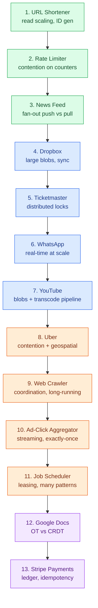
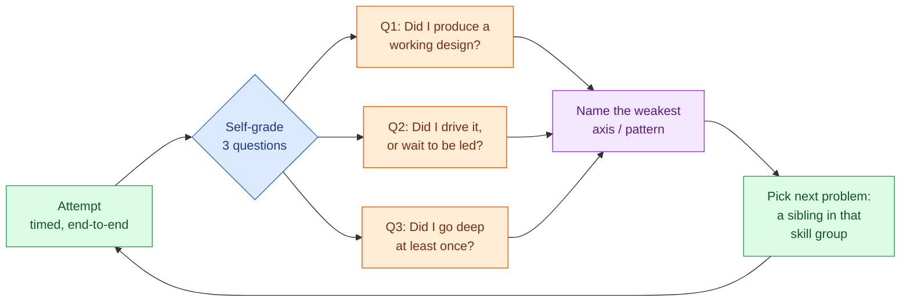

# The Practice Ladder

> **Prerequisites:** [The Delivery Framework](/synapse/system-design-from-first-principles/interview-playbook/delivery-framework), [Level Calibration](/synapse/system-design-from-first-principles/interview-playbook/level-calibration) | **You'll be able to:** build a concrete week-by-week study plan from the book's case studies, pick the *next* problem that stretches a specific weakness, and self-grade a practice attempt the way an interviewer would.

## The problem (why this exists)

You have finished the book. You understand replication, partitioning, contention, fan-out, idempotency, and the delivery framework. And yet the first time you sit in front of a whiteboard with a stranger and hear *"design Uber,"* your mind goes blank, your requirements sprawl, and forty minutes later you have a diagram with no depth and no story.

This is the gap between *knowing* and *performing*. Reading about a distributed lock does not make you fluent at reaching for one under time pressure. System design is a **skill**, not a body of knowledge — and skills are built by deliberate, graded practice, not by re-reading. The trap most candidates fall into is grinding: doing twenty random problems back to back, feeling busy, and improving nothing, because they never diagnose *what* is weak and never target it.

This closing lesson is the antidote. It turns the book's thirteen case studies into a **ladder** — ordered easy to hard, each rung labeled with the patterns it drills — plus a self-review loop that tells you which rung to climb next. A beginner leaves with a concrete plan. An expert leaves with a scalpel: a way to isolate their single weakest axis and drill exactly that.

## Intuition first

Think about how you got good at anything physical — climbing, an instrument, a sport. You did not start on the hardest route. You started on something you could *almost* do, failed a few times, got it, and then stepped up to the next thing that was slightly beyond reach. That zone — "hard enough that you fail sometimes, easy enough that you succeed sometimes" — is where learning actually happens. Too easy and you are bored and coasting; too hard and you flail and absorb nothing.

The same is true here. **Do not start your practice with Google Docs.** Its collaborative-editing deep dive (operational transforms versus CRDTs) will drown a beginner and teach them nothing except that they feel stupid. Start with the [URL shortener](/synapse/system-design-from-first-principles/case-studies/url-shortener) — a design explicitly aimed at a junior audience — nail the delivery framework on a design with exactly one interesting idea (read scaling), and *then* add a second idea, and a third.

The second intuition: **problems cluster by skill.** Ticketmaster, Uber, and the rate limiter feel like different products but drill the *same* core muscle — contention under concurrent writes. If you bomb the contention deep dive in a Ticketmaster mock, the fix is not "do Ticketmaster ten more times" (you will just memorize it). The fix is to do the *sibling* problem — Uber — which exercises the same muscle in a new costume, forcing you to transfer the skill rather than recall the answer. The matrix below is what makes that targeting possible.

## How it works

The ladder has three parts: a **difficulty-ordered climb**, a **case-study × pattern matrix** for targeting, and a **skill-group map** so you know which problems are siblings.

### The climb (easy → hard)

Each rung adds roughly one new axis of difficulty. Run each as a timed, end-to-end mock (see *Numbers that matter*), delivering the full framework — requirements, core entities, API, high-level design, then deep dives — from the [delivery framework](/synapse/system-design-from-first-principles/interview-playbook/delivery-framework) lesson.



The three green rungs are single-idea warm-ups: get the framework automatic here. The blue and orange rungs stack two-to-three patterns each. The two purple rungs are the boss fights — Google Docs and Stripe are the longest, most senior breakdowns in the source corpus, and you should only attempt them once the mid-tier feels routine.

### The matrix — pick the problem that stretches your weakness

This is the core tool. Each row is one of the book's thirteen case studies; each column is one of the eight [patterns](/synapse/system-design-from-first-principles/patterns/scaling-reads) from module 5. **● = the pattern is the case study's headline deep dive; ○ = it appears as a secondary concern.** The final column names the signature *building block* the case study drills that isn't one of the eight core patterns (real-time delivery, geospatial indexing, large-blob handling — the things that recur but live outside the pattern catalog).

Read it two ways. **Down a column:** "I'm weak on contention — which problems drill it?" Follow the ● marks down *Contention* → Ticketmaster, Uber, Rate Limiter, Job Scheduler. **Across a row:** "What will Stripe make me practice?" → sagas, idempotency, and CDC together.

| Case study | Skill group | Rung | Reads | Writes | Contention | Fan-out | Sagas | Long-run | Idem. | CDC | Signature building block |
| --- | --- | :-: | :-: | :-: | :-: | :-: | :-: | :-: | :-: | :-: | --- |
| [URL Shortener](/synapse/system-design-from-first-principles/case-studies/url-shortener) | read-scaling | 1 | ● | | | | | | ○ | | Unique ID gen, base62, CDN |
| [Rate Limiter](/synapse/system-design-from-first-principles/case-studies/rate-limiter) | contention | 2 | ○ | ● | ● | | | | | | Atomic counters, Lua, token/leaky bucket |
| [News Feed](/synapse/system-design-from-first-principles/case-studies/news-feed) | read-scaling | 3 | ● | | | ● | | | | | Hot-key / celebrity mitigation |
| [Dropbox](/synapse/system-design-from-first-principles/case-studies/dropbox) | large-blobs | 4 | ○ | | | | | | | | Presigned URLs, chunked upload, sync |
| [Ticketmaster](/synapse/system-design-from-first-principles/case-studies/ticketmaster) | contention | 5 | ● | | ● | | | | | | Distributed lock, real-time waiting room |
| [WhatsApp](/synapse/system-design-from-first-principles/case-studies/whatsapp) | real-time | 6 | | | | ○ | | | | | Real-time delivery, pub/sub, consistent hashing |
| [YouTube](/synapse/system-design-from-first-principles/case-studies/youtube) | large-blobs / pipeline | 7 | ● | | | | ○ | ● | | | Large blobs, transcoding DAG |
| [Uber](/synapse/system-design-from-first-principles/case-studies/uber) | contention | 8 | | ● | ● | | ● | | | | Geospatial indexing (geohash / quadtree) |
| [Web Crawler](/synapse/system-design-from-first-principles/case-studies/web-crawler) | coordination | 9 | | | ○ | | ● | ● | | | Politeness, backoff, DLQ, visibility timeout |
| [Ad-Click Aggregator](/synapse/system-design-from-first-principles/case-studies/ad-click-aggregator) | streaming / counting | 10 | | ● | | | | | ● | ○ | Stream aggregation, batch-vs-stream, exactly-once |
| [Job Scheduler](/synapse/system-design-from-first-principles/case-studies/job-scheduler) | coordination | 11 | | ● | ● | | ○ | ● | ● | | Leasing, failure detection, partition keys |
| [Google Docs](/synapse/system-design-from-first-principles/case-studies/google-docs) | real-time | 12 | | | ○ | | | ○ | | | OT vs CRDT, stateful connection routing |
| [Stripe Payments](/synapse/system-design-from-first-principles/case-studies/stripe-payments) | money / idempotency | 13 | | | ○ | | ● | ● | | ● | Ledger modeling, event sourcing, reconciliation |

A few things this table makes visible at a glance. **Contention is the most-drilled pattern** in the corpus (Rate Limiter, Ticketmaster, Uber, Job Scheduler headline it) — no accident, it is the axis interviewers probe hardest because it separates people who can *say* "add a lock" from people who can reason about the lock's failure modes. **Real-time delivery** — WhatsApp and Google Docs — barely touches the eight core patterns, because it lives in the building-blocks layer, not the pattern layer; if that column looks empty, that is the point, and it tells you those two problems teach a genuinely different mechanism. And the two hardest problems, Job Scheduler and Stripe, light up the *most* columns — they are integrative, which is exactly why they sit at the top of the ladder.

### The skill groups (which problems are siblings)

When you diagnose a weak axis, drill its *group*, not the one problem you already saw. The book's thirteen cluster into seven skill families:

- **Read-scaling** — URL Shortener, News Feed. Extreme read:write skew, caching, CDN, hot keys.
- **Contention** — Ticketmaster, Uber, Rate Limiter. Concurrent writes to a contended resource; locks, atomic operations, optimistic concurrency.
- **Real-time** — WhatsApp, Google Docs. Persistent connections, server-side push, connection routing.
- **Large-blobs / pipeline** — Dropbox, YouTube. Direct-to-storage upload, presigned URLs, async processing pipelines.
- **Streaming / counting** — Ad-Click Aggregator. Stream processing, approximate vs exact counts, batch-vs-stream trade-offs.
- **Distributed coordination** — Web Crawler, Job Scheduler. Queues, leases, failure detection, long-running orchestration.
- **Money / idempotency** — Stripe Payments. Ledgers, exactly-once semantics, sagas across external systems.

## Trade-offs

The central choice in designing your own practice is **breadth versus depth**: do more problems shallowly, or fewer problems deeply?

| Approach | Gives you | Costs you | Use when |
| --- | --- | --- | --- |
| **Breadth** — many problems, one pass each | Pattern-recognition speed; you have "seen something like this" for almost any prompt | Shallow deep dives; you can start any design but stall when pushed for detail | Your framework is solid but you freeze on unfamiliar prompts; interview is soon and broad |
| **Depth** — few problems, repeated with escalating deep dives | Genuine fluency on the patterns those problems drill; you can go three questions deep | Blind spots on problem types you skipped; risk of memorizing one design | You can start designs fine but crumble under "how would you handle X?" follow-ups |
| **Targeted (recommended)** — the matrix-driven loop below | Efficient: every rep closes a *diagnosed* gap | Requires honest self-review; slower to feel "productive" | Always, once you have done ~3 problems and know your weak axes |

Most candidates over-index on breadth because it feels productive — twenty problems in your history looks impressive. But an interviewer does not test *coverage*; they test *depth on the axis they happen to probe*. The targeted loop wins because it spends every rep on a real, named weakness instead of on the comfortable problems you already do well.

## Numbers that matter

These are **rules of thumb, not from source** — calibrate to your own pace.

- **Time per attempt:** a full mock runs **35–45 minutes** of design plus **10–15 minutes** of self-review. Do not skip the review; the review is where the learning is (see the loop below). An attempt without review is worth roughly *half* an attempt with one.
- **Reps to fluency on a single problem:** most people need **2–3 passes** on a given case study, spaced days apart, before the deep dives feel automatic. The first pass you learn the shape; the second you internalize the deep dives; the third you can drive it. More than 3–4 passes on the *same* problem and you are memorizing, not learning — switch to a sibling in the same skill group.
- **A realistic plan:** **13 problems × ~2 passes ≈ 26 attempts.** At 3–4 attempts a week that is a **6–8 week** cycle to work the whole ladder twice. Front-load the green rungs (they go fast), spend real time on the orange and purple ones.
- **Deep-dive depth target:** for each problem, be able to go **three follow-ups deep** on at least one deep dive — interviewers escalate ("okay, now the lock service fails — then what?") and stop when *you* stop, so your depth ceiling is your score. See [level calibration](/synapse/system-design-from-first-principles/interview-playbook/level-calibration) for how deep is deep enough per level.

## In production

Staff and principal engineers do not stop practicing when they get the job — the muscle atrophies without use, and most engineers interview candidates far more often than they interview themselves. Here is how strong engineers keep the skill sharp, and it is worth copying:

- **Mock-interview cadence.** Many keep a standing **peer mock** every week or two — one person designs, the other plays interviewer and *pushes for depth*. The interviewer role is where a lot of the growth happens: watching someone else stall on a deep dive teaches you the shape of a good answer faster than doing it yourself. If you can find one practice partner, the peer-mock loop beats solo practice by a wide margin, because a partner asks the follow-up you would have let yourself off the hook for.
- **Read real post-mortems and engineering blogs.** The "In production" sections of this book point at real systems — Discord's message store, Uber's dispatch, Stripe's ledger. Engineers keep current by reading incident write-ups; a good post-mortem is a free, high-signal deep dive on how a design *actually* fails at scale, which is exactly what senior interviews probe.
- **Design review at work is practice.** Every real design doc you write or review is a rep. The engineers who are best at the interview are usually the ones who treat their day-job architecture decisions with the same rigor — requirements first, trade-offs explicit, failure modes named.
- **Spaced repetition of the deep dives.** The reason the matrix groups problems by pattern is that senior engineers think in *patterns*, not in *products*. Once "contention" is a first-class concept in your head, you recognize it instantly whether the prompt is ticket sales, ride matching, or inventory — and you reach for the same toolkit. That transfer is the whole goal.

## Pitfalls & interview traps

<div style="border-left:4px solid #da5233;background:rgba(218,82,51,0.08);padding:0.6rem 1rem;border-radius:0 0.5rem 0.5rem 0;margin:1.25rem 0">

⚠️ **The two ways practice fails silently.** First, **grinding without self-review** — doing problem after problem, never grading yourself, never targeting a gap. You feel productive and improve nothing, because you keep re-practicing what you are already good at and avoiding what hurts. Second, **memorizing solutions instead of building the skill** — you do Ticketmaster five times until you can recite the distributed-lock design, then an interviewer asks for Uber and you are helpless because you memorized an *answer*, not a *skill*. The cure for both is the same: after every attempt, name your weakest axis, then drill a *sibling* problem in that skill group, not the one you just did.

</div>

Other traps to avoid:

- **Skipping the boring rungs.** People want to jump to Google Docs because it sounds impressive. But if your framework is not automatic on the URL shortener, you will waste your Google Docs attempt fumbling requirements instead of learning OT vs CRDT. Earn the top of the ladder.
- **Only doing problems you like.** If you are strong on read-scaling, doing News Feed again is a comfort-blanket. Growth is on the axis you avoid. Use the matrix to force yourself toward the empty columns in your own history.
- **Treating the case study as the unit.** The unit of skill is the *pattern*, not the product. An interviewer can dress contention up as any product on earth. Practice recognizing the underlying pattern, and the specific prompt stops mattering.
- **No timer.** Untimed practice hides your worst failure mode — sprawl. If you cannot deliver a coherent high-level design in ~20 minutes, that is the single most valuable thing to discover *before* the real interview, not during it.

## The self-review loop

After every attempt, run this loop. It is what converts reps into skill.



The three self-grade questions map to the three things interviewers actually evaluate:

1. **Did I produce a working design?** Would this system, as drawn, satisfy the functional and non-functional requirements? If a whole requirement went unaddressed, *coverage* is your weak axis — practice the framework's scoping step.
2. **Did I drive it, or wait to be led?** Senior signal is proactivity — you propose the deep dives, you name the trade-offs, you say "the interesting problem here is X." If you sat back waiting for the interviewer to ask questions, *ownership* is your weak axis. See [traps and follow-ups](/synapse/system-design-from-first-principles/interview-playbook/traps-and-followups).
3. **Did I go deep at least once?** Could you take one deep dive three follow-ups deep? If every part of your design stayed shallow, *depth* is your weak axis — pick the problem whose matrix row has a ● on the pattern you dodged.

Whichever question you fail is your target. Pick the next problem accordingly and climb.

## Beyond the ladder: further practice

The book rebuilt thirteen case studies as full lessons. Fourteen more classic system-design prompts are worth practicing beyond them — excellent extra reps, especially for skill groups where you want more variety. Each drills a familiar pattern in a fresh costume; a handful of other commonly-cited prompts (online chess, metrics monitoring, a ChatGPT-style system) are skipped here because there isn't enough settled material to practice against yet.

These are further problems worth practicing on your own, grouped by the skill they extend:

- **Contention / geospatial:** Design Local Delivery (Gopuff-style), Design Tinder, Design Yelp, Design eBay — inventory atomicity, swipe/match races, and eBay's auction bidding is the *canonical* worked example of the contention pattern.
- **Real-time / feeds:** Design Live Comments for a Livestream (the clearest end-to-end SSE/pub-sub example), Design Robinhood, Design Instagram, Design a News Aggregator.
- **Long-running / streaming / counting:** Design LeetCode (async code execution), Design a Top-K Video-Views Counter (exactly-once top-k counting), Design Strava (a notable *inversion* — pushes work to the client to avoid scaling writes), Design a Price Tracker (CamelCamelCamel-style).
- **Search / caching internals:** Design Post Search for a Social Network (inverted index + two-stage retrieval), Design a Distributed Cache (the deepest hot-key treatment of the group, plus LRU/TTL internals).

Use these when the matrix tells you an axis is weak and you have already exhausted the in-book siblings. Robinhood and eBay in particular reward you after Stripe — they extend the money/consistency muscle into new domains.

## Check yourself

```quiz
{"prompt": "You just bombed the deep dive on Ticketmaster: you said 'add a lock' but couldn't reason about what happens when the lock service crashes mid-hold. What should your NEXT practice problem be?", "options": ["Ticketmaster again, until you memorize the lock design", "Uber — a sibling in the contention group that drills the same muscle in a new costume", "Google Docs, to move up the ladder", "News Feed, because you're comfortable with it"], "answer": "Uber — a sibling in the contention group that drills the same muscle in a new costume"}
```

```quiz
{"prompt": "You're brand new to system-design interviews and want to start practicing. Which problem should be your FIRST attempt?", "options": ["Stripe Payments — start with the hardest to stretch yourself", "Google Docs — collaborative editing is impressive", "URL Shortener — a single-idea design explicitly aimed at a junior audience", "Uber — it's the most commonly asked"], "answer": "URL Shortener — a single-idea design explicitly aimed at a junior audience"}
```

```quiz
{"prompt": "Looking at the matrix, which pattern is the headline (●) deep dive in the MOST case studies — i.e., the axis interviewers probe hardest?", "options": ["Fan-out: push vs pull", "Event-driven / CDC", "Dealing with contention", "Long-running tasks"], "answer": "Dealing with contention"}
```

```quiz
{"prompt": "In the self-review loop, you produced a design that met all requirements and you went deep on caching — but you realize you spent the whole session reacting to the interviewer's questions instead of proposing deep dives yourself. Which axis is weak?", "options": ["Coverage — you missed a requirement", "Depth — you never went deep", "Ownership — you didn't drive the design", "Nothing — reacting to questions is correct"], "answer": "Ownership — you didn't drive the design"}
```

<details>
<summary>You've done a problem 4 times and can now recite the design perfectly. Is that good practice? What should you do next?</summary>

No — that's the memorization trap. Being able to *recite* one design is not the same as being able to *derive* a design under a novel prompt. Reciting Ticketmaster won't help when the interviewer asks for Uber. Once a problem takes more than ~3–4 passes and feels like recall rather than reasoning, switch to a **sibling in the same skill group** (Ticketmaster → Uber or Rate Limiter) so you're forced to *transfer* the contention skill to a new surface instead of replaying a memorized answer.
</details>

<details>
<summary>Why does the matrix bother distinguishing "skill group" from the individual case study? Isn't "design Uber" the thing you practice?</summary>

Because the unit of skill is the **pattern**, not the product. An interviewer can dress contention up as concert tickets, ride matching, flash-sale inventory, or auction bidding — same underlying problem, different costume. If you practice at the level of "products," you need to have seen the exact product before. If you practice at the level of "patterns," you recognize contention instantly regardless of the prompt and reach for the same toolkit. The skill groups exist to push you toward pattern-fluency, which is what actually transfers to the real interview.
</details>

<details>
<summary>You have two weeks and can only do about 8 attempts. How should you spend them?</summary>

Don't try to cover all 13. Do a fast triage: attempt one problem from each of your *unfamiliar* skill groups (maybe contention, real-time, coordination) to find your weakest axes — that's ~3 attempts. Then spend the remaining ~5 attempts going *deep* on the one or two weakest groups, using siblings and the further-practice breakdowns. Targeted depth on your weaknesses beats a shallow pass over all thirteen. Front-load the diagnostic attempts, back-load the targeted drilling.
</details>

## Sources

Original synthesis on interview delivery and calibration; this book's own framing.
